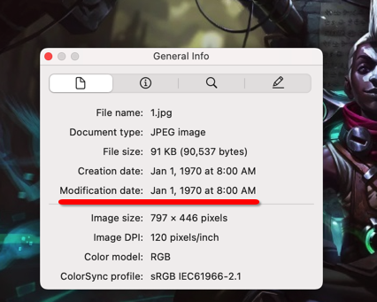

> 本文记录在解答攻防世界「时间刺客」这道题目时的过程，如果对大家有帮助，欢迎关注支持。

附件下载解压后是一个文件夹，里面有四张游戏截图。使用 binwalk、stegsolve 看了下图片都没有什么特别之处。

因为不怎么玩游戏，查询了下原来是英雄联盟中的一个人物，个人介绍是「Ekko，the boy who shattered time」，猜想可能和时间有关系。


但是查看图片1和图片的4的时候，发现创建时间和修改时间都是1970年1月1日，此时搜到了网上 [ElvisElvis6 的一篇文章](https://blog.csdn.net/qq_53229503/article/details/128817670) 



将代码在本地运行后，发现取到的信息不完整。


这个时候是比较困惑的，感觉攻防世界提供的附件有一些问题。于是从 ElvisElvis6 提供的网盘上下载文件，发现时间确实和攻防世界提供的文件有区别。


对比分析了网上提供的解法，发现原来是将四个文件的创建时间视作一些ASCII码可见字符的拼接，然后转换成文本之后就能获得 flag，我也写了一个脚本，其实获取到的时间不需要再做运算，ElvisElvis6 提供的带运算的解法不知道是出于什么思路。

```python
import io
import re
import os

result_str = ''

file_list = ['1.jpg', '2.jpg', '3.jpg', '4.jpg']
for i in file_list:
    filepath = './附件/' + i
    print(i)
    # print( int( (( os.path.getmtime(filepath) * (10 ** 9) ) % (2 ** 64 - 1) ) / (10 ** 9)) )
    result_str += str( int(  os.path.getmtime(filepath)   ) ) 

print(result_str)

num_list = re.findall(r'1[0-2][0-9]|[4-9][0-9]',result_str)

print(num_list)
print(bytes(int(i) for i in num_list).decode())
```

放在解压后的附件上层目录，执行可以获得 flag


## 参考资料

1. [时间刺客](https://blog.csdn.net/qq_53229503/article/details/128817670)
