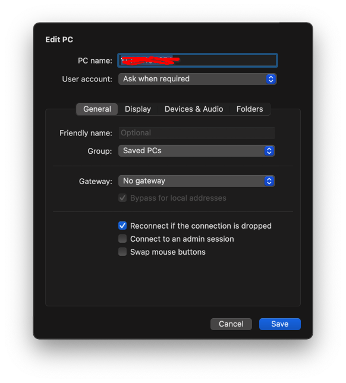
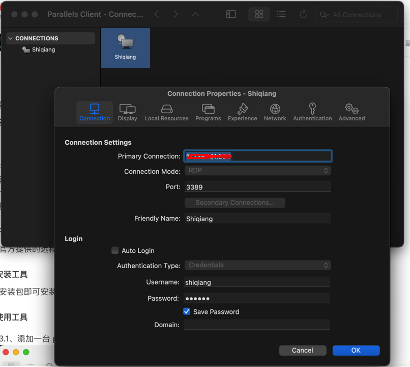

日常办公过程中，使用了一台 Windows 处理一些邮件以及使用一些仅能在 Windows 环境安装的公司软件，使用了一台 Mac 用来写写文档、打打CTF、测试一些代码什么的。Windows 连接了机械键盘，Mac 16寸的屏幕用起来也很爽，因此经常会出现在两个电脑间不断切换的场景。

今天在查找一些资料的时候，突然想到使用远程桌面连接的方式，不就可以同时使用两台电脑了嘛，这样不管在 Windows 上，还是在 Mac 上，两边的软件和工作任务都可以同时处理，切换电脑之后只是换了不同的屏幕、键盘和鼠标，但是内容上就能够保持一致。

想到这个思路之后，就开始准备具体的操作。

## Mac 连接 Windows

从 macOS 系统访问 Windows 是利用 Windows 的 RDP 协议，一般默认访问 3389 端口。

开始访问之前，需要关闭 Windows 的防火墙等设置，或者设置单独的防火墙策略。

macOS 系统中有很多的工具选择可以远程访问 Windows，Microsoft 提供了一款软件支持在 macOS 中远程访问 Windows。但是微软的 Microsoft Remote Desktop 无法在中国区的 AppStore 中下载，可以使用参考资料中的链接从官方页面下载安装包。

安装完成后可以添加需要连接的电脑IP，之后就可以远程访问 Windows 桌面了。

也可以使用 Parallels Desktop 提供的 Parallels Client 工具，这个可以在中国区的 AppStore 中下载。使用也是非常简单，直接输入 Windows 电脑的IP就可以连接。个人感觉 Parallels Client 的图像效果要比微软的客户端好，而且还能提供记住密码的选项，不得不说 Parallels 家经营 macOS 下的 Windows 生态还是有些家底。

## Windows 连接 Mac

通过 Windows 远程访问 macOS 桌面，需要首先在 macOS 系统便好设置中，打开「屏幕共享」或者「远程管理」选项。

可以使用 RealVNC Viewer 软件，连接 macOS 地址就可以访问。从 Windows 访问 macOS 的体验不是很好，感觉操作都有一些迟钝，这还是在局域网的情况，不知道是否还有一些优化参数。 

## 参考资料

1、[Microsoft Remote Desktop Mac 版下载](https://go.microsoft.com/fwlink/?linkid=868963)

2、[Windows在外远程桌面控制macOS](https://blog.csdn.net/lxwssjszsdnr_/article/details/130582932)
