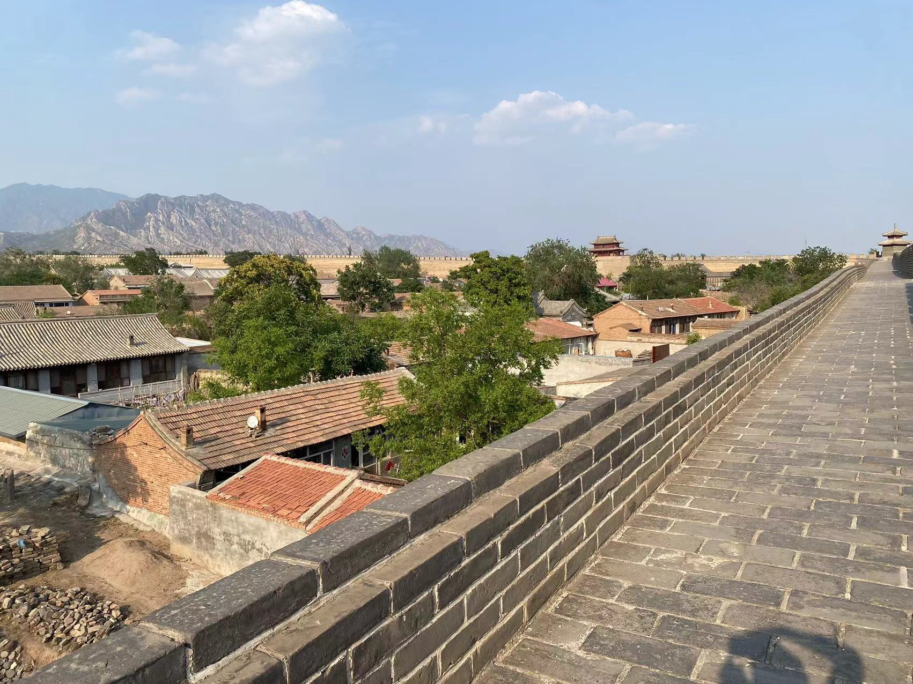

上周6月18日早上7点，我参加了人生中第一次正式的马拉松比赛。比赛的地点在美丽的官厅湖湿地公园，从北京出发一跨过官厅湖大桥很快就能到达公园，这里有很多大风车，白色的风车掩映在湖光山色之间，环境非常优美。

我是前一天到的怀来，先去了这里有明的鸡鸣驿参观。这里原本是古代的一座驿站，经过修缮城墙保留的非常完好，看介绍说是国内保存最完整、规模最大的一座古代驿站。城墙宽大概有个五六米的样子，在城墙上可以绕城一周，能够看到背后秀丽的飞来峰和仍生活在城中的古朴的村民。

因为先去参观了景点，等到去领取比赛包的时候已经比较晚，好多展销的摊位都开始收摊撤退了，感觉如果来早一点体验下主办方组织的集市也非常不错，夜色中的湿地公园夏风不断，一点都不觉得热。

第二天一大早，因为住的离起跑点很近，很早就被音响调试的声音叫醒了，醒来后也不再能睡着，索性就早点起来热身。热身一段时间后，就去和跑团的队友们汇合，吃了一根香蕉喝了一瓶牛奶做为简单的补给，都准备好之后就随着人群去检录口等待出发。

夏天7点钟的时候太阳已经升起的比较高了，好在还不是很热，随着发令的笛声响起，我们就缓慢的出发了（因为人实在太多，起点根本跑不起来）。前面的5公里控制配速在6分30秒，感觉还OK。等到过了10公里之后，有一点点来状态就跑快了一点。下面是一边跑一边拍摄的官厅湖的照片。

等过了15公里才是真正的考验，这时候差不多8点40多，太阳已经狠毒起来，我拿着一瓶矿泉水边跑边喝，不断的补充水分。和我一起的队友，要么快的已经跑的没影，要么慢的被落在了后面，我就像独行侠一般，一边跑一边喝水。中间碰到的很多领跑兔子和其他的跑者不断的互相加油鼓劲，这才觉得跑起来没有那么痛苦。最后很幸运的赶在2小时10分之前完成了半程马拉松的比赛，难忘的人生第一次正式比赛。

今天写博客才发现，我的净计时成绩居然卡在2小时09分59秒，真的是一秒都没耽误呀。总体上，因为平时也有长跑的训练，这次正式比赛感觉和平时没有太大区别，也正常发挥了水平。其他对马拉松感兴趣的朋友，在参加比赛之前，也最好能够系统的训练一下。

比赛过程中，我看到有一些朋友有摔伤、拉伤的情况，参加马拉松，成绩还是次要的，能够健康完赛才是最重要的，希望所有的朋友都能够健康长跑一生。

