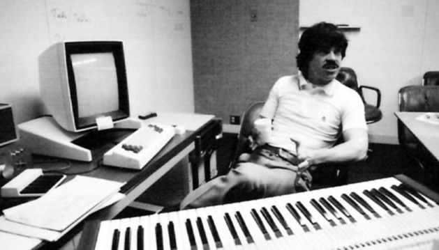
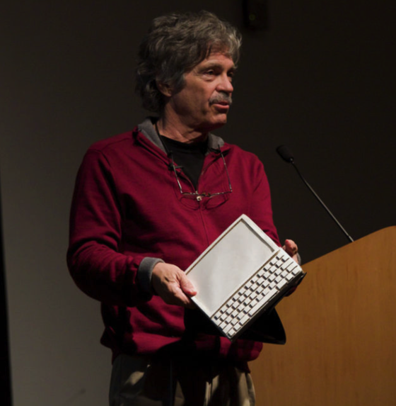

艾伦·凯（Alan Kay，1940年5月17日 - ），美国计算机科学家，他是 Smalltalk 的最初设计者，在面向对象编程和窗口式图形用户界面方面作出了先驱性贡献，2003年获得图灵奖。

艾伦·凯出生在美国马萨诸塞州的 Springfield，1966 年在科罗拉多大学获得数学和细胞生物学的学士学位，1969年在犹他大学获得计算机博士学位。

研究生期间，艾伦·凯参与了Flex（FLEXible Machine）研究项目，这个项目旨在探索和发展新型的计算机系统，以满足不同领域和应用的需求，为用户提供可灵活定制的计算机体验。在二十世纪60年代，计算机通常是庞大而昂贵的设备，被放置在专门的机房中，只有专业人士才能操作。

研究过程中，艾伦·凯 受到美国发明家道格拉斯·恩格尔巴特（Douglas Engelbart，他在二十世纪60年代提出了许多关于人机交互的重要概念和技术，包括鼠标、窗口化界面、超文本等）的影响，提出了 Dynabook 的概念，即一种带有平板式显示屏的小型电脑。这个想法体现了道格拉斯提出的人机交互和信息共享的理念，艾伦·凯认为 Dynabook 应该成为一种工具，能够使个人参与到知识共享和创造中去。虽然艾伦·凯从未实际制造过 Dynabook ，但他有关便携式计算机的想法后来在笔记本电脑和平板电脑中得到实现。

艾伦·凯 在 FLEX 项目研究中，还在灵活的硬件架构、操作系统设计、图形化用户界面等多个方面进行研究和实验。在这个项目中，艾伦·凯 首次提出了面向对象的编程概念。

后来，艾伦·凯 加入了斯坦福大学人工智能实验室（Stanford Artificial Intelligence Laboratory）。在这个实验室，他开始对儿童如何使用计算机产生了兴趣。1972年，他加入施乐公司的帕洛奥多研究中心（Palo Alto Research Center），致力于为教育应用开发第一个面向对象的编程语言「Smalltalk」，Smalltalk 成为了面向对象编程范式发展的先驱，影响了许多编程语言的设计与实现。他同时也参与了以太网、激光打印和客户-服务器架构的相关工作。

艾伦·凯于1983年离开施乐公司，并于1984年成为苹果公司（Apple Inc.）的研究员。他设计的操作系统图形用户界面被应用于 Mac OS，这些工作影响了后来 Windows 的图形化界面发展。

艾伦·凯还曾在迪士尼公司（ 1996 - 2001 ）和惠普公司（ 2002 - 2005）担任研究员。他与巴特勒·兰普森（Butler W. Lampson）、罗伯特·泰勒（Robert W. Taylor）和查尔斯·萨克（Charles P. Thacker）共同分享了 2004 年的 查尔斯·斯塔克·德雷珀奖（Charles Stark Draper Prize），以表彰他们对个人计算机的贡献。

艾伦·凯是计算机科学领域的重要人物，他的创新思想对于现代计算机技术的发展产生了深远的影响。
