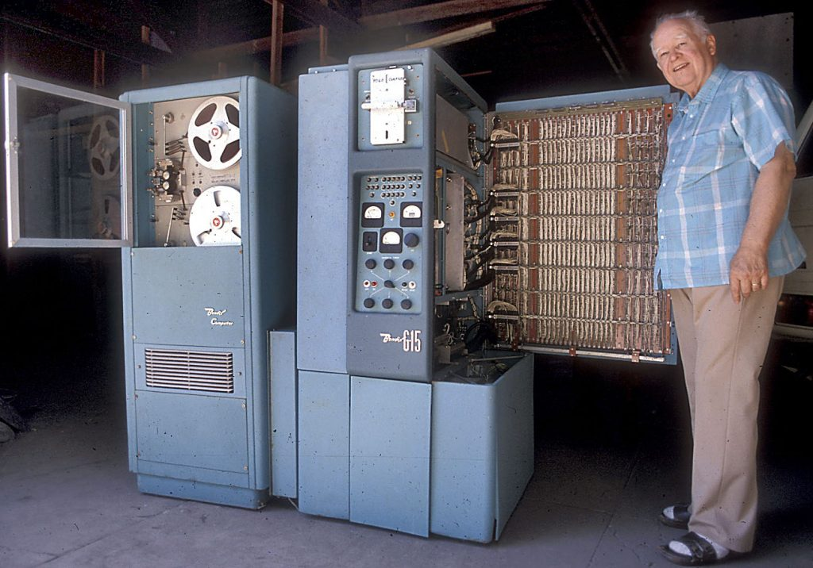
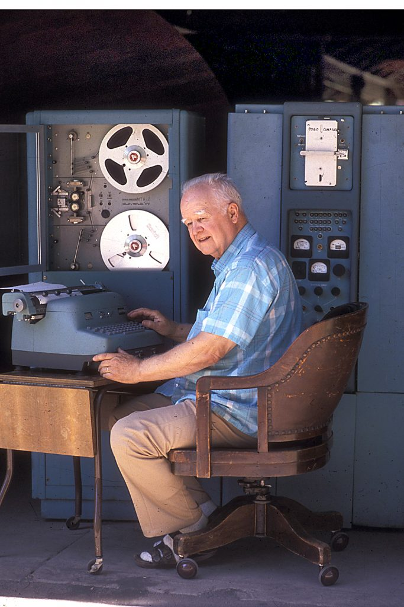

哈利·赫斯基（Harry Huskey，1916年 - 2017年4月9日）是计算机科学领域的先锋人物。赫斯基有很多荣誉，1982年获电气和电子工程师协会（Insitute of Electrical and Electronics Engineers，IEEE）颁发的计算机先锋奖。

哈利·赫斯基出生在北卡罗莱纳州，在他仅18个月大的时候，举家搬到了爱达荷州的一个绵羊牧场。哈利·赫斯基就是在爱达荷的牧场中长大的。

哈利·赫斯基在1937年获得了爱达荷大学的数学和物理学学士学位，1943年获得俄亥俄州立大学数学博士学位。

1945年，赫斯基在宾夕法尼亚大学教授数学，在校期间他兼职参与了摩尔电器工程学院的两个政府项目，一个项目是世界上第一台计算机 ENIAC 的相关工作，另一个是 EDVAC 的相关工作。

1947年，哈利·赫斯基前往英格兰与 [图灵](http://www.edulinks.cn/2021/01/09/20210109-turing/) 一起工作了一年的时间，集中精力研究一种图灵自动计算机的原型（Turing's Automatic Computing Engine computer, ACE）。

1948年，赫斯基加入美国洛杉矶国家标准局（National Bureau of Standards），开始负责设计及建造标准西部计算机（Standards Western Automatic Computer，SWAC）。

哈利·赫斯基还为 Bendix Aviation Corporation 公司设计了 G15 计算机。G15 计算机可以算得上是世界上最早的「个人计算机」，虽然它的尺寸仍有冰箱那么大，但仍是当时为个人使用设计的计算机。1955年，赫斯基在他伯克利的家中放置了一台，1988年他将这台计算机捐赠给了华盛顿的史密森尼学会（Smithsonian Institution）。

1954年到1967年期间，哈利·赫斯基在加州大学伯克利分校担任教职。在这之后，他转到加州大学圣克鲁斯分校（US Santa Cruz）在这里组建了计算机中心，并担任领导职务。在此期间，他还指导了许多国家的大学如何建立计算机学院。

1986年，哈利·赫斯基70岁的时候退休。

> 本文由 [大江小浪](http://edulinks.cn) 根据互联网内容整理而成，转载请注明出处

## 参考资料

1. [Computer History Museum](https://www.computerhistory.org/)
1. [中国计算机历史记忆](https://www.ccf.org.cn/Computing_history/)
1. [“个人电脑之父“ 哈利·赫斯基](https://www.ithome.com/0/305/867.htm)
1. [Harry Huskey](https://harryhuskey.com/)
1. [计算机发展史](https://blog.csdn.net/weixin_30410119/article/details/98408135)
