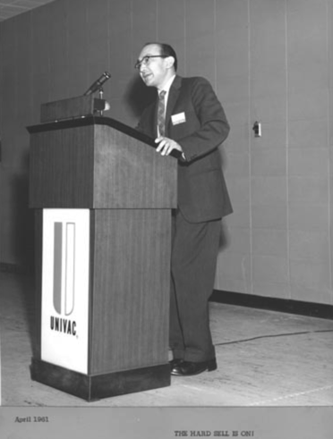

朱传榘（Jeffrey Chuan Chu，1919年7月14日 - 2011年6月6日），美籍华裔计算机科学家，1981年获得 IEEE 颁发的计算机先驱奖。

1919年出生在天津，在中国他获得了上海大学的学士学位。1939年因中日战争影响赴美留学，1942年在明尼苏达大学获得电子工程学士学位（Science in Electrical Engineering），1945年在宾夕法尼亚大学摩尔电气工程学院获得理学硕士学位，福尼尔理工学院的博士学位。

1943年娶了美国妻子，加入美国国籍。

1944年至1948年期间，在宾夕法尼亚大学摩尔电气工程学院担任研究助理。朱传榘参与了第一台电子计算机 ENIAC 的设计，还是工程团队的核心成员之一。

1948年至1950年期间，在里夫斯仪器公司（Reeves Instrument Corporation，冷战期间美国一家雷达和电脑系统制造商）担任高级程序员，致力于 REEVAC 的研究工作。

1950年至1956年期间，在阿贡国家实验室（Argonne National Laboratory）担任高级科学家，帮助设计了几款改进版的大型计算机，包括：AVIDAC 、ORACLE（Oak Ridge Automatic Computer and Logic Engine）、Los Alamos National Laboratory 实验室的 MANIAC。1955年，受 ENIAC 团队的同事 [约翰·埃克特](http://www.edulinks.cn/2021/03/12/20210314-john-eckert/) 邀请，朱传榘来到 Remington Rand（后来成为Sperry Univac）的 Univac 部门工作，主导 LARC（Livermore Automatic Research Computer）相关工作。

1956年至1962年期间，在 Sperry Univac 担任 Dir Engineering。

1962年至1972年期间，在 Honeywell Information System 担任高级经理和总裁助理。

1972年至1974年期间，在王实验室（Wang Laboratories）担任副总裁。

1974年至1977年期间，担任台湾国家科学委员会首席顾问。

1980年至1985年期间，Santec Corporation 公司 CEO。

1986年起担任 Socially Responsible Investment International 的顾问。

1970年，与无锡荣氏家族的荣智珍（1928年 - 2020年，荣宗敬的长孙女，荣鸿元的长女）结婚。随后，随着美国逐渐重新对中国放开，朱传榘将自己的余生投入到了积极参与中国现代化进程中。1978年朱传榘夫妇第一次回国，时任中共中央政治局委员、书记处书记、国务院副总理方毅代表党和政府会见了朱传榘夫妇。1980年朱传榘夫妇受到了邓小平的接见。

作为一名终身学者，朱传榘在中国多所大学担任客座教授，包括上海交通大学、山东大学、南开大学、新疆大学和青岛大学。他策划了上海交通大学管理学院的成立，并帮助促成了该校与宾夕法尼亚大学沃顿商学院的合作伙伴关系。他还设立了一项奖学金，让中国学生有机会在交通大学学习英语。

## 参考资料

1. [Jeffrey Chuan Chu](https://www.computer.org/profiles/jeffrey-chu/)
2. [Jeffrey Chuan Chu](https://www.computinghistory.org.uk/det/66498/Jeffrey-Chuan-Chu/)
3. [百度百科-朱传榘](https://baike.baidu.com/item/%E6%9C%B1%E4%BC%A0%E6%A6%98/1175885)
4. [Jeffrey Chuan Chu](https://prabook.com/web/jeffrey_chuan.chu/168829)
5. [Reeves Instrument Corporation](https://www.ithistory.org/db/companies/reeves-instrument-corporation)
6. [Jeffrey Chuan Chu](https://www.findagrave.com/memorial/194450053/jeffrey-chuan-chu#)
