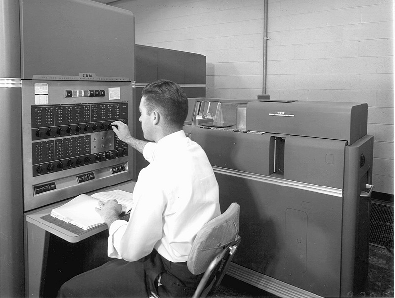

唐纳德·克努斯（Donald Ervin Knuth，1938年1月10日 - ），现代计算机科学的鼻祖。美国著名计算机科学家，美国斯坦福大学计算机系荣誉教授，在计算机领域出版专著17部，发表论文150多篇。撰写了经典巨著《计算机程序设计的艺术》，提出计算机科学技术最基本的两个概念：「算法」与「数据结构」。

> 计算机编程是一种艺术形式，就如同人们谱写诗歌和音乐。
>
> --- 高德纳

高德纳是他的中文名，这个名字是他1977年访华时，香港城大计算机科学系主任、华裔图灵奖得主姚期智夫人姚储枫教授所起。以「高」为姓是因为他体型高大，而且辅音G和K读音接近。「德纳」则与「Donald」相谐，在中文里含有体面高贵之意。姚储枫还为他的爱人和孩子都起了中文名字。

高德纳在其 [个人主页](https://www-cs-faculty.stanford.edu/~knuth/) 仍有持续不断的更新，从这些更新中能看到他对数学的喜爱。从上世纪70年代开始编程后，在他的个人主页上可以看到直到 2022 年仍不断的有代码工程产出。真的是活到老学到老，笔耕不辍，向这样一位伟大的学者致敬。

> I'm gettin' kinda old: now nearly one-third of a byte (256÷3). My age is a beautiful binary palindrome, also the product of two Fermat primes!

## 生平

高德纳1938年1月10日出生于威斯康星州密歇根湖畔的密尔沃基（Milwaukee），「人工智能之父」、诺贝尔奖获得者西蒙（H.A. Simon）也是在这里出生的。高德纳的父亲当过小学和中学教师，星期天在教堂演奏风琴。受父亲的影响，高德纳从小就喜欢学习和音乐。

1956年高德纳进入俄亥俄州克利夫兰的开思理工学院（Case Institute of Technology，后来与 Western Reserve University 合并为 Case Western Reserve University，1963年成为美国第一家开设计算机工程教学的学院）学习物理。

大学一年级的暑假，高德纳在学校打工，负责把统计数字画成图表。碰巧他办公室的隔壁就是计算机房，当时刚到了一台 IBM 650。当时的计算机体积都很庞大，有输入和调试的控制台，上面排列着一排排的开关和指示灯，计算机工作时指示灯闪烁变化出不同的图案，这引起了高德纳极大的好奇与兴趣，他连接好几天彻夜不眠地待在机房，观察它的工作，钻研使用手册，探究计算机的奥秘。

一年后，高德纳改学数学，这段经历对于高德纳是如此重要和关键。他的第一个应用程序也是在 IBM 650 上实现的，他为所在学校的篮球队设计了一个复杂的公式，根据球员在每场比赛中的得分、助攻、抢断、篮板球、盖帽等多项统计数字对球员进行综合评估，球队教练根据高德纳的程序挑选和使用球员。

1960年，高德纳毕业，他不仅获得了学士学位，学校还破例授予他硕士学位。同年，他进入加州理工学院研究生院，1963年获得博士学位，留校工作至1968年。随后转入斯坦福大学任教，1972～1973年间曾经在奥斯陆大学担任客座教授。

## 成就

## 参考资料

1. [高德纳的个人主页](https://www-cs-faculty.stanford.edu/~knuth/)
2. [算法鼻祖高德纳，82 岁仍在写《计算机程序设计的艺术》](https://baijiahao.baidu.com/s?id=1669654209014638318&wfr=spider&for=pc)
3. [百度百科-高纳德](https://baike.baidu.com/item/%E5%94%90%E7%BA%B3%E5%BE%B7%C2%B7%E5%85%8B%E5%8A%AA%E7%89%B9/1436781?fr=ge_ala)

