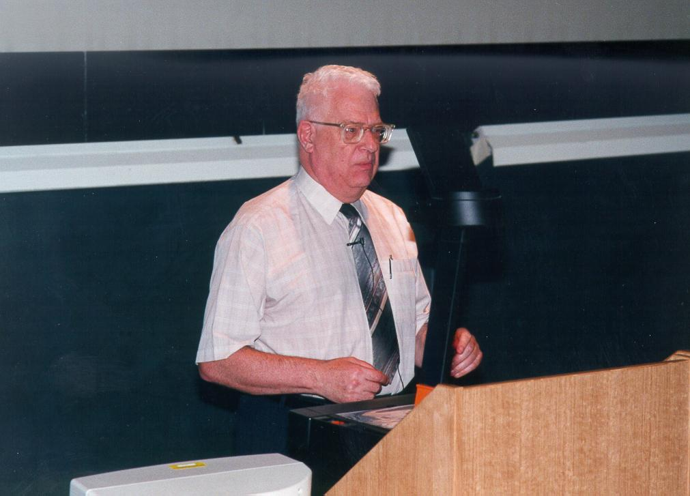

大卫·惠勒（David Wheeler，1927年2月9日 - 2004年12月13日），英国计算机科学家，子程序跳转共同发明人，实现了首个汇编器。

> 在计算机科学中，没有什么问题是不能通过增加一个中间层来解决的，但这通常会产生新问题。—— 大卫·惠勒

## 生平

1927年出生在伯明翰，是众多因为二次大战而从城市中疏散出来的孩子之一。

1945年，惠勒获得剑桥大学三一学院的数学学士学位（Trinity College）。在校期间，莫里斯·威尔克斯主办了学校的数学实验室，并且正在研究制造世界上第一台存储程序式电子计算机（EDSAC）。1947年惠勒加入了威尔克斯的学习小组，并且成为实验室的第二个毕业生。1951年惠勒还成为实验室第一个取得博士学位的学生。

获得博士学位后，惠勒段在在伊利诺伊大学参与 Ordvac 和 Illiac 相关的工作。

1953年，惠勒回到剑桥大学开始发展计算机教学，他是世界上设置计算机科学这个专业后的第一批教师。他的许多学生后来都在大型计算机公司担任高级职位，或者对计算机科学做出了重大贡献。回校后，当时 EDSAC 2 大部分的开发工作已经完成，惠勒仍很快的在计算机的编程系统和指令集部分的工作中担任了关键角色。

1964年，惠勒在剑桥大学继续参与 Titan 计算机的相关工作，在计算机网络、数据压缩和计算机安全方面，他贡献了非常多的努力。

1970年他被选为英国计算机学会的研究员，1981年他成为最早被选为皇家学会研究员的计算机科学家之一。1985年，电气与电子工程师协会授予他「汇编语言编程」先锋奖，还被任命为计算机历史博物馆研究员。

1994年退休，退休后继续在剑桥计算机实验室工作，是实验室的活跃成员。

## 成就

他是剑桥大学 EDSAC 「Electronic Delay Storage Automatic Computer」团队的成员，负责计算机的指令系统，他当时所做的创新仍是现代计算机编程的基础。通过他发明的「initial orders」，人们就能够以简单语言，而不是二进制命令的方式向 EDSAC 发送指令，这也被称为第一种「汇编语言」。1949年3月，惠勒开发的程序第一次在 EDSAC 上运行。

惠勒还意识到在编程过程中，有些代码会被经常性使用，他实现了子程序，并且将经常食用的子程序保存在单独的库中。他还开发了「Wheeler Jump」，能够将程序的控制权转移给子程序，这是「GOTO」的先驱。

## 参考资料
1. [搜狐 - 历史上的今天](https://www.sohu.com/a/521605971_115128)
2. [David Wheeler](https://www.computer.org/profiles/david-wheeler)
3. [莫里斯·威尔克斯](https://baike.baidu.com/item/莫里斯·威尔克斯/7398080?fr=ge_ala)