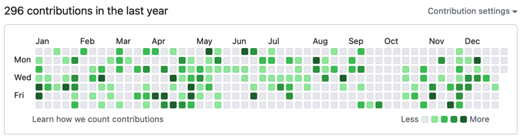
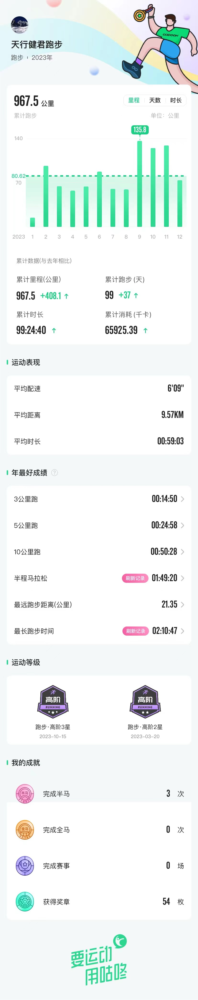

2023年，北京的冬天特别寒冷，雪下的好大好大，持续的时间还特别特别的长。极端的低温，长时间的降雪甚至引发了地铁线路的追尾，个人感觉这在北京地铁交通历史上，应该是第一次。

远在欧洲的俄乌冲突已经不是人们谈论的焦点，因为滴滴前所未见的故障而打不上车才是迫切需要关心和解决的事情。不知不觉，移动互联网扎根我们的生活已经有十多年的时间，对稳定性的依赖成了自然，一些些业务连续性上的意外竟可能影响成千上万家庭的生活。一个系统一天不出问题不难，一个系统一直不出问题，那还是比较难的。毕竟保障这个系统正常运转的，是另外一个非常复杂的协作系统。

2023年整个社会的形式发生了一些变化，身处其中并不能给出全局性和有结论性的意见，也许十几年之后回头看，2023年是一个很重要的转折点。

闲话少说，还是按照去年的模板来做一下总结。

## 撸过的代码

对比 2022 年的提交，今年可以说是为了完成任务提交的一年。中间有国庆期间的两周开了天窗，提交的次数比去年少了将近一半。今年在家投入的时间相对较多，可能是影响提交次数的一个主要因素，毕竟在工作、爱好之外，还需要先有一个稳定、和谐的家庭环境。

既然 2023 已经将要过去，展望未来，在 2024 新的一年中，要十分的投入到代码编写、博客输出的工作中，争取全年的提交能够到 600 次。

## 读过的书

按照完成的先后顺序，列出 2023 年完成的书目：
* 一个革命的幸存者：曾志回忆录
* 沙丘2：沙丘救世主
* 电视人
* 大格局视野中的井冈山
* 自己动手写Java虚拟机
* 旧制度与大革命
* 从零开始做运营2
* 儿童教育心理学
* Spring Boot整合开发实战
* 底层逻辑
* Puppet 实战

总共11本，居然与 2022 年一模一样。回顾 2023 年，认真思考自己真的很喜欢读书么？感觉还是花费了不少的时间在论坛、朋友圈、短视频等一些快速消费的内容上。能安安静静地读书感觉真的很好，能摒弃快速消费内容的吸引也真的需要一些定力。

2024年的 Flag，希望能够读至少 20 本书。

## 跑过的路

跑步，我觉得对我来说已经成为了一件最简单的事情。因为跑步的时候，不需要考虑太多的逻辑、太多的影响因素，只需要做两件事情，先迈出左腿、接着迈出右腿，不停的重复这两个动作就可以。

今年跑了3个半程马拉松，创造了一次个人最好记录。希望明年能够健康的跑下去，争取完成一次全程马拉松。

## 写在最后

每年习惯性的在1月1日前对过去做一个简单的总结，有的目标可以完成、有的目标则略有遗憾，之前的计划我经常会给自己定很多的目标，结果实际执行效果并不好。

后来我有点明白，目标越多越不能够实现。就像走路一样，应当始终朝着一个方向，只要坚持、努力，回过头来看，这样走的反而是最远的。

因此从前年开始，每年的总结基本上都只回顾这三项指标，分别代表了工作、学习和健康，其他的事、其他的指标，应当释然面对，不知是否和我有同样感想的小伙伴，欢迎通过公众号共同交流成长。