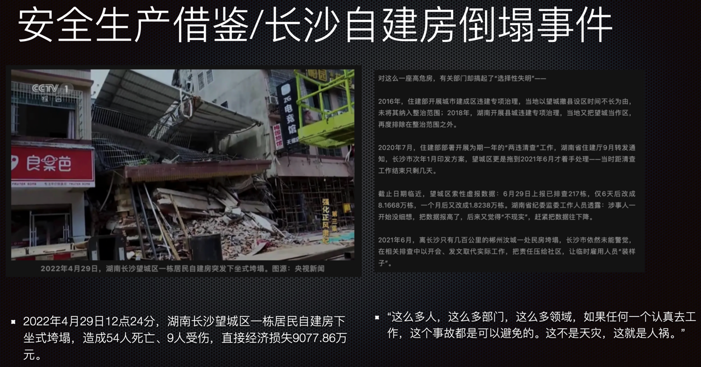

信息系统发生故障的事情每年都有，运维的职责与使命就是让信息系统的故障越少越好，故障发生后恢复的越快越好，对过往的事故进行盘点分析，往往能够给运维人员带来更好更快的提升，本文整理梳理了2023年发生的一些比较重大的信息系统故障，与大家一同分析学习。

## 0329 唯品会

故障时间段：2023年3月29日 00:14 ~ 12:01

故障原因：唯品会南沙机房冷冻系统故障导致机房设备温度快速升高宕机

故障影响：线上商城停止服务，影响客户约800万，损失超亿元

总结分析：个人猜测在这起事故中，唯品会可能也是一个受害者。通过查询南沙机房关键词，发现这是一个运营商的机房，当天冷冻系统故障也同样导致了腾讯相关的业务受到影响。对于唯品会来说，生产系统设备集中在一个机房内，没有考虑跨楼宇、跨园区、跨城市的灾备方案可能是最主要的问题。话说回来，灾备建设意味着成本的极大投入，对于体量不如阿里、腾讯这类大厂的企业来说，如何平衡风险和成本，是每位业务连续性负责人需要考虑的重要问题。

## 0608 广州电信

故障时间段：2023年6月8日 14:18 ～ 17:50

故障原因：未明确披露

故障影响：广州全省范围的电信移动、固网用户受到不同程度的影响。

总结分析：在收集资料的过程中，也看到了其他年份电信运营商发生过几次全省范围的故障，猜测对于某个省的运营商服务来说，应该也是有一些关键的服务可能会影响全局的系统或用户。在系统架构设计过程中，有全局的服务或者控制点能给架构带来很多的便利，随着系统用户规模、部署规模逐渐变得庞大的时候，这种便利性就隐藏着故障后影响全局的风险。实际上，没有什么架构是可以一劳永逸解决所有问题的，一定需要根据系统运行的情况，敏锐的根据各类监控、运营指标来进行对应的调整。

## 1112 阿里云

故障时间段：2023年11月12日 17:44 ～ 21:11

故障原因：与某个底层服务组件有关

影响：淘宝、钉钉、阿里云盘、阿里云等多个系统无法访问或使用

总结分析：阿里云故障复盘的文章有很多，原因应该就是阿里系产品依赖的认证 ak、sk 出了问题，这个事件从外部能够获取的材料来看故障原因相对比较高级一点。在认证这个点上，针对0608电信的故障也分析了，是很容易造成全局性故障的隐患点，想必阿里的工程师在变更的时候也是非常谨慎的，然而百密终有一疏。幸亏是发生在双十一之后，如果赶上双十一，那后果可就不堪设想了。

## 1127 滴滴

故障时间段：2023年11月27日 晚间 ～ 次日晚间

故障原因：底层系统软件发生故障

影响：滴滴网约车、骑行业务无法使用

总结分析：滴滴的变更做的比较晚，但还是影响了不少下班人的归程。并且虽然做了切换恢复，却没有做好容量评估，以至于一些人在月底失去了全勤奖励。

以上是互联网、运营商在2023年发生的几个典型生产事件，初次之外一些券商、银行也都发生过大大小小的信息系统故障。

运维的目标是确保系统安全稳定的运行，而运行过程中的故障可能是无法避免的，只能运用一切可以运用的手段尽量的预防故障的发生、减小故障发生的概率、在故障发生之后能够快速的止损并且恢复，将故障的影响降低到最小。

我把2023年的生产事件做成了一份PPT在内部团队的会议上作了分享，同时也借鉴了2022年长沙市望城区一处自建房倒塌的安全事件来提醒各位运维同仁，安全生产要想在前、做在前。

最后借用希腊哲学家赫拉克利特的一句话「Change is the only constant in life.」，希望各位运维的变更在2024年绝不出错。

如果想获取这份PPT，欢迎大家关注公众号并留言「事件分析」获取。

## 参考资料
1. [2023年中国互联网故障总结之九大故障](https://zhuanlan.zhihu.com/p/676762009)
2. [损失超亿元！唯品会宕机事件公告：客户达800多万，负责人免职](https://xueqiu.com/5562662030/252433850)
3. [腾讯微信、QQ凌晨多个功能异常！朋友圈、支付用不了 官方回应](https://www.chinaz.com/2023/0329/1510420.shtml)
4. [被工信部约谈，腾讯还没做好成为国民应用的准备。](https://zhuanlan.zhihu.com/p/623991415)
5. [广东省内电信网络罕见断网5小时，原因或与核心模块故障有关](https://baijiahao.baidu.com/s?id=1768296993374331471&wfr=spider&for=pc)
6. [广东电信全网故障，官方回复来了](https://new.qq.com/rain/a/20230609A07LWS00)
7. [2023.11.12阿里云发生故障经工程师紧急处理，已全面恢复，你怎么看?](https://www.zhihu.com/question/629947693/answer/3307887852?utm_id=0)
8. [3月21日宕机造就牛市](https://zhuanlan.zhihu.com/p/615760915)
9. [因“619”交易系统宕机事件，中信证券年内收第三张罚单，首席信息官也被警示](https://baijiahao.baidu.com/s?id=1778081247627295184&wfr=spider&for=pc)
10. [突发！系统崩溃，券商紧急回应](https://www.163.com/dy/article/IMGO5MRV0530NLC9.html)