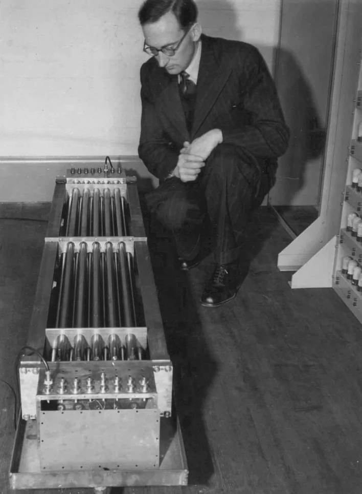

莫里斯·威尔克斯（Maurice Wilkes，1913年6月26日 - 2010年11月29日），英国计算机科学家，设计和制造了世界上第一台存储程序式电子计算机 EDSAC，1967年获得图灵奖。

1913年出生在英格兰的 Worcestershire，出生地距离伯明翰仅20公里。他的父亲是 Dudley 伯爵的管家，后来他们搬到 Stourbridge 居住，他的母亲是一名全职家庭主妇。

十几岁的时候，他读了《无线电世界》并做了晶体管实验，这对于他后来制造计算机有很大帮助。1931年，他进入剑桥大学圣约翰学院学习数学，1934年获得学士学位、1937年获得博士学位。

1935年，他成为卡文迪许实验室（Cavendish Laboratory）的研究生，他从事无线电波在电离层中传播的实验研究，他对大气潮汐运动很感兴趣，他的第一本书就是关于这个主题的。这也导致了他对计算方法的兴趣。1945年服完兵役后，他回到剑桥，成为其计算机实验室的负责人，当时被称为数学实验室。

1946年夏天，威尔克斯博士在费城参加了著名的摩尔学校电子计算机讲座。回到英国后，他带领一个小团队开发了EDSAC。当它在1949年投入使用时，它成为了世界上第一台实用的电子存储程序数字计算机。1951年，他与两位同事出版了《电子数字计算机程序设计》，这是最早的计算机编程书籍之一。此时，他提出了微程序设计系统的建议，后来这一建议在工业中得到了广泛应用。1965年，他发表了一篇关于高速缓冲存储器的论文，随后又出版了一本关于分时系统的书。

1974年，莫里斯·威尔克斯断定，基于计算机技术的更宽带宽网络将取代基于传统电信技术的局域网的时候已经到来。被称为“剑桥环”的设计研究于1975年发表。剑桥模型分布式系统是一个开创性的客户端-服务器系统，就是基于这个环的。

自1980年以来，威尔克斯博士一直在工业界工作，先是在马萨诸塞州的数字设备公司，然后是英国剑桥的奥利维蒂和甲骨文研究实验室，在那里他担任研究策略的员工顾问。他是英国计算机学会的杰出研究员、皇家学会的研究员和皇家工程学院的院士。他是美国国家科学院和美国国家工程院的外籍院士。他还是美国艺术与科学学院的外籍荣誉成员。他曾获得1992年京都先进技术奖。

## 参考资料
1. [1967年图灵奖得主-莫里斯·威尔克斯](https://blog.csdn.net/liyong_zhang/article/details/5632698)
2. [Maurice V. Wilkes](https://ethw.org/Maurice_V._Wilkes)
3. [百度百科-莫里斯·威尔克斯](https://baike.baidu.com/item/%E8%8E%AB%E9%87%8C%E6%96%AF%C2%B7%E5%A8%81%E5%B0%94%E5%85%8B%E6%96%AF/7398080)
4. [MAURICE V. WILKES 1913-2010](https://www.nae.edu/19579/19581/51314/52598/189736/MAURICE-V-WILKES-19132010)