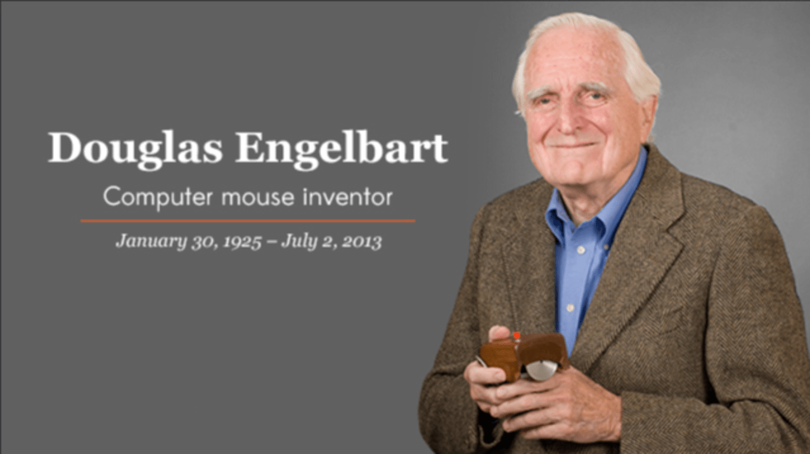
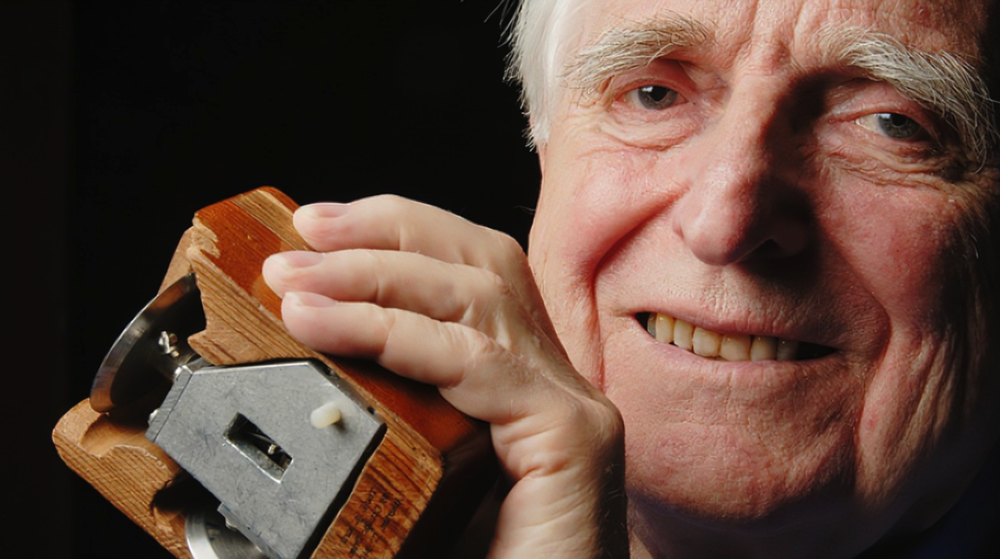

道格拉斯·恩格尔巴特（Douglas Engelbart，1925年1月30日 - 2013年7月2日），美国发明家，1997年图灵奖得主，被誉为计算机界的先驱和创新者。

## 人物生平

道格拉斯·恩格尔巴特（Douglas Engelbart）1925年1月30日出生在美国俄勒冈州，成长于美国大萧条时期，他的父亲是一名电气工程师，而他在青少年时期也展现出对工程和科技的浓厚兴趣。

恩格尔巴特于1942年高中毕业，随后在俄勒冈州立大学学习电气工程，在那里他接受了雷达技师的培训，并于1944年被征召入伍（二战）。雷达培训引发了恩格尔巴特对技术的着迷，在他后来的职业生涯起到了非常重要的作用。1944年到1946年期间，恩格尔巴特在海军服役，并在菲律宾海前线、马尼拉湾驻扎了一年。在那里，他阅读了 [范内瓦·布什](http://www.edulinks.cn/2021/02/27/20210228-vannevar-bush/) （Vannevar Bush）的《我们可能如何思考》一文，这对他的后期工作产生了重要影响。

战争结束后，他回到俄勒冈州科瓦利斯的大学，完成了电气工程学位。他于1948年毕业，然后在加利福尼亚州的埃姆斯海军研究中心工作，在那里工作了3年。1953年获得加州大学伯克利分校电子工程专业硕士学位，1955年获得加州大学伯克利分校获得电子工程博士学位，1955年至1956年担任加州大学伯克利分校电子工程助理教授，1957年之后进入斯坦福研究所工作（SRI，现为 Stanford Research International），斯坦福研究所为恩格尔巴特的人类智力研究中心（Research Center for the Augmentation of Human Intellect）提供了足够的环境支持。

1963年至1964年间，道格拉斯·恩格尔巴特致力于开发创新技术，其中最着名的便是鼠标的发明。作为当时实验的目的是找到一种更好的方式在显示屏上指向和点击。最初制造的鼠标有一个雕刻的木制外壳和一个按钮，后来的一个型号有三个按钮。还有很多现在大家熟知的技术，诸如集成电子邮件、显式编辑、窗口、跨文件编辑、超媒体、共享屏幕远程会议等等创新方式都是在这个中心研究出来的。

1967年初，恩格尔巴特的实验室成为了ARPANET（互联网的主要前身）的第二个站点。1968年12月9日，在旧金山举行的一次计算机会议上，恩格尔巴特演示了一种正在运行的实时协作计算机系统，即NLS（oN-Line System）。他和一位同事在一个窗口中使用键盘和鼠标输入共同处理一份共享文档，同时在另外一个窗口参加视频会议。

恩格尔巴特继续他的研究，构建了越来越复杂的输入和显示设备，并改进了图形用户界面。他坚信通过人与计算机、工具系统与人类系统之间的协作与进化，将最终会引发整个社会产生质的变化。他始终坚持以人为中心的设计，通过技术工具的创新来不断增强人类的能力。

曼斯菲尔德修正案、越南战争的结束以及阿波罗计划的结束导致ARPA和NASA减少了对他的资助。SRI的管理层不理解他正在尝试完成什么，于是在1976年解雇了他。1977年，SRI将恩格尔巴特的NLS小组件系统卖给了电话网络公司Tymshare。Tymshare将其更名为Augment，并试图使其成为一种商业可行的办公室自动化系统。恩格尔巴特是研究实验室中最后一名成员，由于 SRI 对他的工作不再感兴趣，因此他加入了 Tymshare。1984年，Tymshare 被麦克唐纳道格拉斯公司收购，恩格尔巴特在那里从事信息系统方面的工作。

1989年，他成立了Bootstrap研究所，这是一家研究和咨询公司。在接下来的十年里，他终于开始因为自己的创新而受到认可。1996年他获得了尤里·鲁宾斯基纪念奖；1997年他获得了莱梅尔森-麻省理工学院奖，这是世界上对发明和创新的最大单项奖，以及图灵奖。1999年，来自未来研究所的保罗·萨福在斯坦福大学的纪念礼堂主持了一场大型研讨会，以纪念恩格尔巴特和他的思想。

2000年，这位科学家被比尔·克林顿总统授予国家技术和创新奖章，该奖章表彰了恩格尔巴特在“创造个人计算的基础，包括基于阴极射线管显示器和鼠标的连续实时交互、超文本链接、文本编辑、在线期刊、共享屏幕电话会议和远程协作工作”方面的工作，这些创新对当今计算机科学领域的发展产生了深远影响。

## 人物成就

- **发明鼠标**：道格拉斯·恩格尔巴特是鼠标的发明者之一，他在1968年的“母体演示”中首次展示了鼠标，该技术后来被广泛应用于计算机系统中。

  在鼠标发明之前，人与计算机交互是通过键盘或打孔卡以符号形式输入的。而鼠标发明后，允许人们直接在计算机环境操作元素，鼠标改变了以往键盘或打孔卡的中介角色，跨越了人与计算机之间的物理边界，将人类的手部运动扩展或增强为操作数字媒体的能力。

- **超文本概念**：恩格尔巴特提出了超文本的概念，这种非线性文本结构对互联网的发展具有重大影响，为今天常用的网页浏览器奠定了基础。

- **图形用户界面**：他还提出了图形用户界面（GUI）的概念，这种直观的用户界面设计为计算机操作带来了革命性的变化，使得计算机更易于使用和交互。

## 人物趣事

- 道格拉斯·恩格尔巴特对未来计算机技术的发展充满激情和远见，他坚信计算机的潜力可以帮助人类更好地解决问题和提高效率。

- 他建立了斯坦福研究所的人机交互实验室，并致力于推动计算机技术的发展，为人类创造更智能、更有益的工具。

通过道格拉斯·恩格尔巴特的努力和创新，计算机科学领域得到了巨大的推动和发展，他被视为计算机科学的伟大先驱之一，留下了不可磨灭的影响。

道格拉斯·恩格尔巴特的生平充满传奇色彩，他作为计算机科学领域的先驱之一，开创了许多创新技术和思想，对整个行业产生了深远影响。他的精神和成就将继续激励着后继者，推动科技的持续发展和进步。

## 参考资料
1. [Douglas Engelbart | Inventor of the Computer Mouse | Britannica](https://www.britannica.com/biography/Douglas-Engelbart)
2. [Douglas Engelbart, Inventor of Computer Mouse, Dies at 88](https://www.pcmag.com/news/douglas-engelbart-inventor-of-computer-mouse-dies-at-88)
3. [DOUGLAS ENGELBART](https://amturing.acm.org/award_winners/engelbart_5078811.cfm)
