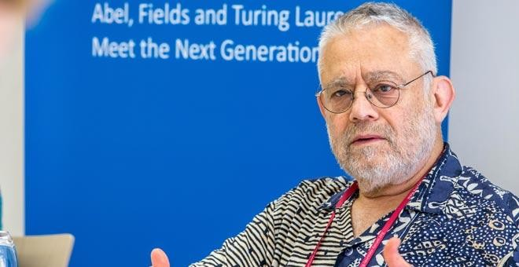

曼纽尔·布鲁姆（Manuel Blum，1938年4月26日 - ）是密码系统和程序检验先驱，计算复杂性理论的主要奠基人之一，1995年因在密码系统和程序检验领域的贡献获得图灵奖，2020年被聘为北京大学访问讲席教授。

## 计算复杂性理论

我们先来了解下什么是计算复杂性理论，这是一门研究计算问题难度和效率的学科，是现代理论计算机科学中最重要的分支之一，它研究各种问题类在计算时所需要消耗的时间、空间等资源的多少。

什么样的问题类是可计算的？这是数学、数理逻辑学和早期计算机科学所关心的一个重要问题。为了回答这个问题，可以给出一个计算的模型，然后规定，凡是这个模型能计算的问题类就叫作可计算的，否则就叫作不可计算的。于是产生了各种计算的模型：图灵机、递归函数、λ 演算、马尔可夫算法和递归算法等。但是，会不会有一类问题，在一个模型中是可计算的，而在另一个模型中却是不可计算的呢？如果这样，一个问题类的可计算性就依赖于模型，而不是问题类本身的性质了。著名的丘奇－图灵论题回答了这个问题。这个论题说：“凡是合理的计算模型都是等价的，即一个模型能算的问题类别的模型也能算，一个模型不能算的别的模型也不能算。”这个论题不是一个严格的命题，无法给于一般的证明，但可以对一个个具体的模型去验证它的正确性。但是，对于一个问题类，只知道它能否计算还很不够，更有实际意义的是要知道计算起来要耗费多少时间，要用多大的空间来存储计算的中间结果等等。为了回答这些进一步的问题，就产生了计算复杂性理论。

## 人物介绍

1938年4月26日出生于委内瑞拉首都加拉加斯。

1959年获得麻省理工学院电气工程学士学位，1961年获得硕士学位，1964年获得数学博士学位。60年代初，计算机已经开始用于解决商业和科学领域的各种问题。解决问题的算法会消耗资源，包括运行所需的时间、使用的内存量、消耗的能量等。人们一直在探索有没有更快的算法，例如使用 MergeSort、QuickSort 或类似的排序算法对计算机内存中的 n 个数字进行 n 个数字的排序，并进行 n 个对数 n 次比较。但是当时评估算法需要考虑各种各样的机器模型和配置，布鲁姆在他的导师马文·明斯基（Marvin Minsky）指导下，在博士论文中发展出一种独立于机器的复杂性理论，该理论是所有复杂性理论的基础。

毕业后，布鲁姆加入了加州大学伯克利分校的计算机科学系，并在那里工作了35年。他带的博士生 Len Adleman 和 Ron Rivest、Adi Shamir 共同发明了 RSA 算法。

1999年，卡内基梅隆大学成功招募了布鲁姆和他的妻子 Lenore，这其中一个重要的原因是他们能和自己的儿子一起并肩工作，三人合作开展了多个计算机科学项目。

2000年，雅虎公司联系卡内基梅隆大学的计算机科学系，希望能够有一种方法帮网站区分是真正的用户在访问网站还是爬虫访问，布鲁姆接受了这个任务并最终完成了 CAPTCHA 这个产品，而且随着计算机自动识别技术的发展，CAPTCHA 使用了更多的方法来识别是不是真正的人类用户，包括扭曲、图片等等。

布鲁姆先生是北京大学的访问讲席教授，还开设了「有意识的图灵机」[课程](https://cfcs.pku.edu.cn/english/news/240076.htm)。

## 参考资料

1. [北京大学前沿计算研究中心](https://cfcs.pku.edu.cn/people/visiting_chair_professors/manuelblum/index.htm)
2. [MANUEL BLUM ](https://amturing.acm.org/award_winners/blum_4659082.cfm)
3. [计算复杂性理论（理论计算机科学分支学科）](https://baike.baidu.com/item/计算复杂性理论)
4. [可计算性理论与复杂性介绍-腾讯云开发者社区-腾讯云 (tencent.com)](https://cloud.tencent.com/developer/article/1524801)
5. [知乎-计算复杂性理论是否具有足够的现实意义](https://www.zhihu.com/question/461796231/answer/1909765916?utm_source=zhihu&utm_medium=social&utm_oi=30102830186496)
6. [Manuel Blum](https://www.britannica.com/biography/Manuel-Blum)
