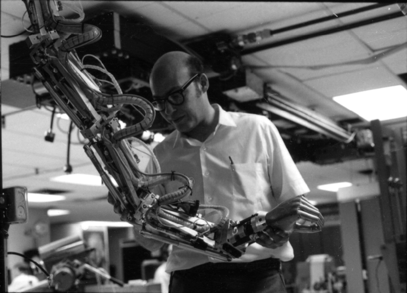

马文·明斯基（Marvin Lee Minsky ，1927年8月9日 - 2016年1月24日），美国数学家和计算机科学家，人工智能之父和框架理论的提出者，因在人工智能方面的开创性工作获得1969年图灵奖。

明斯基1927年8月9日出生于纽约市的一个眼科医生家庭。高中毕业后1944年至1945年在美国海军服役。1946年进入哈佛大学主攻物理，后又改修数学。1950年毕业后进入普林斯顿大学，1951年与同学一起建造了「世界上第一台神经网络计算机」，并将其命名为 SNARC（Stochastic Neural Analog Reinforcement Calculator），目的在于学习如何穿过迷宫。明斯基并在SNARC的基础上解决了使机器基于对过去行为的知识预测其当前行为的结果这一问题，并以“神经网络和脑模型问题”为题完成了他的博士论文，1954年取得博士学位。

博士毕业后，明斯基回到哈佛大学研究员协会（Society of Fellows）。

1957年，明斯基前往麻省理工学院（MIT），追求他对使用计算机建模和理解人类理想的兴趣。当时在麻省理工学院的约翰·麦卡锡（John McCarthy）也对人工智能感兴趣，麦卡锡还发明了 LISP 编程语言，同时在分时计算机系统开发中做出了贡献。1959年，明斯基和麦卡锡共同创立了人工智能项目（现在为麻省理工学院计算机科学和人工智能实验室，MIT Computer Science and Artificial Intelligence Laboratory，[CSAIL]([Home Page | MIT CSAIL](https://www.csail.mit.edu/))） 

明斯基将人工智能定义为：「the science of making machines do things that would require intelligence if done by men.」。1975年，他提出了框架理论（frame theory）概念，以精确识别在考虑特定方向之前必须编程到计算机中的一般信息。例如，如果一个系统必须在一系列由门连接的房间中导航，明斯基建议框架需要阐明门的相关可能性范围 - 换句话说，孩子在面对门时所承担的所有常识性知识：门可以在铰链上向任何方向摆动。 门可以打开和关闭，并且在推或拉开门之前可能必须转动门把手。在人工智能研究人员中，框架被证明是一个丰富的概念，尽管将其应用于高度复杂的情况已被证明是困难的。

明斯基的其他发明包括机械臂、手和其他机器人设备、共聚焦扫描显微镜、 用于音乐变奏的“缪斯”合成器（与 E. Fredkin 合作）等。

明斯基的主要著作包括《感知器：计算几何导论》（1969）、《心灵社会》（1985）、《情感机器》（The Emotion Machine，2006）。

明斯基在麻省理工学院度过了整个的职业生涯，2016年在波士顿逝世。

## 参考资料

1. [马文·明斯基_百度百科 (baidu.com)](https://baike.baidu.com/item/马文·明斯基/7398340)
1. [王飞跃 | 纪念一位真正的科学思想家：人工智能之父马文·明斯基 - 知乎 (zhihu.com)](https://zhuanlan.zhihu.com/p/20641727)
1. [马文·明斯基为什么被称为人工智能之父？ - 知乎 (zhihu.com)](https://zhuanlan.zhihu.com/p/42025213)
1. [Marvin Minsky | AI Pioneer, Cognitive Scientist & MIT Professor | Britannica](https://www.britannica.com/biography/Marvin-Lee-Minsky)
1. [盘点：全球顶尖学府的AI实验室（上篇） - 知乎 (zhihu.com)](https://zhuanlan.zhihu.com/p/33487921)
1. [马文·明斯基 ( Marvin Lee Minsky ) —— 1969年图灵奖获得者 - 知乎 (zhihu.com)](https://zhuanlan.zhihu.com/p/47229337)
1. [Marvin Minsky's Home Page (mit.edu)](https://web.media.mit.edu/~minsky/)

