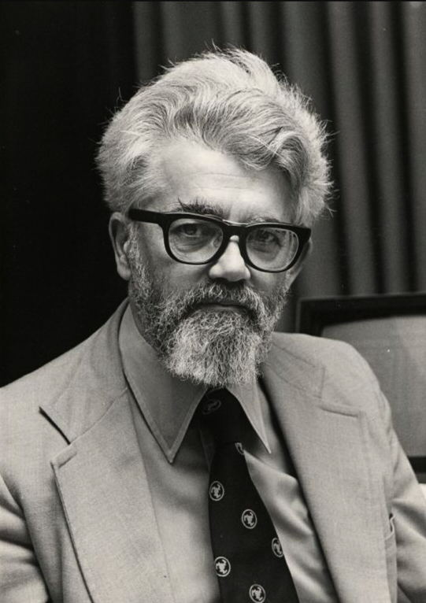

约翰·麦卡锡（John McCarthy，1927年9月4日 - 2011年3月24日）美国计算机科学家，LISP 编程语言的创作者之一，

是一位杰出的计算机科学家，他的贡献在人工智能领域尤为突出。他生于1927年，于2011年离世，他的一生充满了对计算机科学的热情和创新。

McCarthy在他的职业生涯中做了许多令人瞩目的成就。他是人工智能领域的先驱之一，被誉为“人工智能之父”。他最著名的贡献之一是他于1956年提出的术语“人工智能”，并组织了达特茅斯会议，这是人工智能领域的里程碑事件之一。这次会议聚集了来自各个领域的科学家，为人工智能的发展奠定了基础。

除了提出“人工智能”这一概念外，McCarthy还是Lisp编程语言的发明者之一。Lisp成为了人工智能领域中最重要的编程语言之一，被广泛用于机器学习、自然语言处理等领域。他的工作对于人工智能的发展产生了深远的影响，为后来的研究和应用奠定了基础。

除了在学术界的贡献外，McCarthy还对计算机科学的教育和社会影响产生了重要影响。他曾任教于斯坦福大学，培养了许多优秀的计算机科学家。他的影响力不仅仅在于他的学术工作，还在于他对计算机科学社区的领导作用和对未来科技发展的愿景。

总的来说，John McCarthy是一位伟大的计算机科学家，他的成就在人工智能领域尤为突出。他的贡献不仅体现在学术研究上，还体现在他对教育、社会的影响力。他的工作为人工智能的发展铺平了道路，为我们理解和利用人工智能技术提供了重要的基础。

> 这是我整理的计算机名人录系列的第34篇文章。互联网的百科、搜索功能，以及人工智能无比强大的对答功能，让整理这些资料看起来价值不大。而对于我个人来说，整理这些前人资料的过程，正是一个对于计算机科学发展，对于计算机历史发展梳理的过程。通过这样的梳理，能够发现这些人物之间很多的师生关系、同事关系，从而对科技发展的走势有了一些独到的认识。
> 整理、记录这些资料，不单单是一个重复造轮子的过程，还希望能将自己对于计算机科学的一些认识记录下来、分享出来，能够结识一些同样对于这段历史感兴趣的人，共同交流探讨，足矣。

## 参考资料

1. [How John McCarthy Shaped the Future of AI (allganize.ai)](https://blog.allganize.ai/john-mccarthy/)
2. [John McCarthy | Biography & Facts | Britannica](https://www.britannica.com/biography/John-McCarthy)

