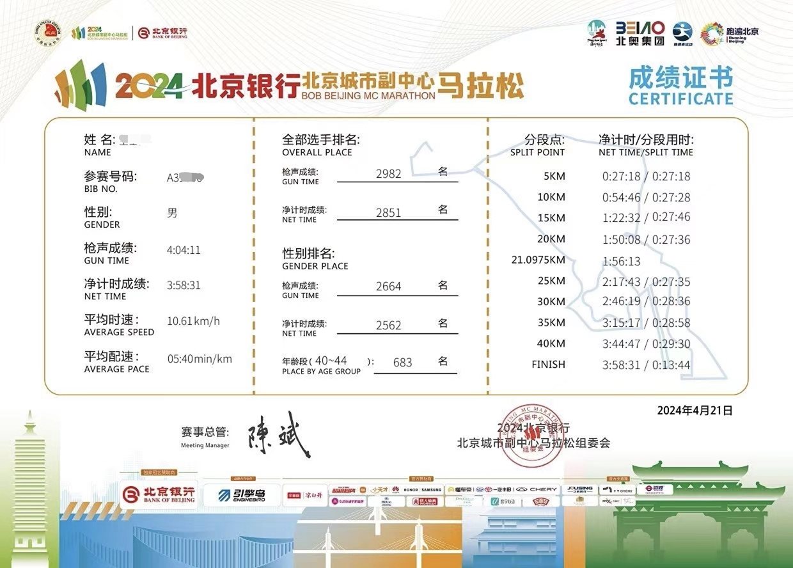
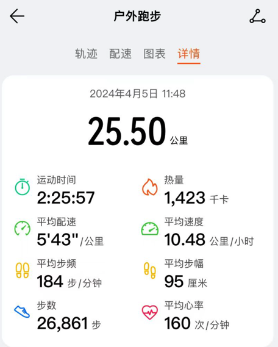
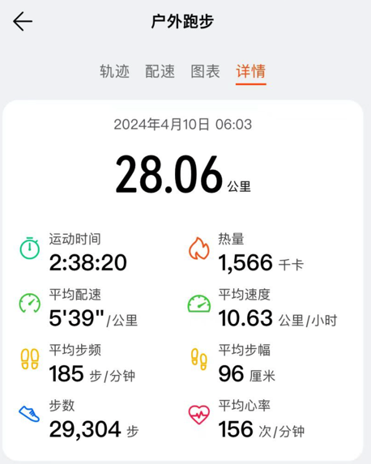
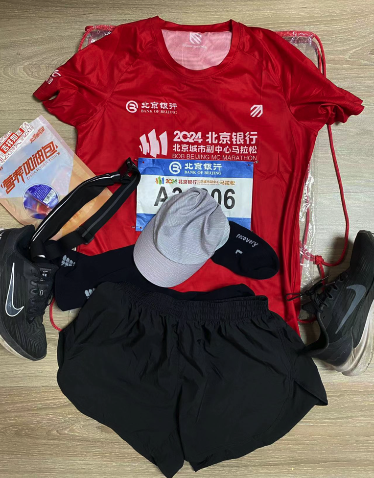
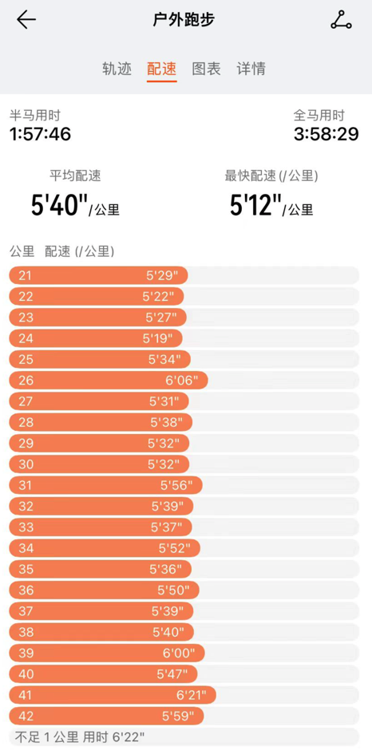

2024年4月21日，北京市通州城市副中心马拉松顺利完赛，留本文以纪念。

先看一下成绩，第一次参加全马，能够取得这个成绩个人觉得非常满意，也比较符合平时自己练习的水平。这次比赛可以说没有冒进，也没有拉胯。

## 赛前准备

从去年加入单位跑团开始规律的跑步之后，累计跑量约1500公里，去年参加了三个半马也都能够顺利完赛，算是有一些半程马拉松经验，但是全马对于体能的要求还没有切身的体会。

本来报通州马拉松并没有指望中签，和跑团的朋友一起报的，本着试试看的态度，中签之前也没有认真准备。3月30日意外收到通州全马中签的短信，其实略微有点心慌

听到很多人说过、看到网上一些文章介绍，过了30公里或者32公里才是马拉松的开始，很容易在32公里之后撞墙，林林总总，都让我有一种忐忑不安的感觉，自己是否能够跑下来一个全程马拉松？

为了能够顺利完赛，4月5日独自尝试了一次长距离，这次练习全程没有补给，再加上中午天气比较炎热，在过了25公里之后突然就觉得没有力气，为了防止受伤我就中止了练习。

第一次长距离之后，认识到补给的重要性，京东下单了一些能量胶和盐丸，准备第二次长距离练习。4月10日一大早，自己在公园练习，从10公里开始补充能量胶，15公里补充盐丸，20公里补充能量胶，25公里补充盐丸。按照这个节奏，在28公里的时候身体感觉还比较轻松，因为要赶时间去上班没有再继续下去。通过这次联系，对30公里以后的体感有了一些底气。

本来计划赛前一周就以休息为主了，但是想不到生活往往比剧本更精彩，4月12日中午在打羽毛球的时候意外右脚脚踝扭伤了。不是特别严重，但脚踝也明显的肿胀了一圈。

这样还能跑吗？休养休养看看吧，是福不是祸，是祸躲不过。4月16日恢复性跑步7公里，4月18日恢复性跑步8公里，脚踝在逐渐的恢复，看来是有希望完成比赛。

## 比赛体验

比赛当日，匆匆吃了2个包子便赶往通州。有了之前比赛的一些经验，在出地铁前先上了厕所、换好了衣服。赛前活动热身，做好了准备。

前面10公里、20公里，脚踝稍微有些感觉，在医疗点喷了两次云南白药，其他方面感觉良好。

过了30公里，天气开始变热，身体也有些疲惫，每次在饮水点的停留时间开始变长。基本上是走两三张桌子来喝水、补充能量。

30公里吃了能量胶，35公里吃了盐丸，之后就是38.5公里吃了补给点的香蕉，40公里补充了水分。明显的过了40公里之后，没有办法保持速度，仅能勉强维持速度，这时才体会到什么是精疲力尽的感觉。

在最后两公里，能够看到很多抽筋的跑友在旁边拉伸，也有很多人以走代跑奔赴终点。终点是我们共同的目标，不管采用何种方式。

## 赛后恢复

比赛后的第一天，两条腿真的是一点力气都没有。中午的时候，甚至还想着做一做排酸跑，速度仅能保持6分40秒。比赛后第二天，明显感觉体力有所恢复，大腿的酸痛感逐渐减退。比赛后的第三天，感觉大腿酸痛基本上恢复了。

在这期间，根据文章的建议，比较注重蛋白质、营养的补充。

现在我已完成人生首马，希望今年北京马拉松中签几率能高一些。以上就是我本次比赛的体验，流水般的记录，如果圈里有喜爱跑步的朋友，欢迎一起交流分享。