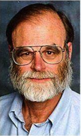

詹姆斯·格雷（James Nicholas Gray，1944年1月12日～2012年1月28日），致力于数据库的研究，1998年图灵奖得主，美国国家科学院院士，美国国家工程院院士，美国艺术与科学院院士，美国微软公司杰出研究员。

詹姆斯出生在美国加州旧金山。

1966年在加州大学伯克利分校数学与工程系获得数学与工程学学士学位。随后的一年里在新泽西州的贝尔实验室工作。之后，他回到伯克利大学新成立的计算机科学系，并在1969年获得加州大学计算机科学专业的博士学位。

1967～1971年，詹姆斯留在伯克利大学攻读 IBM 博士后。

1971～1980年，詹姆斯在IBM的研究机构工作。1972年夏天，詹姆斯接受了IBM圣何塞研究实验室的邀请，在圣何塞实验室，数据库是其一项重要的研究内容。实验室成员 Edgar F. Codd 发表了一篇有影响力的论文，提出了一种组织数据库系统的新方法，称为关系模型。

1973年，詹姆斯加入了IBM的 System R 项目，这个项目持续了五年，与伯克利大学的 Ingres 项目一起成为了关系数据库行业的基础。Ray Boyce 和 Don Chamberlin 为 System R 设计了广泛使用的 SQL 语言。

詹姆斯在 System R 中发挥了重要作用，他将自己的经验与系统和理论相结合，为并发控制和崩溃恢复的相互关联的问题创建了一种统一的方法。他将交易定义为一个工作单元，例如将资金从一个银行账户转移到另一个银行账户，无论交易是否成功，都必须使银行的数据库处于一致状态：要么资金转移，要么留在原始账户中。詹姆斯开发的技术允许并发执行许多事务，以及在崩溃后重新启动，同时保持数据库的一致性。他证明了这种方法的正确性。这项工作是他图灵奖的基础。随着 System R 研究部分的结束，詹姆斯帮助将该技术转移到 IBM 产品组，并开始思考如何将事务扩展到通信计算机的分布式网络。

1980～1990年，詹姆斯在 Tandem Computers 担任软件设计师。

1990～1994年，在 Digital Equipment Corporation 担任企业咨询工程师。

1994～2007年，在 Microsoft Corporation 担任研究员。

2007年1月28日，詹姆斯·格雷驾驶40英尺长的「顽强」号单桅帆船环绕法拉隆群岛航行，但未能返回。

## 成就

詹姆斯·格雷 和 Andreas Reuter 合作编写了《Transaction Processing：Concepts and Techniques》（1993年）。

除了在数据库方面的研究之外，詹姆斯还开发了一个免费的可搜索地球表面卫星图像数据库 Microsoft TerraServer，该数据库于1998年上线，比 Google Earth 推出早了很多年。

从2002年开始，他还帮助开发了 SkySearch（2008年作为Microsoft全球望远镜向公众发布），这是一个可以将各种来源的天文图像组合成一个免费的可搜索和可查看的应用程序。

詹姆斯于1982年当选为美国电气与电子工程师学会会员，1994年入选计算机协会会员，1997年入选美国国家工程院，2001年入选美国国家科学院。他还获得了1998年IEEE的查尔斯·巴贝奇奖。

## 参考资料

1. [James Gray Photos](https://amturing.acm.org/photo/gray_3649936.cfm)
2. [Jim Gray - A.M.图灵奖获得者 (acm.org)](https://amturing.acm.org/award_winners/gray_3649936.cfm)
