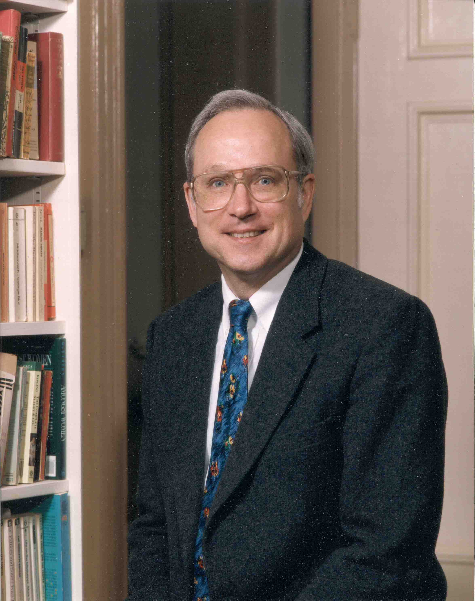

巴特勒·兰普森（Butler Wright Lampson，1943年12月23日 - ），计算机科学家，1992年获得图灵奖，为分布式个人计算机发展作出贡献，并且在工作站、网络、操作系统、显示器等具体实施领域有很多成就。

1964年获得哈佛大学物理学学士学位。

本科毕业后进入加州大学伯克利分校研究生院，在一次计算机会议上他受到史蒂夫·罗素（Steve Russell）指引从而转学计算机，1967年获得电气工程和计算机科学博士学位，之后留校任教。

兰普森在施乐公司的研究中心（PARC）担任研究职位，在那里他发明了 Alto - 第一台个人计算机，它有一个600*800的显示器，一个硬盘，一个以太网局域网和一台激光打印机。

Alto 计算机提供了一个可见即所得的文本编辑器 - Bravo ，由兰普森和 Charles Simonyi 设计。Bravo 最终导致了 Microsoft Word 的发展。

1983年，兰普森去了  DEC 公司的系统研究中心（SRC）工作。1987年，兰普森成为了麻省理工学院的兼职教授，参与了TCP连接规范的制定。

1992年获得图灵奖。

1995年，兰普森加入微软公司，从事平板电脑软件、安全性和富应用程序的编程工作。

## 参考资料

1. [巴特勒·兰普森与Alto 1992年计算机图灵奖授予当时任DEC公司高级研究员和主任设计师的巴特勒·兰普森(Butler Wright Lamps... - 雪球 (xueqiu.com)](https://xueqiu.com/3993902801/85227557)
1. [【互联网口述历史】访巴特勒·兰普森：载誉无数的计算机界传奇大师 - 简书 (jianshu.com)](https://www.jianshu.com/p/aaaa91764ca3)
1. [图灵奖----中国科学院软件研究所 (cas.cn)](http://www.is.cas.cn/kxcb2016/kpwz_128238/201609/t20160923_4668200.html)
1. [Butler W. Lampson | Distinguished Engineer, Turing Award, Operating Systems | Britannica](https://www.britannica.com/biography/Butler-W-Lampson)
1. [Butler W Lampson - A.M. Turing Award Laureate (acm.org)](https://amturing.acm.org/award_winners/lampson_1142421.cfm)
