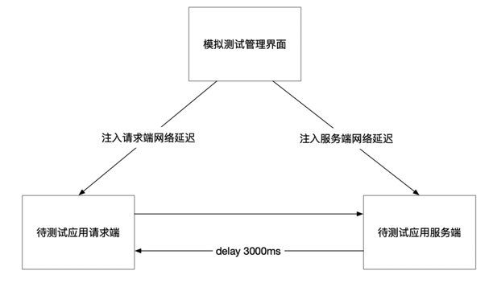

## tc 命令介绍

Linux 操作系统中提供了 tc 命令来进行流量控制 Traffic Control，它利用队列规定建立处理数据包的队列，并定义队列中数据包被发送的方式，从而实现对流量的控制。

一般只能限制网卡发送的数据包，不能限制网卡接收的数据包，流量控制主要是在输出接口实现，通过改变发送次序来控制传输速率。如果是控制网络传输中的丢包，则不管是输入还是输出都可以进行控制。

tc 命令由 Alexey N. Kuznetsov 编写，在 Linux 2.2 版本加入。另外，ip 命令也是由他编写的。

```sh
# 基本语法格式
$ tc qdisc add dev DEV root QDISC QDISC-PARAMETERS
# 删除 qdisc 队列 
$ tc qdisc del dev DEV root
# 查看现有的队列
$ tc -s qdisc ls dev eth0
# 查看现有的分类
$ tc -s class ls dev eth0
# 查看过滤器的情况
$ tc -s filter ls dev eth0
```
## 简单场景

使用Python编写两个程序文件，一个用来模拟服务端，监听端口收到请求后立即在应用层面返回。另外一个用来模拟客户端，请求服务端地址并打印返回结果。



服务端 Python 代码
```python
import http.server
import socketserver
from http.server import BaseHTTPRequestHandler, HTTPServer

# 构建一个 HTTP 的服务端，用来测试验证网络延时案例

class CustomRequestHandler(BaseHTTPRequestHandler):
    def do_GET(self):
        self.send_response(200)
        self.send_header('Content-Type', 'text/plain')
        self.end_headers()
        self.wfile.write(b'hello world')

def run_server():
    PORT = 9999
    server_address = ('', PORT)
    httpd = HTTPServer(server_address, CustomRequestHandler)
    print("Server start running at port : ", PORT)
    httpd.serve_forever()

if __name__ == '__main__':
    run_server()
```

请求端 Python 代码。
```python
import requests  
import time  
  
def measure_request_times(url):  
    # 记录开始时间  
    start_time = time.time()  
  
    # 发送请求  
    try:  
        with requests.Session() as session:  
            # 这里可以添加更多的Session配置，比如超时设置等  
            # 记录建立连接前的时间点（这只是一个粗略的估计，因为requests库内部封装了连接过程）  
            pre_connect_time = time.time()  
              
            # 发送请求并获取响应  
            response = session.get(url)  
              
            # 记录获取响应后的时间点  
            post_response_time = time.time()  
              
            # 计算并打印时间信息  
            connect_time = pre_connect_time - start_time  # 这只是一个粗略的估计  
            total_time = post_response_time - start_time  
              
            print(f"建立连接时间（粗略估计）: {connect_time:.4f} 秒")  
            print(f"获得响应的总时间: {total_time:.4f} 秒")  
              
            # 确保响应已经正确关闭  
            response.raise_for_status()  
  
    except requests.exceptions.RequestException as e:  
        print(f"请求发生错误: {e}")  
  
# 示例URL  
url = 'http://10.211.55.19:9999'  
measure_request_times(url)
```

测试过程记录。
```sh
# 在服务端启动监听
$ python3 server.py
Server start running at port :  9999
# 然后新打开一个终端窗口，模拟延迟
$ sudo tc qdisc add dev enp0s5 root netem delay 3000ms
$ sudo tc qdisc ls dev enp0s5
qdisc netem 8001: root refcnt 2 limit 1000 delay 3.0s
```

在客户端发送请求，可以看到建立链接不受影响，获取响应的时间则延长了很多。
```sh
$ python3 client.py 
建立连接时间（粗略估计）: 0.0001 秒
获得响应的总时间: 9.0191 秒
```

## 拓展应用

* 限制某个应用使用的网络带宽
* 限制某个IP下载的速度
* 利用 tc 命令构建一个网络故障注入的系统

## 参考资料
1. https://cloud.tencent.com/developer/article/1409664
2. https://linux.die.net/man/8/tc
3. https://www.fujieace.com/linux/man/tc.html#google_vignette
4. https://linux.die.net/man/8/tc