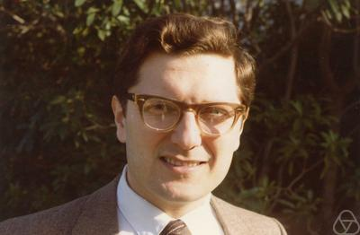
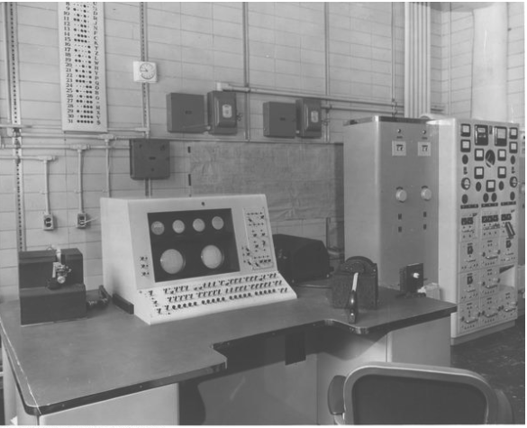
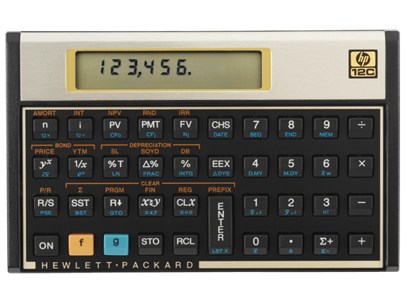

威廉·卡亨（ William M. Kahan，1933年6月5日 -  ），浮点计算方面最重要的专家之一。

卡亨于1933年6月5日出生于加拿大多伦多，在一个犹太移民家庭中长大。年轻时，卡亨喜欢修理机械和电子设备。

1953年，卡亨进入多伦多大学，并分别于1954年、1956年、1958年，获得其数学学士、硕士、博士学位。

在进入多伦多大学后，卡亨就开始学习编程。多伦多大学是早期计算机开发和使用的中心，拥有 FERUT 计算机，这是加拿大的第一台电子计算机，是一台 Ferranti Mark I 计算机，是世界上第一次开始商用的电子计算机机型。原本这台计算机被英国原子能机构预定，因为政府改变了预算才得以落户在多伦多。

> Mark I 型计算机是我们之前介绍过的，是由 [霍华德·艾肯](http://www.edulinks.cn/2021/01/23/20210124-howard-aiken/) 主导设计的世界上第一台数字计算机。

读研究生之后，卡亨将研究重点放在数值分析上，并探索利用计算机实现应用数学的可能性。1957年，卡亨在伊利诺伊大学从事 ILLIAC I 研究。1958年获得博士学位后，卡亨在剑桥大学数学实验室的 EDSAC-2 工作了两年。

1960年，卡亨回到多伦多大学任教，重点研究数值计算的误差分析。这不仅涉及确定计算结果的准确性，还涉及如何设计新的软件和架构功能，在确保高性能的同时，提高准确性。卡亨为学校的 IBM 7094 计算机创建了一个由数学例程、编译器调整和操作系统修改组成的集成系统，帮助程序员创建准确、高性能的浮点运算代码。卡亨在 IBM 的数值分析用户组中发挥主导作用，并在 1966～1967 年间推动 IBM 修复了System/360 计算机算法中的缺陷。

1968年，卡亨离开多伦多前往加州大学伯克利分校（University of California，Berkeley），支持其新成立的计算机科学系。

在伯克利工作期间，卡亨的工作涉及创建实用工具以及论文、算法和定理。他与他的学生一起制作了广泛使用的 fdlibm 数学库。另外一个被广泛使用的是一个测试浮点运算实现错误的程序 paranoia。

卡亨还与众多的计算机公司合作。1974年到1984年，他协助惠普公司处理其计算器的数学功能，提高了许多模型的准确性和性能，包括经典的 HP34C 和 HP12C，并添加了广泛的使用函数，如积分和求解，以方便易用的形式打包复杂的数学运算。

卡亨与英特了也有长期的合作关系，他参与制定了从1980年发布的8087开始，包括80387、486DX的浮点运算设计。1994年英特尔推出奔腾处理器的浮点实现时，引入了一个备受瞩目的「除法错误」，卡亨随后提供了一个测试程序来防止这种情况再次发生。

1977年，卡亨积极参与了IEEE计划，主持制定了二进制的、与基数无关的浮点运算标准，该标准在1985年被正式采用为 IEEE 754 标准。1989年，卡亨凭借在 IEEE 754 标准方面的工作获得了图灵奖，他因此也被称为「浮点之父」

## 参考资料
1. https://baike.baidu.com/item/%E5%A8%81%E5%BB%89%C2%B7%E5%87%AF%E4%BA%A8/7867962
2. https://amturing.acm.org/award_winners/kahan_1023746.cfm
3. https://www.historyofinformation.com/detail.php?id=703
