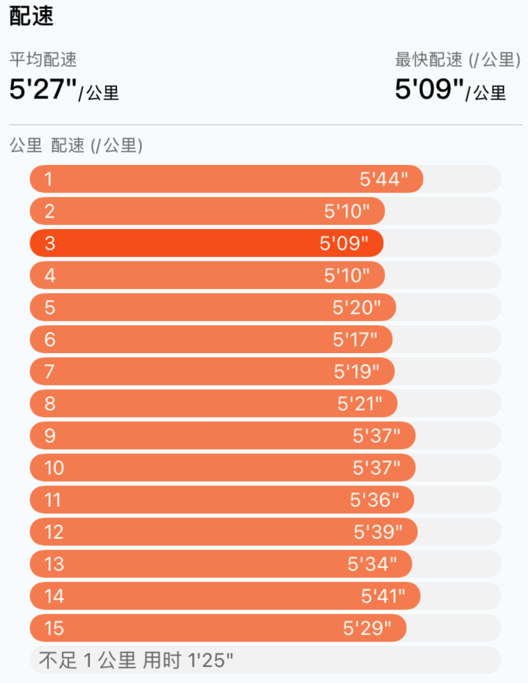
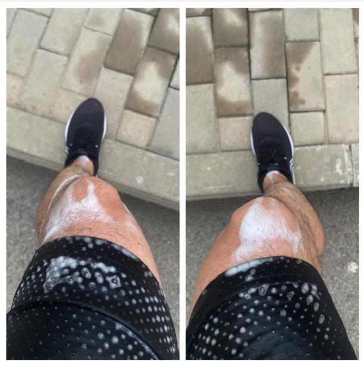

7月23日是大暑后的第一天，还没进入中伏，北京连续多天延续高温闷热的天气，让人时时刻刻感到喘不过气。早上起来天空布满了云层，有点要下雨的迹象，气象台预报说是雨后北京可以迎来短暂的凉爽。

跑步开始前看了下当时的温度，26摄氏度，是今年晨跑以来最高的温度了。看温度的时候是早上5点半。为了应对这种高温天气，吃了一包能量胶，带了一瓶矿泉水。

好在今天天空云层厚，没有强烈的太阳光照射。

第一公里慢慢热身，心率在140左右，没怎么出汗，自我感觉还可以。第二、三、四公里稍稍加了一点速度，闷热天气的威力开始显现，四公里刚结束，感觉上半身都快要湿透了。

这个阶段也说不上特别累，速度还能保持在5分10秒左右，但是闷热的天气强烈的抵消了抬腿奔跑的意愿，就是慢慢的摇，也像是种子发芽一般需要一些勇气和毅力。

五公里到八公里这个阶段，汗水出的越来越多，开始补水了。这个阶段的配速也降到了5分20秒左右，如果想保持速度，心率就会飙高超过160。

这个阶段还遇到了几个小的上坡，下意识的减小了步幅（主要也是加不上去了）。

跑到最后一公里的时候，发现膝盖上白花花的一片，好像是穿了白色铠甲一样。停下来才发现是汗水融化了盐粒形成了一些沫状的附着在膝盖上。

上衣湿透了，短裤湿透了，袜子湿透了，鞋也湿了。

三伏天跑步的体验就是汗比雨先下来。
