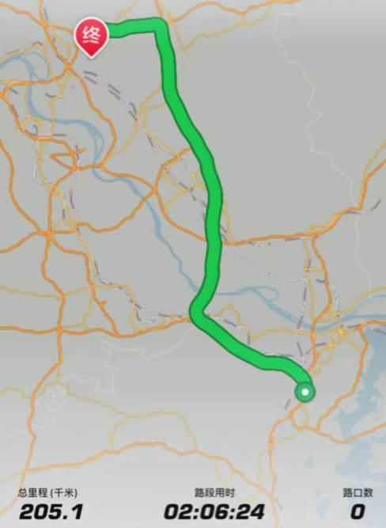

庐山，是中国一座历史悠久、驰名中外的自然与人文名山，向往已久。

8月6日，在中国南方大部分地区都笼罩在高温高湿的天气下时，我们一行5人从湖北出发驱车200公里，登庐山避酷暑，体验庐山的无限魅力。

我们提前一天到达庐山脚下，在进入九江界后，高速上远远可以看到巍峨雄壮的庐山群山，比周围的山峰明显高了不少，山上云雾缭绕，看起来充满了仙界气息。

抵达后天色尚早，去了东林大佛却得知周一闭馆。之前只听说过博物馆惯例上周一闭馆，没想到免费的东林大佛也是周一闭馆。下次大家来之前一定确认好。

虽未能进入东林大佛院内参观，隔着围墙也能体会到东林大佛的壮观。而且当时气温仍在39度左右，看着东林大佛前的台阶，如果游览参观必然是一身汗，想想也有些释然，远远的观赏下也有震撼之感。

