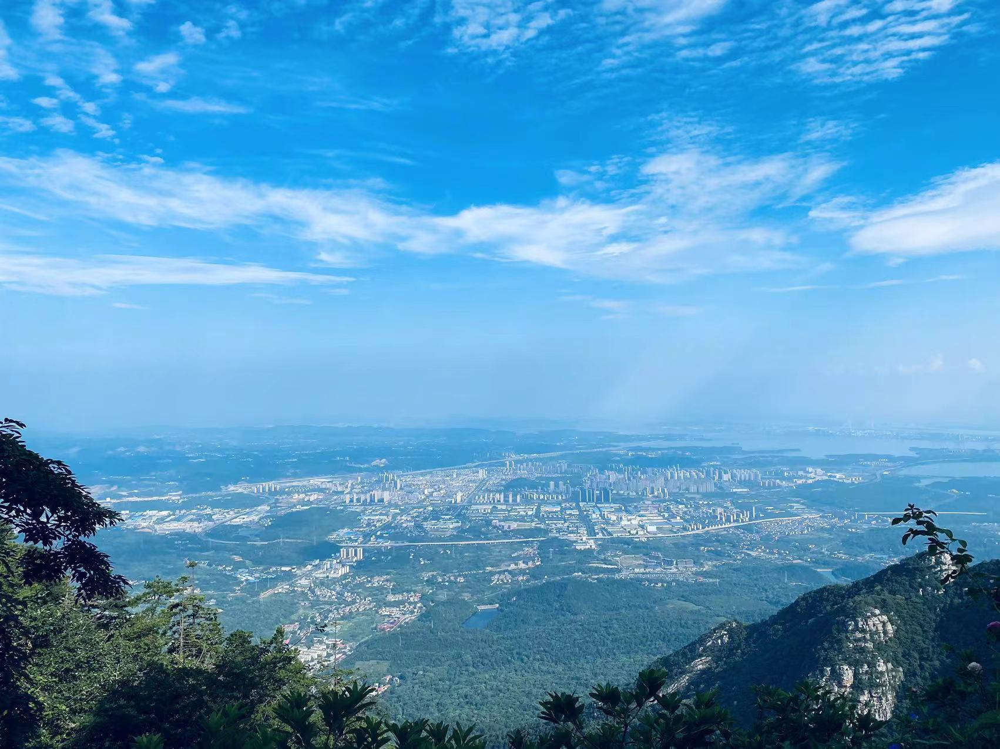

庐山，是中国一座历史悠久、驰名中外的自然与人文名山，向往已久。

8月6日，在中国南方大部分地区都笼罩在高温高湿的天气下时，我们一行5人从湖北出发驱车200公里，登庐山避酷暑，体验庐山的无限魅力。

我们提前一天到达庐山脚下，在进入九江界后，高速上远远可以看到巍峨雄壮的庐山群山，比周围的山峰明显高了不少，山上云雾缭绕，看起来充满了仙界气息。

抵达后天色尚早，去了东林大佛却得知周一闭馆。之前只听说过博物馆惯例上周一闭馆，没想到免费的东林大佛也是周一闭馆。下次大家来之前一定确认好。

虽未能进入东林大佛院内参观，隔着围墙也能体会到东林大佛的壮观。而且当时气温仍在39度左右，看着东林大佛前的台阶，如果游览参观必然是一身汗，想想也有些释然，远远观赏即收获了震撼之感，保持了对佛教寺院的崇敬，也不用因为攀登台阶而出太多汗。要知道，在39度的气温下，光是在太阳下汗都止不住了。

随后我们又到了庐山市的渊明广场，能够一览庐山的全貌。广场上还残留有前一段时间雨水较大时冲到广场上的各种残留物，从水的痕迹来看，现在的水位已经较最高时下降了有一米多，由此可以想象水多时的盛景。

从庐山市返回住处的路上还路过了秀峰景区，驾车过程中就能看到李白诗下那条瀑布，「飞流直下三千尺，疑是银河落九天」。听别人介绍说，这条瀑布最佳的观赏点就是在秀峰景区门口，不需要进入景区，传说当年李白也是这样看到瀑布并题诗的。

暑假期间上庐山有两种方式，一种是做观光巴士，可以分别从南门、北门做观光车上线；还有一种方式是做索道上线，需要去专门的索道入口（和观光巴士不在一个门）。如果不是暑期，还可以预约自驾车上山，每天也有名额限制，先到先得。

索道上线速度较快，大约20分钟，价格也较高。观光车上山需要走山路十八弯，就像主席诗词中说的一样「一山飞峙大江边，越上葱茏四百旋」，对于晕车的朋友不太友好，好处是价格比较便宜。如果是自驾车到庐山脚下，两种方式最好是选择同样的方式上山和下山，否则还需要考虑到自驾车停车场的解决方案。

权衡再三，我们决定选择观光车上下山。随着第一班观光车出发，兜兜转转，到山上也没觉得花太多时间。到了山上之后，明显感觉到凉爽了很多。走路不会出汗，站在树荫下吹着山风觉得特别清爽，难怪是避暑胜地，真想在这里住下不走。

庐山的景点散步在山上各处，人文景点聚集在牯岭街附近。牯岭街是当地人居住生活的村镇，说是当地人其实都是为了建设庐山迁移上来的人们，庐山并没有土著居民。自然景观比较分散也相对较远，因为时间和随行老人体力的原因，选择性的参观了仙人洞、百里涧、含鄱口、美庐、会议旧址这些景点，全程下来走路步数不超过一万五。

百里涧是一个单独景区，不在通票范围内。坐缆车下到半山腰欣赏景色，据说是当年苏轼题词「横看成岭侧成峰，远近高低各不同」的地方，在这里还坐着一位蒋校长，感兴趣的朋友千万不要错过。

下面是含鄱口，能够远远看到鄱阳湖。

第一次庐山之旅就这样愉快的结束了，下山的时候大概是五点钟，没有体验晚上庐山牯岭街热闹的夜生活，留点遗憾等待下次再来吧。庐山，真的是值得多次游览。