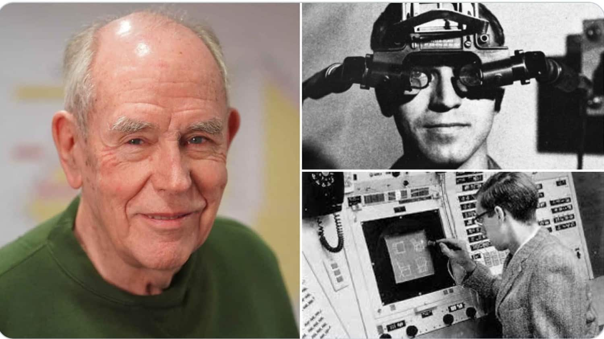

伊万·萨瑟兰（Ivan Edward Sutherland，1938年5月16日 - ），1988年图灵奖的获得者，被称作「计算机图形学与虚拟现实之父」、「计算机辅助设计CAD之父」。

1938年5月16日，萨瑟兰出生于美国内布拉斯加州的中西部小城市黑斯廷斯，父母都有土木工程博士学位，他从小就沉浸在学习氛围中。萨瑟兰高中时最喜欢的科目是几何，并对计算机图形有浓厚的兴趣，自称为「视觉思考者」。

1959年，萨瑟兰在卡内基·梅隆大学获得电气工程学士学位。第二年，在加州理工学院获得硕士学位。随后，萨瑟兰到MIT攻读博士学位，其导师是信息论创始人香农，在林肯实验室的TX-2计算机上，他开始研究导师交给他的博士论文课题「三维的交互式图形系统」，萨瑟兰依靠扎实的专业基础和勤奋的工作，经过3年时间完成了这个艰巨而复杂的任务，开发了著名的 Sketchpad 系统。

Sketchpad 中的许多创意是革命性的，他的工作原来简单来说是这样：光笔在计算机屏幕表面上移动时，通过一个光栅系统测量笔在水平和垂直两个方向上的运动，在屏幕上重建由光笔移动所生成的线条。一旦出现在屏幕上，线条就可以被任意处理和操纵，包括拉长和缩短任意角度等，还可以互相连接起来表示任何物体，无题也可以旋转任意角度并显示其任意方位的形态。

为了在论文答辩时效果更好，萨瑟兰还精心制作了一部影片「Sketchpad：人机图形通信系统」。答辩时，他边放映、边讲解，生动、活泼、形象，取得了极大的成功。答辩导师包括香农、明斯基、考恩斯等，一直给萨瑟兰博士论文打了「优」。Sketchpad 的成功奠定了萨瑟兰作为「计算机图形学之父」的基础，并为计算机仿真、飞行模拟器、CAD/CAM、电子游戏机等重要应用的发展打开了道路。

1966年，萨瑟兰取得博士学位后离开 MIT 进入了军队，后来被任命为国防部高级研究计划署「DARPA」信息处理技术局 IPTO「Information Processing Techniques Office」 处的处长，年仅26岁，军衔中尉，这是非常罕见的任命。

离开军队后，萨瑟兰回到大学，进入哈佛大学继续计算机图形学方面的研究，开发了一些有用的图形工具。

1967年，著名学者大卫·埃文斯「David Evans」邀请萨瑟兰一同工作，从此他转学至犹他大学。1968年，萨瑟兰在其学生 Bob Sproull 的协助下，开发了被认为是第一个虚拟现实「Virtual Reality」和增强现实「Augmented Realit」的 HMD「Head Mounted Display」系统。

196年，萨瑟兰应母校加州理工学院的邀请，出任计算机科学系主任至1980年。

1983年，获得ACM关于图形学的专门委员会颁发的 「考恩斯 Coons」 奖。

1988年，获得计算机领域的最高奖项「图灵奖」。

## 参考资料
1. https://baike.baidu.com/item/%E4%BC%8A%E4%B8%87%C2%B7%E8%90%A8%E7%91%9F%E5%85%B0/541819
2. https://36kr.com/p/1723173404673
3. https://blog.csdn.net/m0_37149062/article/details/106597062
4. https://baijiahao.baidu.com/s?id=1803755035711817655
5. https://www.d-arts.cn/article/article_info/key/MTIwMDcxMjU4MjODuYWtsJzKcw.html