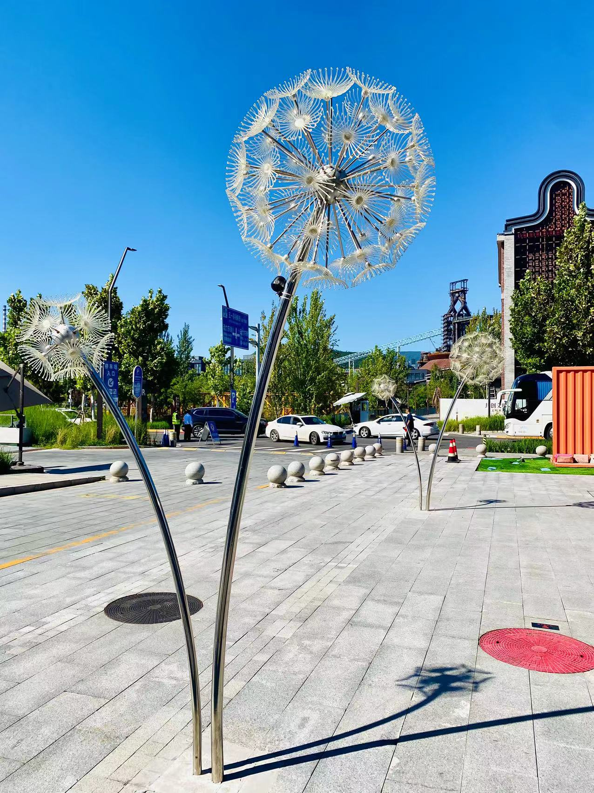
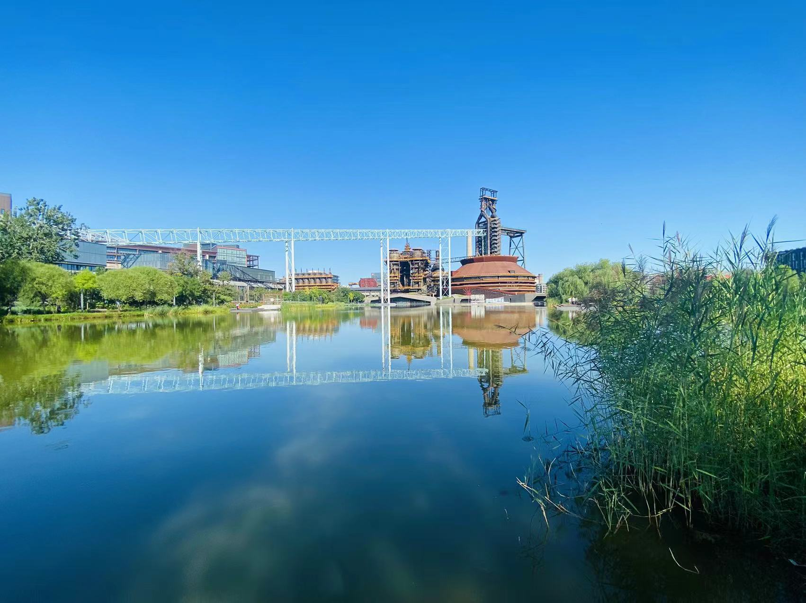
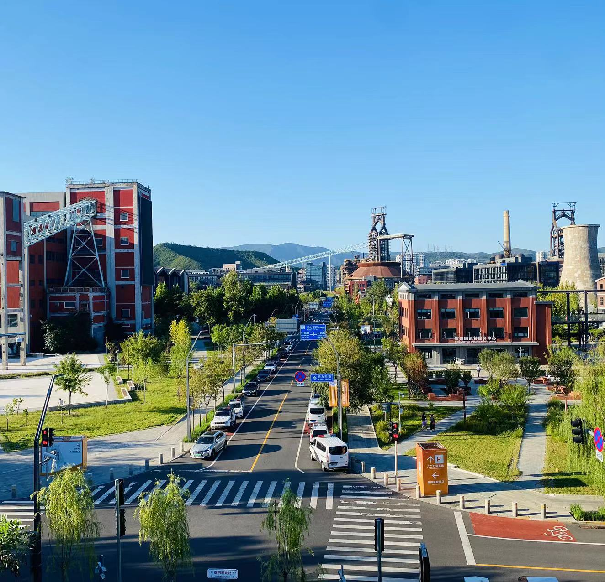
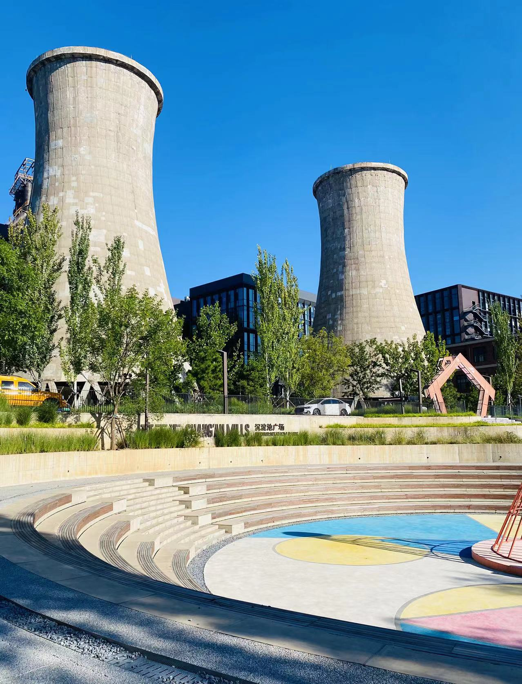
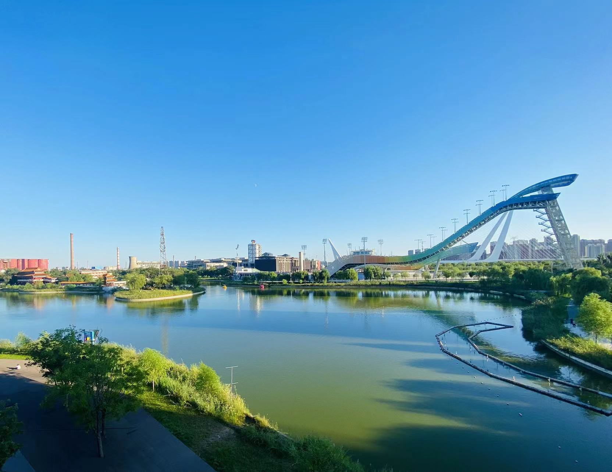
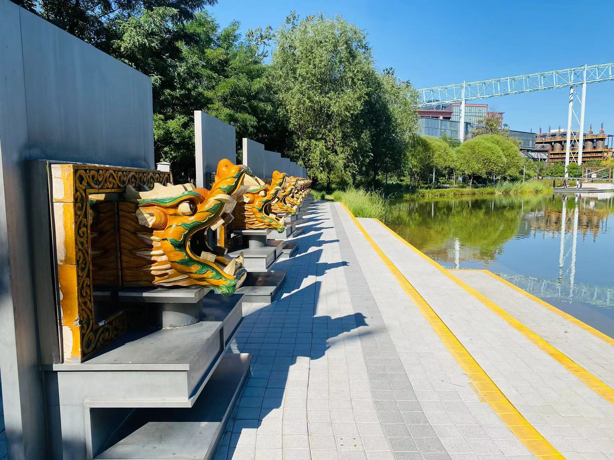
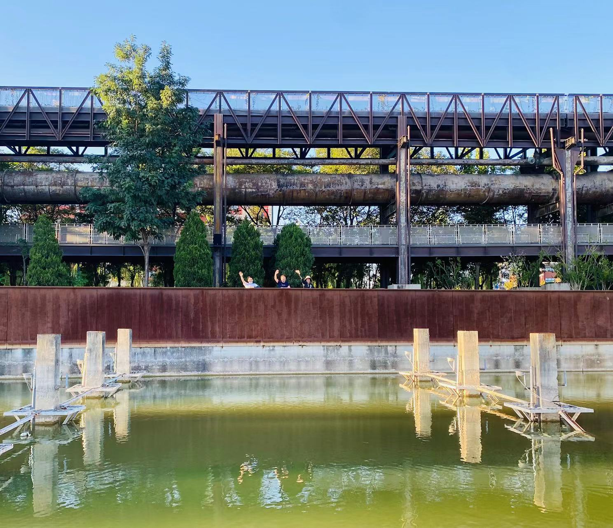

「中秋前后是北平最美丽的时候，天气正好不冷不热，昼夜的长短也划分的平匀。没有冬季从蒙古吹来的黄风，也没有伏天里挟着冰雹的暴雨。天是那么高，那么蓝，那么亮，好像是含着笑告诉北平的人们：在这些天里，大自然是不会给你们什么威胁与损害的。西山北山的蓝色都加深了一些，每天傍晚还披上各色的霞帔。」

老舍先生以平缓的笔调，揭开了北京秋天的美好一面。经过十几年的环境治理，北京的蓝天真的如老舍先生笔下所描绘的那样，又跃然纸上，又充盈在了我们生活之中，蓝天、白云、青山、绿水。而秋天又仿佛是忽然之间，就带着一点点的凉意，跳进了我们的日常。

今天部门一行人来到了首钢园区 City Walk，来体验北京的秋天，体验蓝天白云与历史工业交融，体验现代科技与绿水青山的和谐共处。

首钢自从2010年左右完成整体搬迁后，经历大的改造，顺利完成了冬奥会的各项任务，现在已经成为市民休闲娱乐的绝好去处。恰巧这两天赶上北京服贸会在这里召开，园区里车来车往，行行色色的人员川流不息，热闹非凡。

首钢园吸引人的地方，在于通过修缮和改造，让工业时代的高炉、烟囱、传送带、沉淀池等厂房设施，和现代的科技、科幻以及人们的休闲、运动比较好的融合在一起。走在园区中，整个道路规划横平竖直，井然有序。

一高炉、二高炉、三高炉集中的区域，也都配备了对应的参观设施，让感兴趣的人能够深入这些庞然大物的内部去探索钢铁是如何炼成的。

对于钢铁高炉不那么感兴趣的人们，可以移步到秀池、群名湖，以及登高景观步道，欣赏大跳台和西山的秀美风光。值得一提的是，不管走在园区的哪个位置，只要往西北方向看去，谁都能瞅见石景山和石景山上的「金阁寺塔」。可惜的是，这个塔暂时没有对外开放，期待能够将其修葺完善，让众人贴近欣赏。

在园区的中心位置，还有从厂房改造而成的「六工汇」购物中心，里面餐饮、娱乐一应俱全。是周末带娃、遛娃的好去处。

我们一行人溜溜达达一直参观到傍晚。返程时路过六工汇底商，看到室外的大排档做了几桌貌似同样团建的队伍，伴着夕阳西，品尝着店里师傅精酿的啤酒，吃起刚出炉的烤串与鸡翅，非常的惬意。

我们中的许多人，有些因为工作的事情还没处理完、有些因为家庭的事还需要处理、有些因为个人的事需要理一理，纷纷走散了。若在他日，能够不为生活所困扰，必能成就一段难忘的 City Walk 之旅。

