9月22日，北京周五大雨后的第二天，万里无云，秋高气爽，一大早我便起身去灵山参加今天的穿越活动。爬升约700米，下降900米，步行16公里，充满挑战的一天开始了。

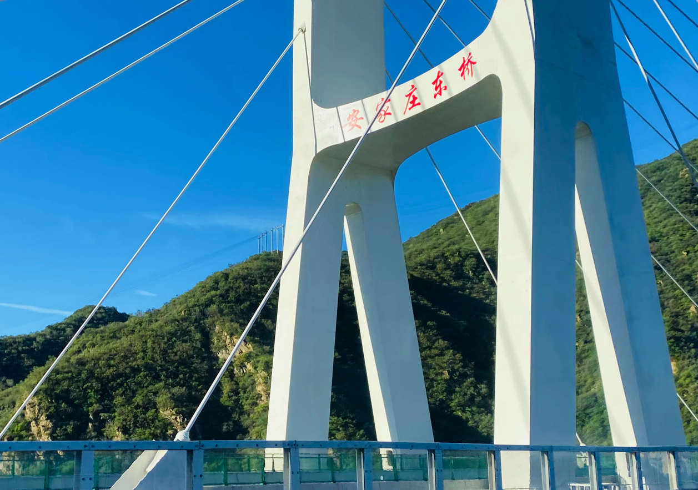

早上七点钟出发，沿着阜石路、西六环，开上了新开通的「京蔚高速」，现在六环到北京灵山段已经开通了，还剩下一段到河北的没有完全通车，没办法直通首都环线高速。下了高速之后，大概开了半个小时左右的山路，路过洪水口村，随后到达了本次穿越的起点「北灵山韭菜坡」。起点路段在河北境内，出市界的时候有个检查站，据说离京不检查，进京需要检查。

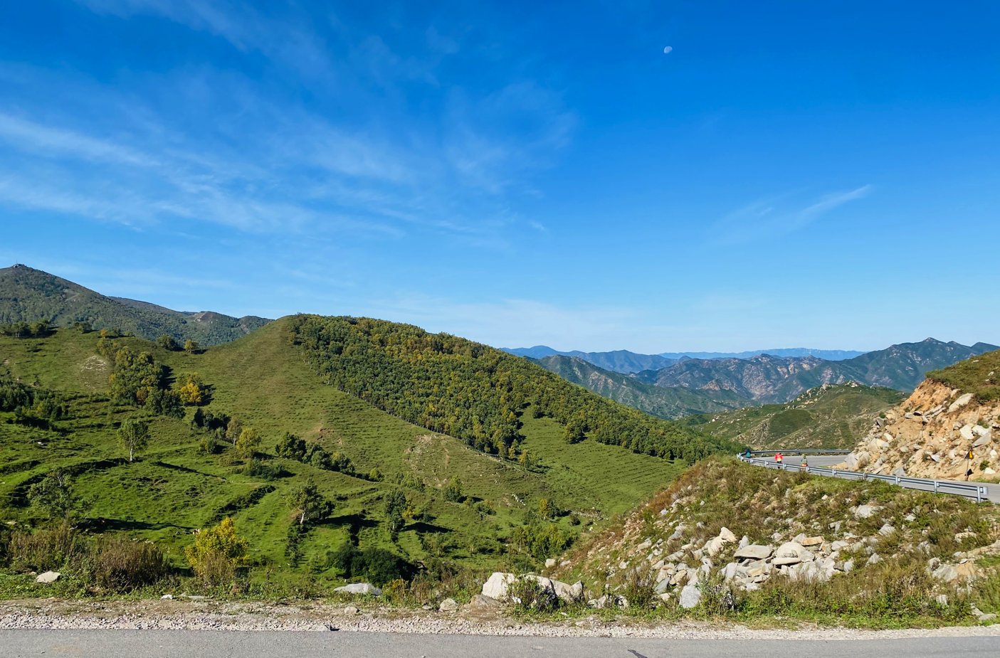

下车的时候九点钟左右，体感温度大概不到10度。看小红书上网友分享昨天风比较大，穿越一趟会被吹傻。可能是因为已经吹足了一天，今天的风力不大，除了体感有一点点凉之外，阳光照射下还有些微温暖，是一个适合爬山的好天气。

从下车点停车场出发，沿着弯弯曲曲的小路，一行人开始了今天的穿越之旅。开始的这段路海拔已经比较高了，坡度不是很陡，用不了多久，就能到达一个小山头，在这个山头上可以望到灵山主峰。主峰看起来像一个憨憨的汉子，在整个穿越的过程中，可以多次看到。主峰并不险峻，看起来让人安心。

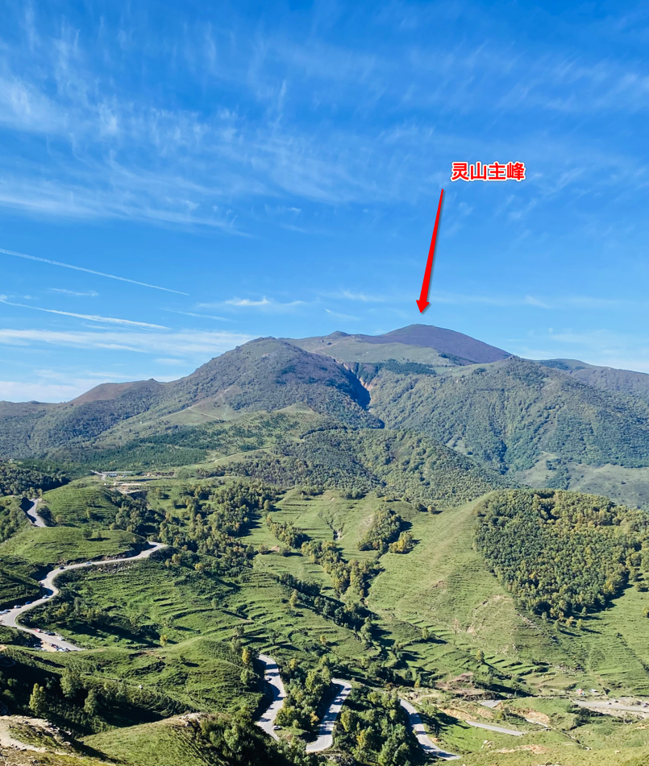

山坡上三三两两的有在悠闲吃草的黄牛，同事介绍说，后面的山上还有牦牛，这里是北京唯一适合饲养牦牛的区域。

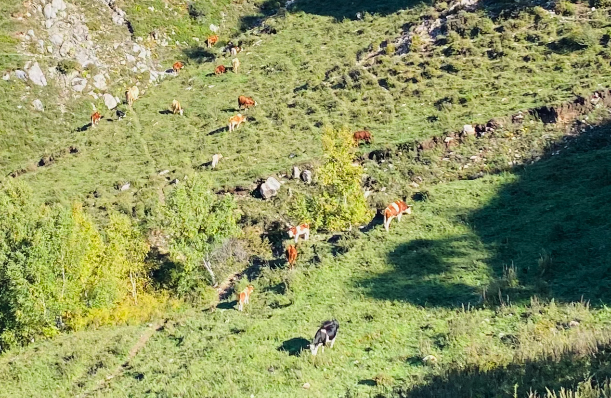

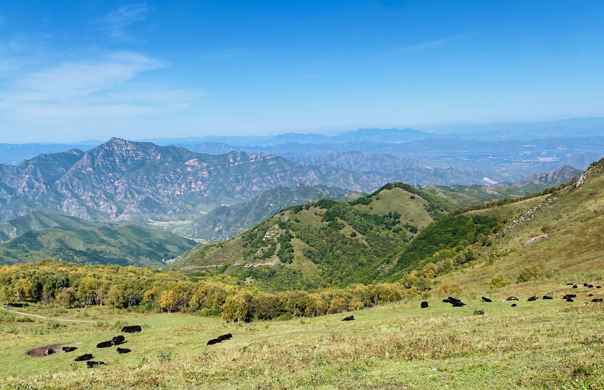

翻上小山头，就能看到一大片高山草甸。向北方远远望去，可以看到张家口的鸡鸣山，向东方向也隐隐约约能看到官厅水库。后面有一段路过古代修建的敌楼，这个位置的敌楼，能够清楚的看到从北面而来的军队，对于古代的侦察和防守，应该是相当重要的。

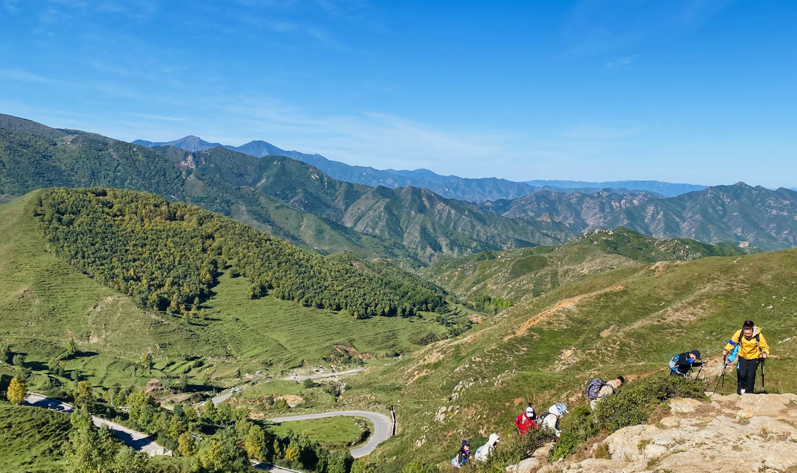

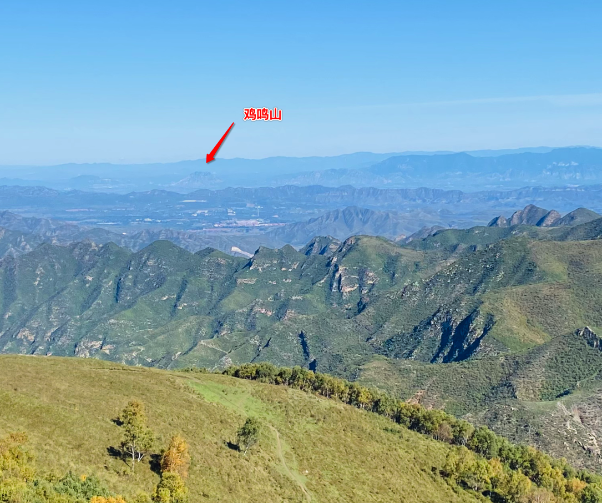

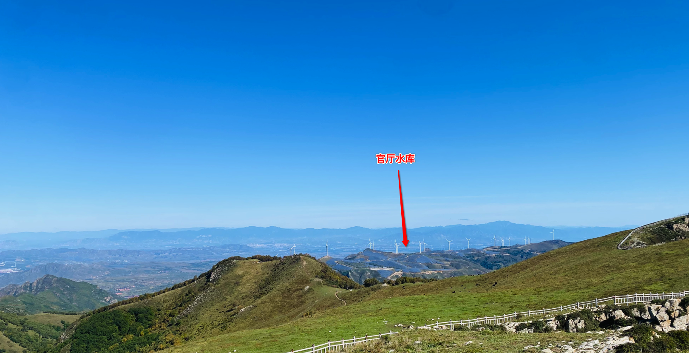

在山顶上，可以看到很多昨天在这里露营的队伍正在收拾营地，准备离开。营地上还留有篝火燃尽后的草灰，夜深人静时，仰望星空，一定特别感人。

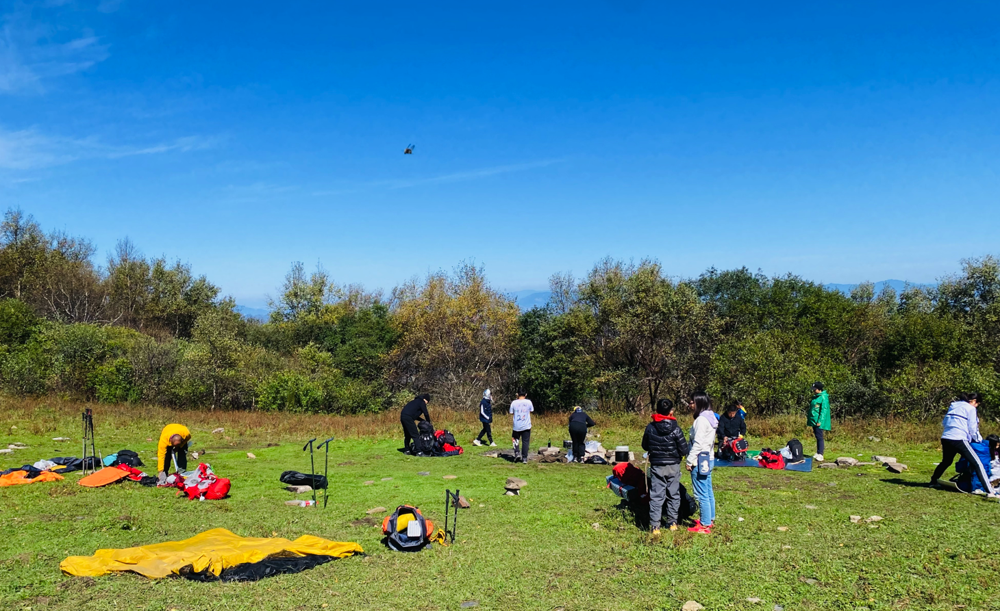

继续前行到一下坡处，路两边长满了叶子长长的野草，整个区域气味很浓郁，有点韭菜的味道。向导介绍说这里是韭菜坡，叶子宽一点的是野生韭菜，真的可以拿来包饺子。

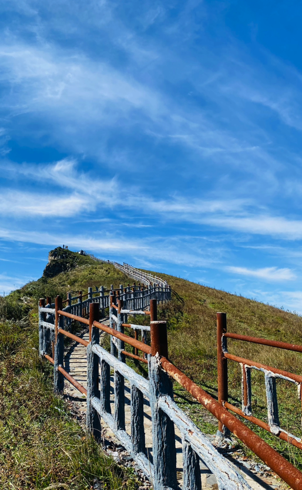

下山过程中，发生了一点小插曲，因为对路线不太熟，一部分人走了有明显栏杆的国家步道，另外一部分人走了小路去象鼻山。因为路线不一致，行进途中就出现了人员点不齐的情况。我们一组就在国家步道上原地休息等待情况确认。这时差不多下午两点多时分，阳光明媚但不燥热。此时路边的栗子树上跑出来两只小松鼠，刚开始还有点羞涩，时间久了看我们没有侵略性，便互相追逐打闹起来。

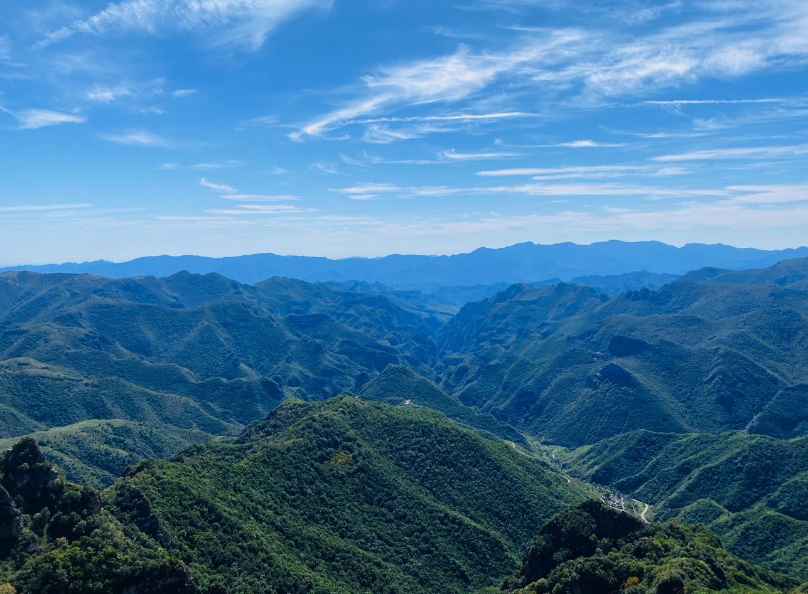

每一段旅程都有结束，每一次爬山都有下坡。旅程结束伴随着一堆需要浆洗的衣服，下山伴随着太阳西下和疲惫上身。下到山下，完全笼罩在山的影子里，气温也逐渐降低了，好在大巴司机就在下山的地点等着收队，不需要走太多的公路，就可以顺利返程了。

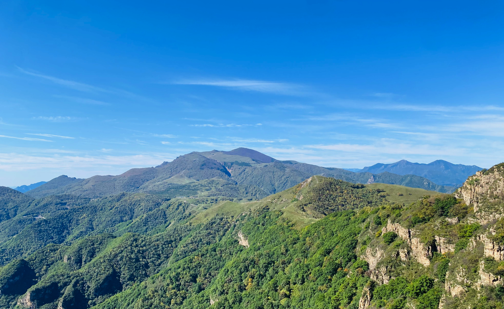