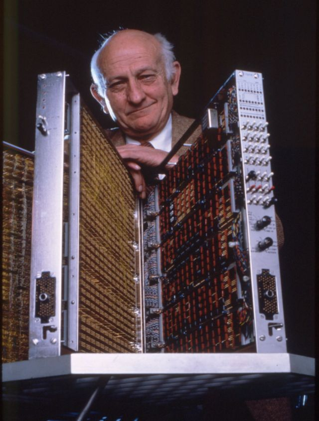
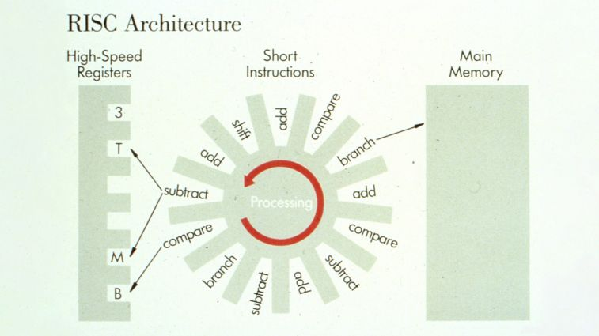

约翰·科克（1925年5月30日 - 2002年7月16日），科克对高性能计算机的体系结构和优化编译器的设计做出了重大贡献，发现并系统化了用于优化编译器的多种基本转换，包括降低运算符强度、消除公共子表达式、寄存器分配、常量传播等。

约翰·科克于1925年出生于美国北卡罗来纳州夏洛特市。他的父亲诺曼是杜克电力公司的总裁和杜克大学董事会成员。

约翰·科克于1946年获得杜克大学机械工程学士学位，1953年获得杜克大学数学博士学位。博士毕业后，科克加入了 IBM，并在 T.J. Watson 研究中心工作直到退休。

科克从 1975 年开始领导 IBM  801 微型计算机项目，该项目最初是一个纯粹的研究项目。801 设计理念基于硬件和编译器之间的紧密耦合和同步开发，由此产生的体系结构与当时在硬件中内置许多复杂指令的常见做法不同。

科克决定在设计 801 时，使用一小组基本指令进行优化，以供编译器使用，从而产生更简单但更快的机器。这对计算机体系结构研究产生了广泛的影响，后来被称为精简指令集计算机 （RISC） 方法。科克和合作者认识到，一组适当定义的机器指令，以及由精心设计的编译器生成的程序，利用该指令集，可以产生非常高性能的流水线处理器，与使用复杂指令的计算机相比，成本更低，电路更少。

RISC 成功的关键是优化编译器能够有效地使用简化的指令集。作为开发此类编译器理论基础的先驱，科克与 Frances Allen 共同开发了区间分析，这是一种基于控制流图缩减的程序分析技术 。科克共同发明了当今编译器的许多优化转换，包括数组的高效范围检查、全局公共子表达式消除、代码移动、运算符强度降低、常量传播、死代码消除和指令调度。与其他人的工作不同，科克的编译器优化技术与计算机体系结构的相关设计密切相关。

RISC 的想法受到科克之前在计算机体系结构和优化编译器技术方面的工作的影响。他参与的 Stretch 项目有一个雄心勃勃的目标，即比现有计算系统（如 IBM 704）快 100 倍，同时在寻址、浮点运算和非数值运算方面提供灵活性。将性能提高两个数量级的挑战导致了 Cocke 共同设计的几个硬件和软件功能，包括指令流水线、纠错码 （ECC）、指令调度和寄存器分配。这些想法中的大多数在 Stretch 中首次使用 50 多年后仍在现代计算机架构中使用。Stretch 项目是 IBM System/360 和 IBM Engineering Verification Engine（一种用于模拟 IBM 计算机逻辑电路的特殊用途并行处理器）的原型。

科克对计算机体系结构和优化编译器的开创性研究对计算系统产生了持久的影响。801 小型计算机被认为是第一台 RISC 机器。该技术直接馈送到 IBM 基于 RISC 的商业 RS/6000 系列工作站中，后来又被馈送到 Apple、IBM 和 Motorola 共同开发的 PowerPC 处理器架构中，该架构用于各种计算机系统，包括 IBM 的 Blue Gene/L 超级计算机。RISC 处理器甚至用于 IBM 3090 和 390 系列主机，以提供特殊功能。许多计算机公司已将 RISC 技术纳入其产品线。惠普的产品线基于 RISC 原理的变体和扩展，并且还将其设计授权给日立和三星。世界各地的许多计算机公司都向 IBM 寻求许可，以使用科克开发的 RISC 技术。Sun Microsystems、MIPS、Motorola 和 Intel 也开发了基于 RISC 的微处理器。

约翰·科克在 1989 年与安妮·霍洛威结婚，当时他已接近退休。在 1998 年福布斯杂志的一次采访中，他说「我想我当时相对心不在焉......但是，你知道，有些人对科学的兴趣比对正常的生活方式更感兴趣。」。科克还不太关注他的工资和股票证书，据说他的助手需要定期检查他扔掉的垃圾，以取回他可能无意中丢弃的任何有价值的东西。

尽管他举止不拘一格，但 IBM 还是在 1972 年授予他 IBM Fellow 称号，以表彰他的许多成就。这给了他灵活性，在接下来的 20 年里，直到他退休，他可以从事他感兴趣的硬件或软件的任何方面，而不会狭隘地专注于即时的商业应用。

1987年约翰·科克获得了图灵奖，1991年获得美国国家技术奖章，1994年获得美国国家科学奖章。

## 参考资料
1. https://baike.baidu.com/item/%E7%BA%A6%E7%BF%B0%C2%B7%E7%A7%91%E5%85%8B/7868274
2. https://amturing.acm.org/award_winners/cocke_2083115.cfm
3. https://www.ibm.com/history/john-cocke