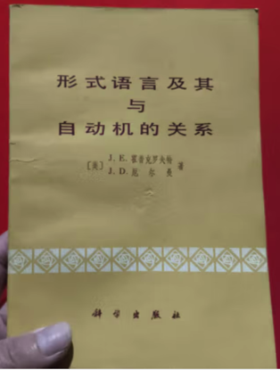

约翰·霍普克罗夫特（John E Hopcroft，1939年10月7日 - ），美国计算机科学家，中国科学院外籍院士，1986年图灵奖得主。在算法和数据结构设计，以及自动机理论、计算机复杂性方面做出了贡献。

霍普克罗夫特1939年10月7日出生于美国华盛顿州西雅图的一个工人阶级家庭。他的父亲是第一次大战的英国退伍军人，由于无法在英国找到工作而移居加拿大。最终一路工作到西海岸，最后到西雅图，在那里他遇到了约翰的母亲并与之结婚。

霍普克罗夫特从小就对技术着迷，起初是火车，后来是数学和逻辑。1961年，获得西雅图大学电气工程学士学位，1962年获得斯坦福大学电气工程硕士学位，1964年获得博士学位。

1964年博士毕业后，霍普克罗夫特再普林斯顿大学任教。

1967年，加入康奈尔大学。在1987年至1992年间，担任计算机科学系主任，1993年担任学院事务副院长。1994年至2001年任康奈尔大学工程学院院长。2009年当选为美国科学院院士，2017年当选为中国科学院外籍院士。

霍普克罗夫特的研究集中在计算的理论方面，尤其是算法分析、自动机理论和图算法。在早期，算法往往根据程序的总运行时间进行比较，总运行时间取决于计算机的速度、编程效率、算法的恒定开销以及随着输入变大而运行时间的增长率。霍普克罗夫特认识到，随着计算机变得更快并处理更大的问题，需要了解的最重要的部分是最后一个部分：运行时间的增长率。他对这种「渐进复杂性」的关注为算法分析的新领域设定了方向。

霍普克罗夫特著有[《形式语言及其与自动机的关系》](https://item.jd.com/10119157481410.html)（1971 年），并与美国计算机科学家 Jeffrey D. Ullman 和 Alfred V. Aho 合著了[《计算机算法的设计与分析》](https://item.jd.com/10069160427578.html)（1974 年）、《自动机理论导论》、《语言与计算》（1979 年）和《数据结构和算法》（1983 年）。

从2011年起，霍普克罗夫特每年在上海交通大学工作三个月，讲授计算机科学方向课程，据统计至2024年，霍普克罗夫特已授课13门次，学生逾600人。他还将课程讲义近乎无偿地在中国出版，唯一的要求是售价在30元以下，保证所有学生能够支付。

## 参考资料
1. https://www.cs.cornell.edu/jeh/
2. https://www.britannica.com/biography/John-Hopcroft
3. https://baike.baidu.com/item/%E7%BA%A6%E7%BF%B0%C2%B7%E7%88%B1%E5%BE%B7%E5%8D%8E%C2%B7%E9%9C%8D%E6%99%AE%E5%85%8B%E7%BD%97%E5%A4%AB%E7%89%B9/64581583
4. https://amturing.acm.org/award_winners/hopcroft_1053917.cfm