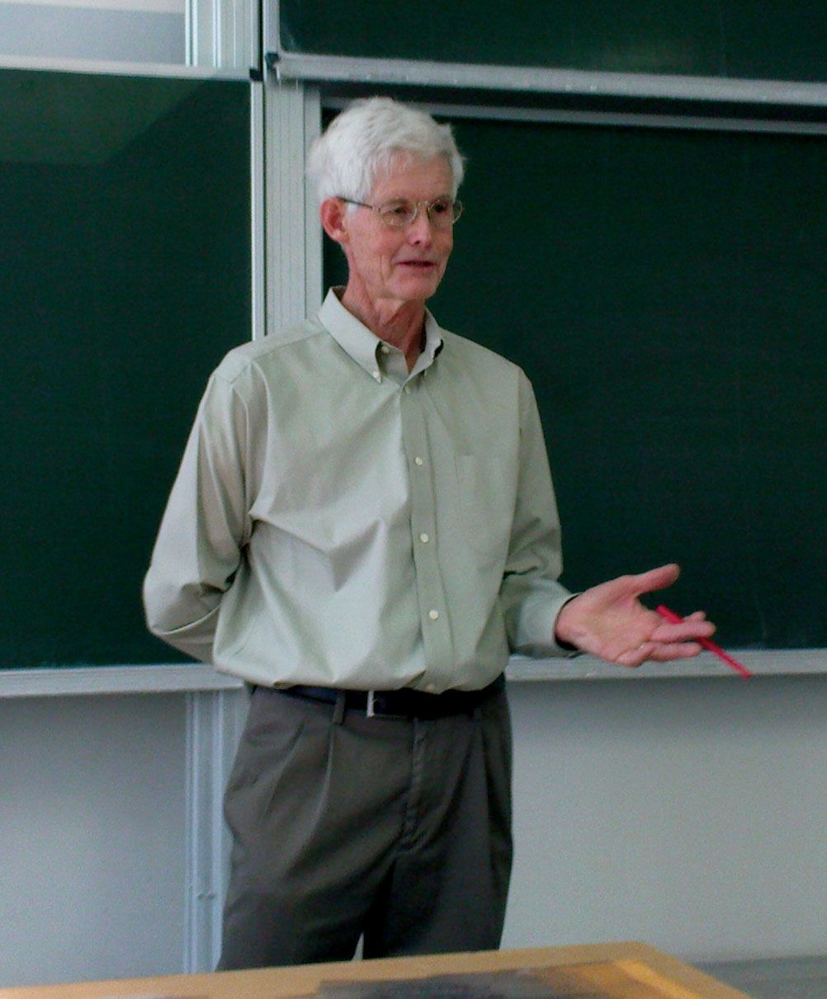

斯蒂芬·库克（Stephen Cook，-1939年12月14日 - ），1982年图灵奖得主，ACM fellow，计算复杂性理论的重要研究者。

从我们用来优化制造的算法到保护我们个人数据安全的密码学，计算复杂性在现代生活中起着至关重要的作用。但是我们如何确定哪些复杂的问题对计算机来说很容易解决，哪些是困难的，甚至是不可能的呢？斯蒂芬·库克是这个问题背后的基础思想家。

1939年12月14日，斯蒂芬·库克出生于美国纽约州布法罗，他的父亲是联合碳化物公司「Union Carbide」的一名化学家，他的母亲是一名家庭主妇。1949年全家搬到了纽约州克拉伦斯，那里是指入式起搏器的发明者威尔逊·大巴奇「Wilson Greatbatch」的家。十几岁时，斯蒂芬·库克对电子产生了兴趣，并为 Greatbatch 工作，当时该公司正在试验基于晶体管的电路。

1957年中学毕业后，斯蒂芬·库克进入密歇根大学科学工程专业就读。他在 Bernard Galler 教授的新生课程中接触到计算机编程，他和一名同学共同编写了一个程序来测试哥德巴赫猜想，即每个大于2的偶数都是两个素数之和。后来斯蒂芬将专业改为数学。1961年，斯蒂芬·库克获得美国密歇根大学理学学士学位，1962年获得哈佛大学理学硕士学位，1966年获得哈佛大学数学博士学位，博士研究课题是计算复杂性，他的博士论文题目为「On the Minimum Computation time of Functions」《论函数的最小计算时间》，探讨了乘法的固有计算复杂性。该论文的一个贡献是改进了 Andrei Toom 的乘法算法，该算法现在称为 Toom-Cook乘法。

1966年至1970年间，进入加州大学伯克利分校数学系担任助理教授。

斯蒂芬·库克在197年 ACM SIGACT 计算理论研讨会上发表开创性论文「The Complexity of Theorem Proving Procedures」（定理证明过程的复杂性），首次提出NP完全性问题，为NP完备性理论奠定了基础。

1970年之后，斯蒂芬·库克进入多伦多大学。1985年，他晋升为多伦多大学教授。斯蒂芬·库克的工作得到了广泛的认可，他于1982年被授予ACM图灵奖，他也是美国国家科学院、美国艺术与科学院的成员。

## 参考资料
1. https://baike.baidu.com/item/%E5%8F%B2%E6%8F%90%E8%8A%AC%C2%B7%E5%8F%A4%E5%85%8B/2154582
2. https://blog.csdn.net/m0_37149062/article/details/106633307
3. https://www.britannica.com/biography/Stephen-Arthur-Cook
4. https://amturing.acm.org/award_winners/cook_n991950.cfm
5. https://gsas.harvard.edu/news/stephen-cook-2020-centennial-medal-citation
6. [Cook 先生的主页](https://gsas.harvard.edu/news/stephen-cook-2020-centennial-medal-citation)