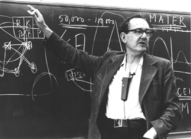

赫伯特·亚历山大·西蒙（Herbert Alexander Simon，1916年6月15日 - 2001年2月9日），美国计算机科学家、心理学家，中国科学院外籍院士，诺贝尔经济学奖获得者，诺贝尔经济学奖获得者，中文名为司马贺。他对计算机的杰出贡献源于他希望使计算机成为模拟人类解决问题的有效工具的愿望。

瑞典科学皇家学院总结认为：「就经济学最广泛的意义来说，西蒙首先是一位经济学家，他的名字主要是与经济组织中的结构和决策这一相当新的经济研究领域联系在一起的」。其实，西蒙在人工智能、信息处理、决策理论、问题解决技术、组织理论、复杂系统这些领域中都做出过先驱性的贡献。

西蒙1916年6月15日出生于威斯康星州密尔沃基，父亲是 Cutler-Hammer 制造公司的员工，负责设计控制设备。

1936年毕业于芝加哥大学，并于1943年获得政治学博士学位。在政治学领域担任过多个职位后，他于1949年成为卡内基理工学院（现在为卡内基梅隆大学）的管理和心理学教授，后来成为卡内基梅隆大学的计算机科学和心理学教授。西蒙在卡内基梅隆一直工作到退休，任职期间在多个领域做出了开创性的贡献，巩固了他作为真正的跨学科研究人员的地位。

西蒙指出，人们打算保持理性，但他们很少（如果有的话）能够获得所有信息或做出最佳理性选择所需的所有时间。因此，西蒙得出结论，我们不能，因为我们不能，通过使用详尽、精确的算法来解决问题。相反，我们必须使用更简单的启发式方法，并接受令人满意的结果而不是最佳结果，以便做出决策或解决问题。用一个常见的类比：一个没有时间的保险箱破解者可以尝试每一种组合，因此可以确保最终打开保险箱。然而，在现实世界中运行的 safecracker 时间有限，因此首先尝试基于所有者的家庭生日、周年纪念日等的组合。这种启发式方法并不能保证成功，但它会经常起作用，并且当它起作用时，可以更快地给出结果。

西蒙和他的学生，也是他的同时 Allen Newell 一起，在第一个成功的 AI 程序中采用了启发式解决问题的概念，即1955-56年的逻辑理论家（Logic Theorist）。西蒙和 Newell 以及 Shaw 在 1957-58年创建了另一个著名的程序 The General Problem Solver（GPS）。

西蒙、Newell 和他们的同事 Alan Perlis 于1964年首次创建了计算机科学系，卡内基梅隆大学计算机科学学院在 AI、仿真、软件设计和人机交互领域表现出色。

1975年，西蒙获得了ACM图灵奖（与他的学生 [Newel](http://edulinks.cn/2024/11/22/20241122-allen-newell/)l 一起）。1978年，西蒙因其提出的有限理性理论，获得了诺贝尔经济学奖。

## 参考资料
1. https://baike.baidu.com/item/%E8%B5%AB%E4%BC%AF%E7%89%B9%C2%B7%E4%BA%9A%E5%8E%86%E5%B1%B1%E5%A4%A7%C2%B7%E8%A5%BF%E8%92%99/15237989
2. https://baijiahao.baidu.com/s?id=1780183435650441652
3. https://zhuanlan.zhihu.com/p/29882449
4. https://amturing.acm.org/award_winners/simon_1031467.cfm
5. http://diva.library.cmu.edu/Simon/
6. https://www.historytools.org/people/herbert-a-simon-complete-biography