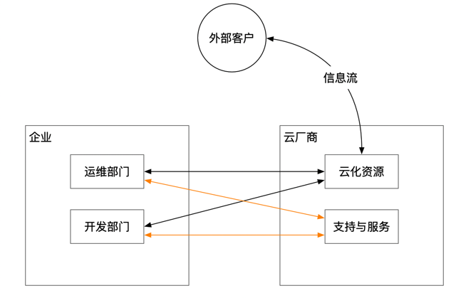
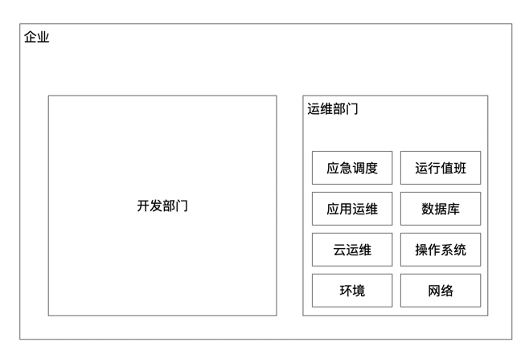

云已经不是一个新鲜的事物了，几大运营商提供了丰富的云上产品供大家选择。一个中小型的公司，如果选择将企业的业务系统或内部信息系统部署在云上，能够免除机房建设、服务器硬件采购、网络硬件采购、服务器和网络的日常运维等很多工作，原本这些工作需要投入的资金和人力，都以云服务投入的方式交给了云厂商，公司则获得了相当大的灵活性和便捷性，能够快速的获取所需要的信息系统基础设施及上层的产品服务。

## 小型机构

使用外部云厂商的公司，可能内部仅需要维持一个小规模的运维团队来对云上资源进行规划管理，日常的运维重点工作放在业务系统的应用运维上就可以。云厂商服务的可靠性是这些公司信息系统安全稳定运行的重要保障。

如果公司的业务持续发展扩大，在单个可用区部署系统就不太能够满足业务连续性的要求，此时会加大云服务的投入实现在多个可用区部署，确保不会因为云厂商单个可用区的故障而影响业务运行。毕竟，某云厂商的机房空调故障或其他事故也不是一次两次了。

## 大型机构

对于企业规模再扩大，当基础设施的数量级开始上万甚至更高的时候，或者因为某些特殊行业的政策要求，使得企业不得不考虑云的本地化部署，此时企业内部的运维组织结构开始变得复杂起来。

对于那些本来就是用企业内部基础设施资源来提供科技信息服务的公司来说，运维团队往往会比较大，如果企业实力雄厚进行固定资产投资自建机房，那就会更加庞大。

一般来说基建是由专门的建筑承包商来负责完成，基建交付给用户后，通常会由园区管理部门或者物业部门来负责管理园区的风火水电这些基础的服务。

交给运维部门使用的，是具备了电力供应、备用电力供应、空调供应、消防用水供应，能够将服务器、网络设备上架部署的成熟的机房环境。

运维部门内部，就要区分环境设备管理部门，负责设备的采购、上架以及日常运行过程中的环境巡检和故障处理；网络部门，负责网络规划和管理，因为网络设备的特殊性，有些单位可能还会将网络设备的管理交给网络团队；基础软件管理部门，主要负责操作系统的运维管理，包括安装和日常运维等等。

再往上就到了应用运维部门，有些应用运维人员是在开发团队，有些则是在数据中心，特别是金融行业，按照监管和业务连续性的要求，应用运维大多数都是在数据中心。这样在数据中心，除了基础设施部门外，还要安排人数众多的应用运维部门。

如果企业内部使用了云的本地部署方案，那么在应用运维部门和基础设施运维部门之间，还要加一个云的运维管理部门，再额外加上很多云使用的限制和约束，那机构内部组织之间的关系就更复杂了。

当一个企业运维部门扩大化的时候，企业的研发部门一定是先于运维部门扩大化。运维做为成本中心，一般都是为企业发展和研发服务的。运维部门随着企业信息化规模的扩大而扩大之后，运行监控、日常值班、应急响应等一些列运维领域的痛点问题就被逐步放大，从而成为运维行业着力研究解决的重点。