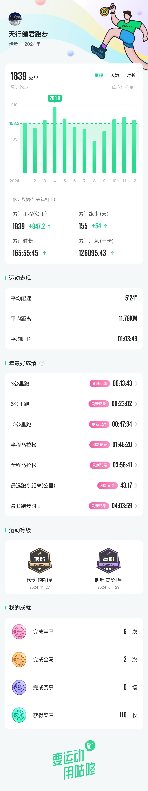

不刷抖音、不看微博，平平安安我又度过了一年，今天来写下2024年的总结和感悟。

## 跑过的路
今年最高兴的事是自己完成了2次马拉松，第一次是 [通州马拉松](https://mp.weixin.qq.com/s/nrrgbwgj4eMJWwSsWRKdjQ) 没想到自己能坚持下来，还能够跑进4小时。这大大增强了我对自己跑步的信心，对于马拉松35公里以后的感觉，也有了切身的体会。

第一次马拉松充满了忐忑与兴奋，第二次马拉松则就体现了轻敌冒进的问题，[第二次参加的马拉松是海淀马拉松](https://mp.weixin.qq.com/s/iP2Wmv6UAQ4EF55bYc6sCw)。写总结的时候，再来看看海淀马拉松的配速表，妥妥的前面冲的太快了，后面心率压不住导致降速明显，勉强坚持到了终点。

这两次马拉松的经历让我深刻体会到，第一要清楚的认识自己的体能和能力，另外要在比赛中合理分配体能，马拉松不是1000米，毕竟要等到35公里之后才能看出真正的实力。这种感悟让我在生活、工作中也受益颇多，现在单位中有一些急难杂事的时候，我往往能够让自己的内心非常平静，从从容容的对待每一件突然冒出来的事情，这样往往能够处理的更合理。

刚才还看了新华社推出的[马拉松年终短片](https://mp.weixin.qq.com/s/Z5Ib0yAVGP1RJbysURb5Eg) 里面很多故事都非常感人，有一句话非常好「你对待痛苦的方式，就是你面对人生的态度」，生活虽有沉闷，但跑起来就会有风。

看了下咕咚2024年的总结数据，2024年在3公里、5公里、10公里、半马、全马几个维度都刷新了自己历史最好成绩。2025年，期望能够在全马刷新一下成绩就满足了。

## 读过的书

微信读书现在是2024年主要的阅读媒介，一般都是抽一些等电梯、吃饭间隙或者睡前的功夫看一看，全年陆陆续续也看了12本书。缺点就是时间块太分散，有些内容看的不系统，记忆也就没有那么深刻。

| No.   | 书名               | 作者          |      | 开始时间 | 完成时间 | 年份 | 总数  |
| ---- | -------------------- | ----------------- | ---- | ---------- | ---------- | ---- | ---- |
| 12   | 国富论               | 亚当斯密          |      | 2024-11-25 | 2024-12-25 | 2024 | 111  |
| 11   | 制内市场             | 郑永年            | 1347 | 2024-10-08 | 2024-11-22 | 2024 | 110  |
| 10   | 追风筝的人           | 卡勒德·胡赛尼     |      | 2024-09-05 | 2024-10-07 | 2024 | 109  |
| 9    | 列宁画传             |                   |      | 2024-08-17 | 2024-08-30 | 2024 | 108  |
| 8    | 马克思传             |                   |      | 2024-03-02 | 2024-08-17 | 2024 | 107  |
| 7    | 我们的纲领           | 列宁              |      |            |            | 2024 | 106  |
| 6    | 华与华正道           | 华彬              |      | 2024-08-12 | 2024-08-15 | 2024 | 105  |
| 5    | 朱德传               |                   |      | 2024-06-05 | 2024-08-12 | 2024 | 104  |
| 4    | 让孩子学会学习       | 法比安·格罗利蒙德 |      | 2023-12-25 | 2024-06-19 | 2024 | 103  |
| 3    | 粟裕回忆录           | 粟裕              |      |            | 2024-06-03 | 2024 | 102  |
| 2    | 曾国藩传             | 梅寒              |      | 2024-03-24 | 2024-04-09 | 2024 | 101  |
| 1    | 资本论（超值白金版） | 马克思            |      | 2023-12-26 | 2024-03-01 | 2024 | 100  |

全年中印象最深的是唯一的一本文学类作品「追风筝的人」，当亲情、爱情、种族交织在一起的时候，即便是遥远国度阿富汗发生的事情，也会让人有强烈的同情心。看完这本书之后我甚至去网上搜寻了一些博主拍摄的阿富汗现在的生活情况，想通过视频更真切的了解下这个国家人们生活的状况。

今年也了解到阿富汗的巴米扬大佛被塔利班毁坏的故事，当五一期间我在西安看到剧场内展出的巴米扬大佛时，对比在云冈石窟看到的大佛，对于人类文化遗产被无情摧毁的事实更是扼腕叹息。

## 写过的代码

## 生活的苦

人到中年，总是要面对各种各样的问题。问题往往不是一个一个出现，而是同时涌来。

记得12月初的时候，在单位上线没想到遇到了一个BUG而导致加班到很晚，回去却发现儿子发烧还得跑去医院看急诊，回来后又遇到楼下邻居投诉卫生间漏水。此时才深刻的体会到，风平浪静的生活才是最幸福的，家人健康，工作在自己能力范围内顺利推进，没有其他的烦心事打扰，那已经是极好的生活状态了。

生活总是会出问题。有时是你不得不被动接受的问题，有些也可能是好奇心引发的问题。但是我们总是希望，也总是相信自己能够解决生活中遇到的问题，因为希望家人身体健康，希望孩子学业有成，希望工作顺利升职加薪，不管如何，我们总是保留着希望。

正如尼采所说「知道为什么而活的人，便能生存。」。

## 2025展望

2025年又是崭新的一年，在这一年里，能够做好自己，就是幸福的一年。

新的一年，我希望在以下几个方面继续努力：
* 马拉松能够突破 345
* 读书超过12本
* 每周要有代码提交

亲爱的朋友，你有什么新的希望要在2025年实现呢？