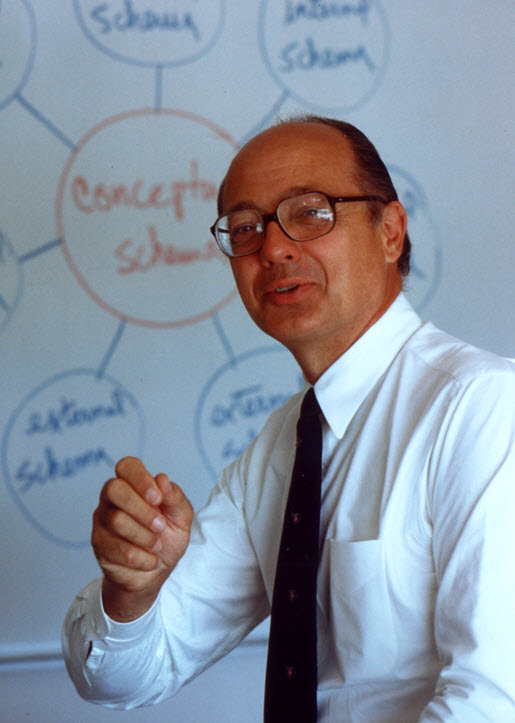
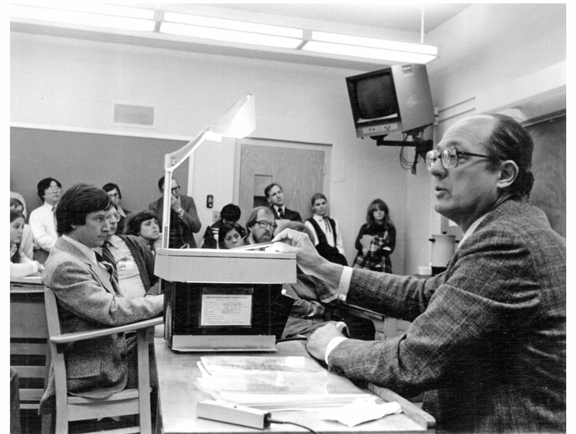
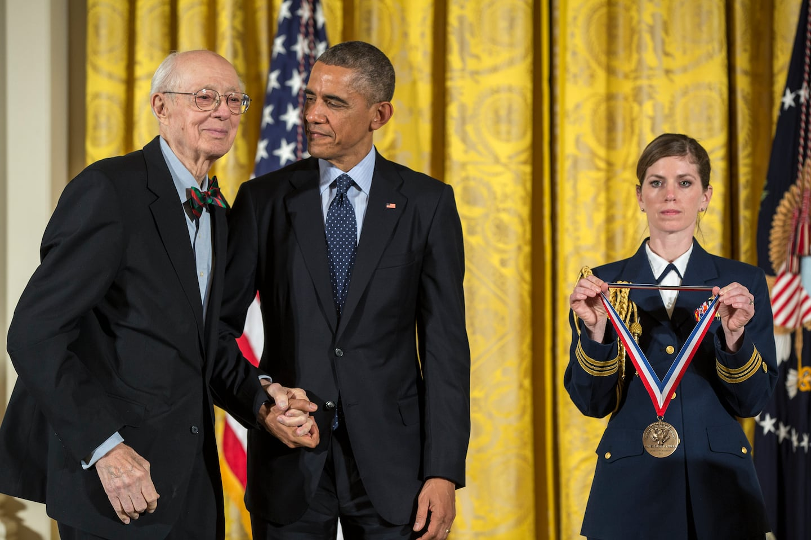

查尔斯·巴赫曼（Charles William Bachman，1924年12月11日 -  2017年7月13日），美国计算机科学家，因对数据库技术的杰出贡献荣获1973年图灵奖。巴赫曼还经营了一家化工厂，创建了成本资本会计系统，并创立了一家上市公司。

巴赫曼出生于美国堪萨斯州曼哈顿，他的父亲是曼哈顿堪萨斯农业学院的橄榄球主教练，随着父亲到密歇根州立大学担任主教练，巴赫曼也搬迁至密歇根州。1943年，巴赫曼进入密歇根州立大学。完成第一年的课程后，巴赫曼加入美国陆军，二战期间在太平洋战区服役。

1946年退伍后，巴赫曼回到密歇根州立大学，1948年获得机械工程学学士学位。1950年，巴赫曼获得宾夕法尼亚大学机械工程硕士学位，他还就读于沃顿商学院。毕业后，巴赫曼在密歇根州陶氏化学公司「Dow Chemical Company」担任运筹学问题工程师，由于对管理和成本会计方法的兴趣，他接触到了穿孔卡机，并在1957年被选为新数据处理部门的第一任负责人。在此期间，巴赫曼建议公司从 IBM 购买了一台数字计算机「IBM 709」并聘请了一支由计算机成员和数据分析师组成的团队。这使陶氏有资格成为 Share Inc. 的成员，Share Inc. 是一个由志愿者运营的IBM大型计算机用户组，他通过 IBM 的 SHARE 用户组与其他计算机中心领导者的接触，改变了他的职业生涯。

1961年，巴赫曼加入纽约市的通用电气公司「General Electric Company」，他所在的团队负责试验运筹学、模拟、预测和自动化等新方法，以便在公司的许多不同业务部门中应用。

1950年代，由于计算机快速发展的趋势，数百家美国企业争先恐后地订购计算机，但是让机器做有价值的事比预想的要困难得多，购买的计算机通常最终仅用于自动化工资单或计费工作。到1960年，管理专家开始意识到，公司应当将计算机与销售、会计和库存等业务流程联系在一起，以便管理人员能够访问集成的最新信息。各种公司都试图构建这种完全集成的管理信息系统。但是在那个时代，因为硬件和软件的限制使这个想法实现起来非常困难，每个业务流程都单独运行，相关的数据文件存储在磁带上。对程序的轻微修改可能意味着重写整个公司的相关程序，但业务需求不断变化，因此无法满足实际的需要。

巴赫曼在通用电气公司从事了「集成系统」项目，并为 GE 在费城的一家制造工厂生产了制造信息和控制系统「MIACS」，使用最早可用的磁盘驱动器。1963年，巴赫曼发明了集成数据存储「IDS」，IDS 在磁盘上维护了一组共享文件，以及用于构建和维护这些文件的工具。负责特定任务（如账单或库存更新）的程序通过向 IDS 发送请求来检索和更新这些文件。IDS 为应用程序提供了一组强大的命令来操作数据，这很快被称为数据操作语言的早期表达。

IDS 使程序员的工作效率大大提高，从今天的观点来看，这种设计实际上是将对底层磁盘存储设备的访问封装为标准、专用的数据接口，解决了数据管理的复杂性，是朝着集成不同类型数据迈出的关键一步。到了60年代末，IDS 等程序被称为「数据库管理系统」，是商业计算研究和开发的重要领域之一。当大型机软件行业在1970年代蓬勃发展时，数据库管理系统是其最重要的产品类别，巴赫曼在这个过程中发挥了重要作用，作为计算机贸易协会 CODASYL（著名商业编程语言 COBOL 创建者）数据库任务组的早期主席和积极成员，对数据库领域的概念、术语和技术的标准化起了重要推动。巴赫曼对 IDS 的设计以及网络数据模型基本概念的制定，对数据库小组的工作起了重要影响。

1970年，霍尼韦尔「Honeywell Inc.」收购了通用电气的计算机业务，巴赫曼前往波士顿为霍尼韦尔的高级研究小组工作。

1973年，巴赫曼成为第八位图灵奖获得者，他是第一位没有博士学位的图灵奖获得者，第一位接受过工程而不是科学培训的人，第一位因计算机应用于工商管理而获奖的人，第一位因特定软件而获奖的人，也是第一位将整个职业生涯都花在工业界的人。

1981年，巴赫曼转到 Cullinane Database Systems Inc 从事数据库设计工作。1983年，巴赫曼离职创办了自己的咨询公司 Bachman Information Systems Inc. ，他的公司后续经历了几次并购。

1996年，巴赫曼退休到亚利桑那州的图森。

巴赫曼因「在数据库管理、事务处理和软件工程方案的基础发明」而获得2012年美国国家技术与创新奖章（NMTI）。该奖项由总统颁发给为新技术和重要技术的发展做出重大贡献的美国发明家/创新者。该奖项于2014年由巴拉克·奥巴马总统颁发给巴赫曼。

## 参考资料
1. https://baike.baidu.com/item/%E6%9F%A5%E7%90%86%E5%A3%AB%C2%B7%E5%B7%B4%E8%B5%AB%E6%9B%BC/4004186
2. https://www.britannica.com/biography/Charles-William-Bachman
3. https://amturing.acm.org/award_winners/bachman_9385610.cfm
4. https://cacm.acm.org/news/in-memoriam-charles-w-bachman-1924-2017/
5. https://ieeexplore.ieee.org/document/6096530