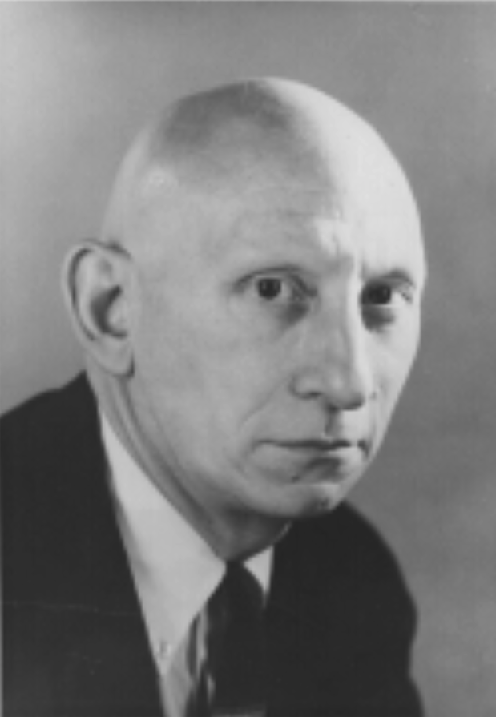
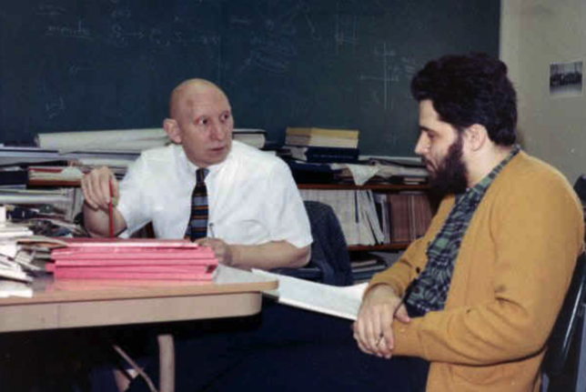

艾伦·佩利（Alan Perlis，1922年4月1日 - 1990年2月7日），计算机学科的奠基人，第一届图灵奖得主。

艾伦·佩利于1922年4月1日出生于宾夕法尼亚州匹兹堡的一个犹太家庭。他在家乡上小学，1933年进入著名的公立高中「Taylor Allderdice High School」。后来进入卡内基理工学院，1942年12月20日以优异的成绩毕业，获得化学学士学位。

毕业后2天，即1942年12月22日早上，他报名参加了美国陆军航空队的航空学院气象学计划。经过9个月的培训，他成为气象服务部门的二级中尉。他被分配到宾夕法尼亚州哈里斯堡的陆军航空队情报学校。佩利后来还被派往英国美军第9陆军航空队作战总部，在那里担任一个侦察中队的情报官和气象官。

1945年9月，佩利退役后进入加州理工大学攻读化学研究生。但是他很快意识到这不是他感兴趣的领域，于是转到麻省理工学院学习数学。他在麻省理工学院菲利普·富兰克林「Philip Franklin」指导下金星了数值分析方法的研究，并在1949年完成了硕士论文「通过迭代方法求解线性积分方程」，在1950年完成了博士论文「关于积分方程，通过迭代和解析延拓求解」。

佩利的导师菲利普·富兰克林「Philip Franklin」参与了麻省理工学院的数字计算机项目旋风计划「Project Whirlwind」，该项目由杰伊·福里斯特「Jay Forrester」领导，旨在为美国海军开发一款通用飞行模拟器，该项目研制了世界上第一台可以实时运行的数字计算机，这台计算机的成功直接导致了1951年麻省理工学院林肯实验室的诞生「MIT Lincoln Laboratory」。

富兰克林时该计划数学小组的负责人，这个小组负责为计划中的计算机准备软件程序。佩利因为具备军事经验，被邀请以兼职方式参与该项目。在1948年到1949年，佩利协助富兰克林团队为尚未完成的计算机编写基本程序，并调查已知的数值方法。

获得博士学位后，佩利于1951年在马里兰州阿伯丁试验场的弹道研究实验室「BRL」工作，从事弹道学表的计算工作。阿伯丁试验场是计算机设计、编程和数值方法新研究的摇篮。最多的时候试验场容纳了三台不同的计算机：ENIAC「1947年转移到BRL」、EDVAC「1949年转移到BRL」、ORDVAC「1951年春天转移到BRL」。

1952年，佩利重新回到了旋风计划，此时更名为麻省理工学院数字计算机实验室，进入了罗伯特·威瑟「Robert Wieser」的团队，负责科德角项目。这是一个用于自动检测敌机的原型系统。科德角系统于1953年投入使用，为第一个全尺寸自动防空系统 SAGE 奠定了基础。

1952年9月，佩利加入普渡大学统计实验室担任数学系的助理教授和统计实验室计算部的主任，该实验室受 Carl F. Lossac 领导。到达后不久，佩利说服 Kossac 和大学管理人员购买了当时最好的中型计算机 Datatron 205。佩利的团队开始为其设计「数学语言编译器」，这是一组可以自动将以类似于数学符号编写的程序转换为机器代码的程序。它的功能与当时IBM开发的 Fortran 语言没有太大区别。它的有趣之处在于逻辑结构与 Datatron 205 完全独立，只需进行少量修改就可以在其他计算机上实现。这种独立于机器的特性比大多数高级语言出现的更早。

1956年，佩利进入卡内基理工学院（现在是卡内基梅隆大学）担任数学副教授和计算中心主任。在那里，他在 IBM 650 计算机上完成了编译器的第一个版本。很快这个编译器被许多大学计算设施用作 Fortran 的替代品，当时 Fortran 仅适用于更大、更昂贵的计算机。佩利的工作为促进编程技术的研究做出了很大贡献，他的工作似乎暗示了一条通往通用语言的道路。

1958年，佩利斯作为ACM程序设计语言委员会主席，牵头组织了瑞士苏黎世的ACM-GAMM联合会议，旨在解决早期高级语言（如FORTRAN）的移植性和抽象性不足问题。会议中，佩利斯提出将原计划命名的「国际代数语言（IAL）」更名为更简洁的「ALGOL」，并主导了语言核心设计。经过多次迭代，首版ALGOL 58诞生，但仍有局限。1960年，佩利斯再次召集国际专家在巴黎召开会议，最终推出ALGOL 60。该语言引入分程序结构、嵌套作用域和动态数组等创新特性，其语法通过BNF形式化描述，成为首个具备严格理论定义的语言。

ALGOL 60（Algorithmic Language 1960）是计算机科学史上具有里程碑意义的高级编程语言，其诞生过程与计算机科学家艾伦·佩利斯（Alan Perlis）的领导密不可分。作为首个采用巴科斯范式（BNF）严格定义语法的语言，ALGOL 60 不仅革新了编程语言设计理念，还为现代编译理论和结构化编程奠定了基础。

佩利斯不仅是ALGOL项目的主要组织者，还推动了其在学术界的普及。他率先将ALGOL引入大学课程，使计算机科学脱离传统的数值分析框架，成为独立学科。此外，他领导开发的ALGOL 60编译器为语言实践铺平道路，其设计的灵活参数传递机制和过程抽象概念深刻影响了后续语言（如C、Pascal）的发展。1966年，佩利斯因「高级编程技术及编译器构造的贡献」成为首位图灵奖得主，ALGOL系列也被誉为「公共汽车语言」——承载了程序语言理论的核心思想。

ALGOL 60的严谨性使其成为20世纪学术界描述算法的标准工具，并直接促进了编译技术的理论突破。例如，其嵌套结构催生了栈式内存管理模型，而形式化语法定义推动了自动机理论的发展。尽管ALGOL 60未在工业界广泛普及，但其设计哲学通过类ALGOL语言（如C）延续至今，佩利斯的开创性工作也成为计算思维中「抽象与自动化」的典范。

1971年加入耶鲁大学计算机系，担任计算机科学教授。

1990年2月7日在康涅狄格州纽黑文因心脏病发作去世，享年67岁。

## 参考资料
1. https://amturing.acm.org/award_winners/perlis_0132439.cfm
2. https://baike.baidu.com/item/%E8%89%BE%E4%BC%A6%C2%B7%E4%BD%A9%E5%88%A9/7397968
3. https://zhuanlan.zhihu.com/p/86652335
4. https://zhuanlan.zhihu.com/p/46988121