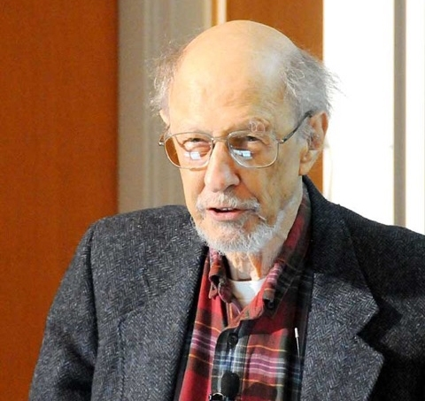

费尔南多·何塞·科尔巴托（Fernando José Corbató，1926年7月1日——2019年7月19日），美国物理学家和计算机科学家，1990年图灵奖得主，开发了早期的兼容分时系统并被广泛认为是密码的发明人。

科尔巴托是西班牙人，出生在加利福尼亚州的奥克兰。他的父亲是一位西班牙文学教授，1930年他父亲被加州大学洛杉矶分校聘用，科尔巴托随家人搬到加州南部。

第二次世界大战期间，科尔巴托在洛杉矶上高中，因为战事影响他得以提前毕业，并在17岁时加入美国海军，成为一名电子技术员。

1943年，科尔巴托考入加州大学洛杉矶分校。

1956年，他获得麻省理工学院物理学博士学位。在麻省理工学院期间，他在 Philip M. Morse 教授鼓励下成为使用 Whirlwind 计算机进行物理计算的专家。

博士毕业后，科尔巴托成为新成立的麻省理工学院计算中心的研究人员。该中心当时拥有一台 IBM 704 计算机，随着计算机使用的用户的增加和使用程度的深入，科尔巴托逐渐熟悉了该计算机的局限性。

当时许多用户对计算机的使用方式不满意。像 Whirlwind 这样的计算机一次只能供一个人使用，并且需要提前注册。而麻省理工学院计算中心的 IBM 704 计算机以「批处理模式」运行，由专门的人员负责提交并运行作业。这两种使用方式都要求程序员等待数小时或数天，如果由于错误而必须重新运行作业，则要再次等待。

1950年代末期，几个人提出了一种称为「分时」的新想法，其中包括麻省理工学院教授「[约翰·麦卡锡](http://edulinks.cn/2024/04/07/20240407-john-mccarthy/)」，这个方案支持多个用户同时连接到计算机。计算机会在他们的程序之间快速切换，先运行一小段时间，然后再运行另一个。每位用户使用称为终端的设备与他们的程序进行交互。为了使分时工作，计算机必须能够中断正在运行的作业、保存其状态、查找和恢复另一个作业，并在中断的位置启动它。

当时科尔巴托所在计算机中心的 IBM 709 计算机没有这样的能力。1961年，科尔巴托在 IBM 709上提出了一个小型项目，用于演示这种交互式计算。他与 Bob Daley 和 Marjorie Merwin-Daggett 一起构建了兼容分时系统「CTSS」的初始版本，并于1961年11月进行了演示。它将暂停的程序保存到四个磁带驱动器上，为终端的四个分时用户提供同时访问。科尔巴托、Merwin-Daggett 和 Daley 在1962年春季联合计算机会议上发表的一篇论文中描述了CTSS。

CTSS的兼容性在于，以批处理模式运行的二进制对象程序也可以进行交互运行，并且传统批处理可以与分时用户共享计算机。该系统为每个用户提供了一台虚拟的IBM 709计算机，该计算机可以执行用户程序和系统命令以响应在终端上输入的命令行。CTSS在后续的几年中继续发展，计算机升级到了IBM 7090。后来CTSS可以从位于麻省理工学院的办公室以及研究人员、工作人员家中电话拨号访问终端。

CTSS 还无意中帮助建立了密码的概念，由于不同的用户希望将自己的文件限制为只能自己查看，CTSS引入了让人们使用个人密码创建个人账户的想法。

1962年秋天，J.C.R. Licklider 和麻省理工学院教授 Robert M. Fano 发起了MAC项目，专注于分时，初期由美国国防部高级研究计划署资助。1963年，MAC项目使用的计算机从IBM 7090升级到IBM 7094。MAC项目计划开发CTSS的第二代替代品，称为 Multics：Multiplexed Information and Computing Service。MAC项目选择了通用电气作为计算机供应商，并邀请贝尔电话实验室参与软件设计和实施。Multics的目标还包括将内存分段和分页集成到一个虚拟内存系统中，该系统为共享内存多处理器提供单级存储。虚拟内存被组织成保护环，并特别注意确保系统安全。Multics 采用高级语言实现，许多行业观察家认为该项目过于雄心勃勃。

科尔巴托被选为MAC项目研究小组的负责人，他管理着一个大约30人的小组，与来自贝尔实验室和通用电子设备类似规模的团队协调。他的重要贡献之一是创造了一种强调开放沟通、全身审查和迭代改进的开发文化。从1963年到1970年代中期，他领导了 Multics 的开发。Multics 系统于1969年10月在麻省理工学院可供通用使用，于1970年至1978年由通用电气和霍尼韦尔销售。最后一个 Multics 系统于2000年关闭。

贝尔实验室于1969年退出了 Multics 项目。前 Multics 贡献者 Ken Thompson 和 Dennis Ritchie 开始开发一种简单而优雅的操作系统，称为 UNIX，UNIX 同时受到 CTSS 和 Multics 的影响。

科尔巴托的另一个遗产是「科尔巴托定律」，该定律指出，无论使用哪种语言，一个人一天可以编写的代码行数是相同的。

## 参考资料
1. https://baike.baidu.com/item/%E8%B4%B9%E5%B0%94%E5%8D%97%E5%A4%9A%C2%B7%E4%BD%95%E5%A1%9E%C2%B7%E7%A7%91%E5%B0%94%E5%B7%B4%E6%89%98/23620625
2. https://zhuanlan.zhihu.com/p/73992467
3. https://amturing.acm.org/award_winners/corbato_1009471.cfm
4. https://www.britannica.com/biography/Fernando-Jose-Corbato
5. https://news.mit.edu/2019/mit-professor-emeritus-fernando-corby-corbato-computing-pioneer-dies-0715