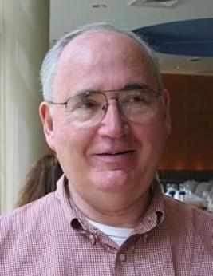

达纳·斯科特（Dana Stewart Scott，1932年10月11日 - ），1976年图灵奖得主，是国际公认的数理逻辑学家，其工作涵盖计算机科学、数学和哲学，致力于有限自动机理论的研究，他对自动机理论、模态逻辑、模型理论、集合论和编程语言理论作出了开创性的贡献。他对当代逻辑做出了重大贡献，并以创建域论而闻名，域论是数学的一个分支，对于分析计算机编程语言至关重要。

斯科特于1932年10月11日出生于加利福尼亚州伯克利，年少时斯科特学习了单簧管和一些钢琴课程，他对乐器如何发出声音产生了兴趣，通过阅读《音乐声音的科学》这本书了解到很多数学知识，这激发了他自学微积分相关的课程。他的妻子是钢琴家，女儿和孙女都是专业级的古典音乐家。

斯科特的父母都没有上过大学，而他很幸运地获得了一笔小额奖学金，足够他进入加州大学伯克利分校学习。斯科特于1950年进入加州大学伯克利分校，学习哲学和逻辑学。大学生活的前两年，斯科特的生活比较拮据，为了养活自己，他在学校图书馆的期刊室打工。在那里，他读了很多符号逻辑期刊上的文章，虽然大部分文章他都看不懂，除了 Jan Kalichi 有关真值表的那篇论文。后来斯科特还在伯克利见到了 Kalichi 并合作写了一些关于方程理论的论文。

1954年获得学士学位后，斯科特搬到普林斯顿大学，1958年在 Alonzo Church（美国逻辑学家） 的指导下完成博士学位。顺便提一句，艾伦·图灵在二战前是丘奇的博士生，他坚持让图灵用 lambda 演算来表述他所有关于超有限的计算工作。完成博士学位后在芝加哥大学担任讲师，并一直工作到1960年。

Michael Rabin 是斯科特博士期间的师兄，1957年，他们被选中在 IBM 约克镇高地研究中心进行暑期学习，一起研究有限状态自动机问题。1959年，斯科特和 [Michael Rabin](http://edulinks.cn/2025/06/13/20250613-michael-rabin/) 在合作的论文「Finite Automata and Their Decision Problems」（有限自动机与其判定性问题）中提出了非确定自动机的概念，这被证明是计算理论科学研究中的一个非常重要的概念，这篇经典卢文后来成为这个领域后续研究的灵感源泉。

二十世纪六十年代，斯科特先后在加州大学伯克利分校（1960-1963年）、斯坦福大学（1963-1969年）、普林斯顿大学（1969-1972年）工作。在斯坦福大学期间，斯科特认识像 Don Knuth、John McCarthy 等计算机科学系的重要人物。

斯科特于 1972 年担任牛津大学数理逻辑教授，在那里斯科特工作了九年。1981年，斯科特接受了卡内基梅隆大学计算机科学、数理逻辑和哲学教授的职位。

> 趁年轻时尽可能多地学习，因为以后的生活会变得太忙了！

> 试着把数学看作是一门实验课的。

斯科特于2003年以名誉教授的身份退休。

## 参考资料
1. [百度百科-达纳·斯科特](https://baike.baidu.com/item/%E8%BE%BE%E7%BA%B3%C2%B7%E6%96%AF%E7%A7%91%E7%89%B9/4005818?structureClickId=4005818&structureId=ced913fd22dfe016c93805da&structureItemId=078f17f96f9ac613ca636505&lemmaFrom=starMapContent_star&fromModule=starMap_content&lemmaIdFrom=324645)
2. https://amturing.acm.org/award_winners/scott_1193622.cfm
3. https://www.britannica.com/biography/Dana-Scott
4. https://history.computer.org/pioneers/scott.html
5. https://cacm.acm.org/news/an-interview-with-dana-scott/
6. https://m.thepaper.cn/baijiahao_19591944