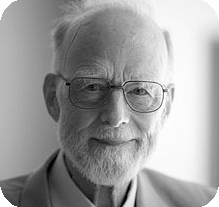

安东尼·霍尔（C.Antony R.Hoare，1934年1月11日 - ），被称为「托尼」霍尔，快速排序算法发明者，1980年图灵奖得主。

托尼于1934年1月11日出生在锡兰（现在的斯里兰卡）科伦坡市，全名叫查尔斯·安东尼·理查德·霍尔。他的父母参与了当时大英帝国的生意，他在英国接受了中学教育，曾就读于牛津的龙校「Dragon School」和坎特伯雷的国王学院「King's School」，大学在牛津学习现代哲学，这为他理解逻辑学奠定了基础。

1956年毕业时，托尼被征召进入皇家海军。两年义务兵役结束后，他回到牛津学习统计学，并开始使用 Mercury Autocode 进行计算机编程。研究生期间前往莫斯科国立大学，师从安德烈·柯尔莫哥洛夫「Andrey Kolmogorov」学习机器翻译。正是在这段时间，托尼认为排序很重要，在这里首先想到了后来被称为快速排序的新颖排序算法。

**工业实践与学术转向**
回到英国后，霍尔加入了名为Elliott Brothers的小型英国计算机公司。他领导的重要项目之一是为Elliott 503计算机开发**ALGOL 60编译器**。这段工业实践经历深刻影响了他后续的学术生涯，带来了两大核心研究主题的灵感：

1.  **编程语言的重要性**：在参与ALGOL 60项目（并受到Edsger Dijkstra, Peter Landin, Peter Naur等人的影响）时，霍尔认识到**递归（recursion）** 是清晰表达快速排序算法的关键。这次经历让他深刻体会到编程语言设计对软件开发的基础性作用。
2.  **并发控制的挑战**：为Elliott 503 Mark II开发操作系统的失败经历，促使他后期将大量研究精力投入到理解和控制程序执行中的**并发性（concurrency）** 问题上。

这段时期的一个美好收获是，他与团队成员吉尔·皮姆（Jill Pym）结婚，她成为了他的终身伴侣。

**编程语言设计与形式化方法的先驱**

图灵奖颁奖词特别强调了霍尔在**编程语言设计**领域的卓越贡献。他始终认为，作为程序表达媒介的编程语言设计至关重要，低劣的语言设计是导致软件质量低下、安全漏洞（如病毒入侵）和巨额经济损失的重要原因。他不断呼吁软件设计应追求**简洁（simplicity）和优雅（elegance）**，以确保软件处于人类智慧的掌控之中（这一观点在其图灵奖演讲[3]中清晰阐述）。他1973年发表的论文《编程语言设计提示》[2]是其思想的集中体现。

霍尔对计算机科学最革命性的贡献之一是在**程序语义形式化**方面。1968年，他离开工业界，成为贝尔法斯特女王大学（Queen's University, Belfast）的正教授。他对当时描述编程语言语义的主流方法感到不满。在深入研究罗伯特·弗洛伊德（Bob Floyd）关于程序赋义的工作后，霍尔于1969年发表了具有里程碑意义的论文《计算机程序设计的一个公理基础》[1]。在这篇论文中：
*   他摒弃了流程图，发展了一套基于 **“霍尔三元组”（Hoare Triples）** 的逻辑系统（`{P} C {Q}`），用于在程序规范下对语句行为进行推理。
*   他提出这种**公理化（axiomatic）** 系统可以作为定义编程语言语义的一种抽象方法。
这项开创性工作奠定了**程序验证（program verification）** 的理论基础，使得“开发可证明正确的程序”成为可能，而非事后补救。围绕“霍尔语义”（Hoare semantics）的研究极大地深化了人们对编程语言的理解和程序推理的能力。

**并发理论与CSP**

1977年，霍尔回到牛津大学担任教授，并重新专注于并发性问题研究。他认识到早期基于**共享变量（shared variables）** 的并发同步机制存在根本性缺陷，极易导致难以察觉却破坏性巨大的错误。

1978年，他做出了另一项重大贡献：在ACM通讯上发表论文（随后出版专著《通信顺序进程》[4]），提出了 **CSP（Communicating Sequential Processes）** 理论。CSP的核心思想是：程序（进程）间的交互应仅限于**预定义的通信（pre-planned communications）**，摒弃共享变量。CSP不仅成为重要的**并发建模理论**和**软件设计工具**，启发了大量后续研究及工业应用（如Occam语言），甚至直接影响了 **Transputer** 并行计算机架构的设计。

**晚年荣誉与持续影响**

霍尔于1999年从牛津大学退休，但并未停止研究，随即加入微软剑桥研究院（英国）。他继续活跃在科研前沿，其著作《统一理论》[6]在研究者中广受关注。他还联合领导了国际性的**“验证软件”（Verified Software）** 倡议[7, 8]，致力于解决软件可靠性的根本问题。

霍尔培养了大量杰出的博士生，其学术“家谱”深远地影响着计算机科学的发展（相关研究可参见为庆祝他75岁生日出版的文集《C.A.R. Hoare工作的反思》[9]）。

**荣誉等身**

托尼·霍尔爵士的杰出贡献获得了广泛认可，主要荣誉包括：

*   1980年：荣获计算机科学最高荣誉——**图灵奖（A.M. Turing Award）**，以表彰“他对编程语言定义和设计的基础性贡献”。
*   2000年：被英国女王伊丽莎白二世授予**爵士（Knight Bachelor）** 头衔，表彰其对教育和计算机科学的服务。
*   2000年：荣获**京都奖（Kyoto Prize）**（尖端技术领域）。
*   拥有多所大学的名誉博士学位。
*   同时当选为**英国皇家学会（FRS）和英国皇家工程院（FREng）院士**。

托尼·霍尔爵士的一生，是不断探索计算机科学基础、追求程序正确性与可靠性的典范。从快速排序到公理语义，再到CSP，他的每一项开创性工作都深刻塑造了现代计算的面貌，其思想遗产至今仍在指引着软件工程和理论计算机科学的前进方向。

## 参考资料
1. https://amturing.acm.org/award_winners/hoare_4622167.cfm
2. https://baike.baidu.com/item/%E6%89%98%E5%B0%BC%C2%B7%E9%9C%8D%E5%B0%94/65848