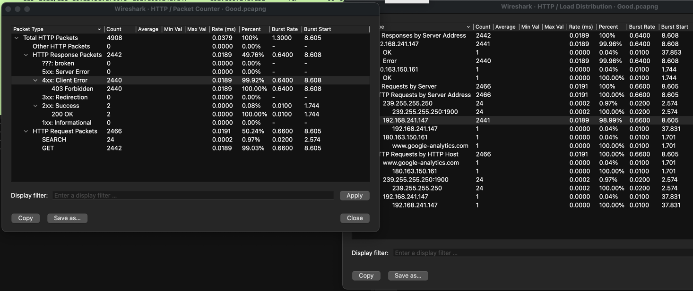

### 赛事简介

「陇剑杯」被公安部网安局确定为是「网鼎杯」、「天府杯」之后的全国第三大网络安全赛事，与「网鼎杯」一样隔年举办，「陇剑杯」在「网鼎杯」的次年举办。「陇剑杯」是全国同类赛事中首次引入「人工智能人机对抗」，首个「以防为主」的网络安全大赛。2021年成功举行了第一届比赛，共3020支战队，1135人报名参赛。

### 签到题

网管小王在上网途中发现自己的网络访问异常缓慢，于是对网络出口捕获了流量，请您分析流量进行回答: 此时正在进行的可能是 __________ 协议的网络攻击。（如有字母请全部使用小写，填写样例：http、dns、ftp）。

附件是 Good.pcapng 文件，用 Wireshark 打开分析，使用 Statistics -> HTTP 下的 Packet Counter 和 Load Distribution，可以看到大部分是 HTTP 请求，状态码是 403，请求地址最多的是 192.168.241.147，对照提示看应该是 HTTP 协议。

 

### jwt

第一问：昨天，单位流量系统捕获了黑客攻击流量，请您分析流量后进行回答：该网站使用了______认证方式。（如有字母请全部使用小写）。

第二问：黑客绕过验证使用的jwt中，id和username是______。

第三问：黑客获取webshell之后，权限是______？。

第四问：黑客上传的恶意文件文件名是_____________。(请提交带有文件后缀的文件名，例如x.txt)。

第五问：黑客在服务器上编译的恶意so文件，文件名是_____________。(请提交带有文件后缀的文件名，例如x.so)。

第六问：黑客在服务器上修改了一个配置文件，文件的绝对路径为_____________。（请确认绝对路径后再提交）。

### webshell

单位网站被黑客挂马，请您从流量中分析出webshell，进行回答：

第一问：黑客登录系统使用的密码是_____________。

第二问：黑客修改了一个日志文件，文件的绝对路径为_____________。

第三问：黑客获取webshell之后，权限是____________？

第四问：黑客写入的webshell文件名是_____________。(请提交带有文件后缀的文件名，例如x.txt)。

第五问：黑客上传的代理工具客户端名字是_____________。（如有字母请全部使用小写）。

第六问：黑客代理工具的回连服务端IP是_____________。

第七问：黑客的socks5的连接账号、密码是______。

### SQL注入

某应用程序被攻击，请分析日志后作答：

第一问：黑客在注入过程中采用的注入手法叫_____________。（格式为4个汉字，例如“拼搏努力”）。

第二问：黑客在注入过程中，最终获取flag的数据库名、表名和字段名是_____________。（格式为“数据库名#表名#字段名”，例如database#table#column）。

第三问：黑客最后获取到的flag字符串为_____________。

### 简单日志分析

某应用程序被攻击，请分析日志后作答：

第一问：黑客攻击的参数是______。（如有字母请全部使用小写）。

第二问：黑客查看的秘密文件的绝对路径是_____________。

第三问：黑客反弹shell的ip和端口是_____________。（格式使用“ip:端口"，例如127.0.0.1:2333）。

### ios

一位ios的安全研究员在家中使用手机联网被黑，不仅被窃密还丢失比特币若干，请你通过流量和日志分析后作答：

第一问：黑客所控制的C&C服务器IP是_____________。

第二问：黑客利用的Github开源项目的名字是______。

第三问：通讯加密密钥的明文是____________。

第四问：黑客通过SQL盲注拿到了一个敏感数据，内容是____________。

第五问：黑客端口扫描的扫描器的扫描范围是____________。

第六问：被害者手机上被拿走了的私钥文件内容是____________。

第七问：黑客访问/攻击了内网的几个服务器，IP地址为____________。（多个IP之间按从小到大排序，使用#来分隔，例如127.0.0.1#192.168.0.1)。

第八问：黑客写入了一个webshell，其密码为____________。

### 内存分析

网管小王制作了一个虚拟机文件，让您来分析后作答：

第一问：虚拟机的密码是_____________。（密码中为flag{xxxx}，含有空格，提交时不要去掉）。

第二问：虚拟机中有一个某品牌手机的备份文件，文件里的图片里的字符串为______________。（解题过程中需要用到上一题答案中flag{}内的内容进行处理。本题的格式也是flag{xxx}，含有空格，提交时不要去掉）。

### 流量分析

某天晚上，X单位的网站被黑客入侵了，管理员从单位网络出口捕获采样流量，请您分析流量进行回答：

第一问：攻击者的IP是_____________。

第二问：攻击者所使用的会话密钥是_____________。

第三问：攻击者所控制的C&C服务器IP是_____________。

### 机密内存

一日网管中心的安全审计设备推送了一则高危入侵警报，经过了解发现有一台机密容器因违规操作遭遇入侵与破坏，容器宿主机内只留下了一段机密容器的内存与部分经过篡改的神秘文件，请你帮助还原容器的入侵过程。

第一问：取证人员首先对容器的基本信息进行核实，经过确定该容器的基本信息为________。（答案为32位小写md5(容器操作系统系统的版本号+容器主机名+系统用户名），例如：操作系统的版本号为10.0.22449，容器主机名为DESKTOP-0521,系统登录用户名为admin，则该题答案为32位小写md5(10.0.22449DESKTOP-0521admin) 的值ae278d9bc4aa5ee84a4aed858d17d52a)。

第二问：黑客入侵容器后曾通过木马控制端使用Messagebox发送过一段信息，该信息的内容是____________。（答案为Messagebox信息框内内容）。

第三问：经过入侵分析发现该容器受到入侵的原因为容器使用人的违规进行游戏的行为，该使用人进行游戏程序的信息是____________。（答案为“32位小写md5(游戏程序注册邮箱+游戏程序登录用户名+游戏程序登录密码)，例如：注册邮箱为adol@163.com,登录用户名为user,密码为user1234，则该题答案为” adol@163.comuseruser1234”的小写md5值5f4505b7734467bfed3b16d5d6e75c16)。

第四问：经过入侵分析发现该容器曾被黑客植入木马控制的信息是____________。（答案为“32位小写md5(木马程序进程名+木马回连ip地址+木马回连ip端口）”，例如：木马程序进程名为svhost.exe，木马回连ip为1.1.1.1，木马回连端口为1234，则该题答案为“svhost.exe1.1.1.11234”的32位小写md5值f02da74a0d78a13e7944277c3531bbea)。

第五问：经过入侵分析，发现黑客曾经运行过痕迹清除工具，该工具运行的基本信息是________。（答案为“32为小写md5”(痕迹清除工具执行程序名+最后一次运行时间)，例如：黑客运行工具执行程序名为run.exe，运行时间为2021-07-10 10:10:13，则本题的答案为小写的32位md5(run.exe2021-07-10 10:10:13) 值为82d7aa7a3f1467b973505702beb35769，注意：本题中运行时间的格式为yy-mm-dd hh:mm:ss，时间时区为UTC+8）。

### wifi

网管小王最近喜欢上了ctf网络安全竞赛，他使用“哥斯拉”木马来玩玩upload-labs，并且保存了内存镜像、wifi流量和服务器流量，让您来分析后作答：

小王往upload-labs上传木马后进行了cat /flag，flag内容为_____________。（压缩包里有解压密码的提示，需要额外添加花括号）。

### 日志分析

单位某应用程序被攻击，请分析日志，进行作答：

第一问：网络存在源码泄漏，源码文件名是_____________。(请提交带有文件后缀的文件名，例如x.txt)。

第二问：分析攻击流量，黑客往/tmp目录写入一个文件，文件名为_____________。

第三问：分析攻击流量，黑客使用的是______类读取了秘密文件。
