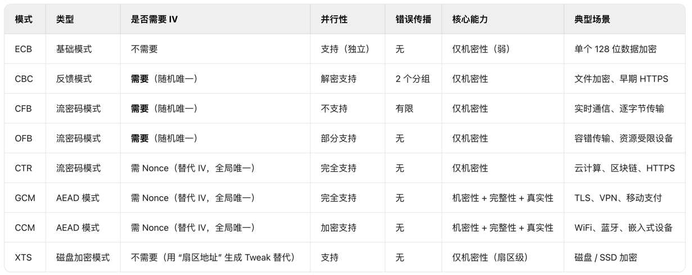

### 赛事简介

第二届「陇剑杯」网络安全是2023年9月16日在甘肃兰州举办的，由兰州新区、国网甘肃省电力公司、中国移动通信集团甘肃有限公司承办。本文整理了初赛阶段的题目和解题思路，参考了一些大牛的 WP。总体上感觉流量分析类型的题目偏多。

第二届比赛共有1680支战队报名参赛，有200支战队进入半决赛，通过半决赛角逐最终有120支战队进入决赛。

决赛阶段设立了实景防御与人工智能工坊赛道。在实景防御赛道，基于平行仿真和春秋云专有云技术，仿真真实数字业务环境，通过数据分析、漏洞修复、网络配置、服务构建等场景，考验各战队的问题分析、安全策略、安全技术能力。在人工智能赛道，要求各战队利用全机器自动化方式执行，对含有漏洞的二进制文件进行自动化漏洞分析、挖掘和利用。

### Easy Web

下载到一个名为 ez_web.pcap 流量包附件，是一道流量分析的题目。可以先用统计功能看看流量的各项特征。通过 `http` 过滤HTTP流量，因为很多 GET 请求，GET请求一般不会造成什么危害，看 POST 请求。

第一问：服务器自带的后门文件名是什么？（含文件后缀）


第二问：服务器内网IP是多少？

逐个查看每个 POST 请求，会发现有一个请求发送了 `ifconfig` 命令。

第三问：攻击者往服务器中写入的Key是什么？

这一问是看了 WP 才知道怎么解的，找到文件内容解码后，需要能识别出来表示的是 zip 文件。

### Easy Wiki

题目附件是 stream_new.cap 文件，是一道流量分析题。

第一问：攻击者通过暴力破解进入了某 Wiki 文档，请给出登录的用户名与密码，以:拼接，如 admin:admin。

找登录相关的关键信息，然后找返回码没有报错的。

第二问：攻击者发现软件存在越权漏洞，请给出攻击者越权使用的 cookie 的内容的 md5 值。（32位小写）。

找到成功登录的会话，记录会话请求头中的 cookie 值。

第三问：攻击使用jdbc漏洞读取了应用配置文件，给出配置中的数据库账号密码，以:拼接，比如 root:123456。


第四问：攻击者又使用了CVE漏洞攻击应用，执行系统命令，请给出此CVE编号以及远程EXP的文件名，使用:拼接，比如CVE-2020-19817:exp.so。

如何快速找到CVE这个感觉还比较困难。

第五问：给出攻击者获取系统权限后，下载的工具的名称，比如nmap。

这道题还是流量分析，所以看来陇剑杯对于 Wireshark 的熟练使用要求很高。

### Small Sword

这道题的附件给了一个流量包，还是需要先从流量分析入手。

第一问：连接蚁剑的正确密码是____________?（答案示例：123asd）

查找 HTTP 协议，并且查找 POST 方法。`http && http.request.method == "POST"`

第二问：攻击者留存的值是________?（答案示例：d1c3f0d3-68bb-4d85-a33-fb97cf99ee2e）

查找包含 `fwrite` 函数名的流量包。

第三问：攻击者下载到的flag是__________?（答案示例：flag3{uuid}）

看别人的WP知道的，可以从 HTTP 对象中导出一个 huorong.exe 文件，执行后还能生成一个图片（所以比赛如果没有 Windows 环境很吃亏）

### WS

这一题比较简单，也是流量分析类的题目，包的数量不多，从头到尾全看一遍也不用太多时间。

第一问：被入侵的主机IP是？

第二问：被入侵主机的口令是？

第三问：用户目录下第二个文件夹的名称是？


第四问：/etc/passwd 中倒数第二个用户的用户名是？


### IR

你是公司的一名安全运营工程师，今日接到外部监管部门通报，你公司网络出口存在请求挖矿域名的行为。需要立即整改。经过与网络组配合，你们定位到了请求挖矿域名的内网IP是10.221.36.21.查询CMDB后得知该IP运行了公司的工时系统。（虚拟机账号密码为：root/IncidentResponsePasswd）

第一问：挖矿程序所在路径是？（答案中如有空格均需去除，如有大写均需变为小写，使用 echo -n 'strings' | md5sum | cut - d '' -f1 获取md5值做为答案）

解题思路：
1. 首先查看 history 分析是否有敏感操作
2. 如果不是 root 用户，尝试 su 或者 sudo
3. 通过 .viminfo 查看文件编辑记录
4. 查找各类日志目录，看看执行历史中有没有应用的日志路径，从 /var 下找一些公共日志

在第三步能发现大量 Redis 修改记录，查看 Redis 的配置文件，发现 pools 关键字，判断挖矿程序为 /etc/redis/redis-server。

第二问：挖矿程序连接的矿池域名是？（答案中如有空格均需去除，如有大写均需变为小写，使用 echo -n 'strings' | md5sum | cut - d '' -f1 获取md5值做为答案）

矿池的域名就在 Redis 的配置文件中。

第三问：攻击者入侵服务器利用的方法是？（答案中如有空格均需去除，如有大写均需变为小写，使用 echo -n 'strings' | md5sum | cut - d '' -f1 获取md5值做为答案）
题目提示：答案md5值的前两位为3e

根据 .bash_history 中的启动目录找到 nohup.log 的文件路径，查看文件有 shiro 的报错信息。这里看别人的WP是根据经验判断shiro漏洞的，方法的名字是 shirodeserialization。


第四问：攻击者的IP是？（答案中如有空格均需去除，如有大写均需变为小写，使用echo -n ‘strings’|md5sum|cut -d ’ ’ -f1获取md5值作为答案）

攻击者应该登陆了服务器，通过 `last` 命令查看得到。

第五问：攻击者发起攻击时使用的User-Agent是？（答案中如有空格均需去除，如有大写均需变为小写，使用echo -n ‘strings’|md5sum|cut -d ’ ’ -f1获取md5值作为答案）

这道题攻击者IP有好几个User-Agent，正确答案好像是最后一次请求的User-Agent。

第六问：攻击者使用了两种权限维持手段，相应的配置文件路径是？(md5加密后以a开头)（答案中如有空格均需去除，如有大写均需变为小写，使用echo -n ‘strings’|md5sum|cut -d ’ ’ -f1获取md5值作为答案）

权限维持的几种方式，第一种是利用Web服务，后面四种都是针对Linux服务器的，Windows的不是很熟悉：
* Webshell 通过上传一句话木马之类的文件到后台服务器，利用蚁剑之类的工具链接
* 通过定时任务执行反弹Shell之类的脚本，客户端通过监听获取登录权限。这类属于操作系统层面的权限维持
* SUID后门，这种需要先拿到 root 权限，给一个普通文件设置设置SUID的方式，获取root权限
* SSH Key免密登录后门，将自己的公钥添加到目标服务器，可以 ssh 免密登录。可以查看 ~/.ssh/authorized_keys 文件内容判断。
* 在目标服务器中添加一个用户

第七问：攻击者使用了两种权限维持手段，相应的配置文件路径是？(md5加密后以b开头)（答案中如有空格均需去除，如有大写均需变为小写，使用echo -n ‘strings’|md5sum|cut -d ’ ’ -f1获取md5值作为答案）

看别人的 WP 是通过 redis.conf 猜到去找 systemd 配置文件的，也可以先看一下配置的系统服务。服务的配置路径在 `/lib/systemd/system/` 下这个属于硬知识了。


### SS

这道题给了一个流量包文件，一个服务器。应该是从流量包入手。可以通过HTTP包分析、地址分析、请求分析找一些关键的要素，再进一步分析。

第一问：黑客是使用什么漏洞拿下root权限的。格式为：CVE-2020-114514

利用 `http.response.code == 200` 能找到 `shell.jsp` ，但是不知道是怎么传上去的，通过 `http` 筛选逐步查看能找到一个 POST 请求尝试了漏洞利用。大模型可以根据 payload 给出 CVE 编号，看起来不错。


第二问：黑客反弹shell的ip和端口是什么，格式为：10.0.0.1:4444

查看流量可以看到执行了`bbbb.sh`这个脚本，到服务器上查询到这个脚本看内容就行。

第三问：黑客的病毒名称是什么？格式为：filename

这个是看 WP 的，貌似是 /home/guest/main 这个程序。

第四问：黑客的病毒运行后创建了什么用户？请回答用户名与密码：username:password

通过 `/etc/passwd` 和 `/etc/shadow` 查找。

第五问：服务器在被入侵时外网ip是多少？格式为：10.10.0.1

在`/home/guest`目录下的一个日志文件里找到了可疑地址。

第六问：病毒运行后释放了什么文件？格式：文件1，文件2

上一问的日志文件中看到执行了一个脚本，在 `idea` 目录下。

第七问：矿池地址是什么？格式：domain:1234

在 `idea` 目录下继续查找可疑的 sh 文件。

第八问：黑客的钱包地址是多少？格式：xx:xxxxxxxx

### hard web

这道题也是流量分析的题目。

第一问：服务器开放了哪些端口，请按照端口大小顺序提交答案，并以英文逗号隔开（如服务器开放了80 81 82 83端口，则答案为flag{80,81,82,83}）

ip.addr == 192.168.162.180 and tcp.flags.syn == 1 and tcp.flags.ack == 1，使用这个条件可以查到地址是 180 并被成功扫描到的端口。

第二问：服务器中根目录下的flag值是多少？

翻一下HTTP流量包能看到一个 shell.jsp 的请求，看到有些流量都是加密过的。再往前面找看到一个请求中有个类似的 Key，也有 AES 的字样。这里有个知识点，AES 加密有多种模式，其中不需要 IV 变量的只有基础的 ECB 模式。下图是豆包总结的各种模式的对比。



这道题在具体操作上学到一些技巧，比如在 Wireshark 中复制响应部分的 Hex 流，可以按照截图提示，选中响应部分的内容，然后右键 Copy 选择对应的格式。


解密也是要按照 Hex -> AESDecrypt -> Gunzip 的顺序，需要用到 CyperChef 。


第三问：该webshell的连接密码是多少？

通过上面的解密方法，能够看到一个流量包中有 `the key is 1****y` 的提示，看WP说是之前的 IV 值 `748007e861908c03` 进行 md5 的结果。这个确实没想到，一般 md5 的长度好像是32位的，而这个才16位，试了一下确实可以用在线 MD5 爆破网站碰出来。

正常的 md5 字符串为 `748007e861908c03ba0830d5c47fd282` 。

### Hacked

附件是一个名为 flask.pcap 的流量包，又是流量分析。

第一问：admin用户的密码是什么？

刚开始以为几个 register 里面的 base64 编码能解决，后来分析 HTTP 流量发现有前端加解密，通过豆包生成了一段 Python 代码。

```python3
from Crypto.Cipher import AES
import base64
import binascii

# Python3 版本的 AES 解密脚本
# 安装依赖：pip install pycryptodome
# 运行：python3 aes_decrypt.py

# 提供的密钥和IV
crypt_key = 'l36DoqKUYQP0N7e1'
crypt_iv = '131b0c8a7a6e072e'

# 待解密的Base64字符串
encrypted_str = 'KGM7NI0/WvKswK+PlmFIhO4gqe8jJzRdOi02GQ0wZoo='

# 转换密钥和IV为字节
key = crypt_key.encode('utf-8')
iv = crypt_iv.encode('utf-8')

# Base64解码
ciphertext = base64.b64decode(encrypted_str)

# 创建AES解密器（CBC模式，Pkcs7填充）
cipher = AES.new(key, AES.MODE_CBC, iv)

# 解密并去除填充
decrypted_bytes = cipher.decrypt(ciphertext)

# 处理PKCS7填充
pad_len = decrypted_bytes[-1]
decrypted_bytes = decrypted_bytes[:-pad_len]

# 转换为字符串
decrypted_str = decrypted_bytes.decode('utf-8')

print(f"解密后的字符串: {decrypted_str}")
print(f"解密的十六进制表示: {binascii.hexlify(decrypted_bytes).decode('utf-8')}")
```

第二问：app.config['SECRET_KEY']值为多少？

这个仔细找一下就能发现，有一个对首页的 GET 请求返回了相关内容。

第三问：flask网站由哪个用户启动？

第四问：攻击者写入的内存马的路由名叫什么？（答案里不需要加/）

### baby forensics

这种题型没见过，给了一个 vmdk 后缀的文件，看着像是 Vmware 的磁盘虚拟文件，还有一个 raw 后缀的文件，根据题目描述猜测可能是内存快照数据。

看大牛的WP提示需要使用 Volatility 取证工具分析，工具使用和文件分析都不太懂，留在后面有时间继续学习分析。

第一问：磁盘中的key是多少？

第二问：电脑中正在运行的计算器的运行结果是多少？

第三问：该内存文件中存在的flag值是多少？

## 参考资料

1. https://zhuanlan.zhihu.com/p/692447949
2. http://nooemotion.com/2023/09/19/%E7%AC%AC%E4%BA%8C%E5%B1%8A%E9%99%87%E5%89%91%E6%9D%AF%E7%BD%91%E7%BB%9C%E5%AE%89%E5%85%A8%E5%A4%A7%E8%B5%9Bwp-%E6%95%B0%E6%8D%AE%E5%88%86%E6%9E%90-smallsword/
3. https://blog.csdn.net/z2414_sxs/article/details/136318786
4. https://cloud.tencent.com/developer/article/1142506
5. https://www.cnblogs.com/F07on3/p/18985679