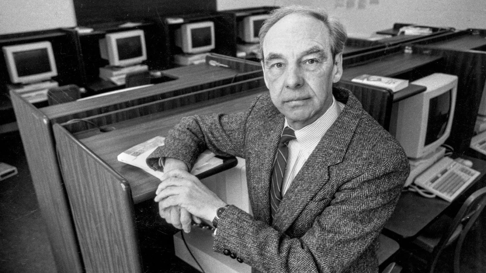

尤里斯·哈特马尼斯（Jris Hartmanis，1928年7月5日 - 2022年7月29日），致力于计算理论及计算复杂性理论的研究，与理查德·E·斯特恩斯共同获得1993年图灵奖。

尤里斯·哈特马尼斯出生于拉脱维亚首都里加一个显赫的家庭，他的父亲是拉脱维亚军队参谋长。他的童年安稳、愉快且有趣。

二战接近结束时，苏联占领了拉脱维亚，哈特马尼斯的生活随之改变。1944年，哈特马尼斯移民德国，在马尔堡菲利普斯大学学习物理学，1949年获得物理学学士学位。

随后移居美国，因为拉脱维亚人在战后德国很难找到合适的工作。初到美国后，哈特马尼斯在 Gleaner Harvester Company 工作，该公司生产农业联合收割机。后来因为产量削减被裁员，随后去了堪萨斯城的谢菲尔德钢铁公司做钢铁工人。

暑假期间，哈特马尼斯去了堪萨斯城大学，这所大学认定了他在德国期间的学习记录，并录取他为本校的研究生。1951年获得美国堪萨斯城大学（现密苏里大学堪萨斯城分校）数学硕士学位。1955年获得加州理工学院数学博士学位。

哈特马尼斯的职业生涯开始于康奈尔大学，1955年到1957年期间他在大学中担任讲师。随后到1958年，他在俄亥俄州立大学担任助理教授。

1958年，哈特马尼斯加入通用电气研究实验室。在通用工作期间，他和同事理查德·斯特恩斯开始关注执行不同计算所需的时间和内存——这一领域被他们命名为「计算复杂性」。他们根据每个计算类别、内存空间的使用量定义了反映不同难度的计算类别，他们的论文「论算法的计算复杂性」于1965年发表后，开始吸引其他计算机科学家以同样的方式研究复杂性。

哈特马尼斯在复杂性理论基础上的工作，对将计算机科学确立为一门与数学、物理和电气工程不同的正式学科起到了关键作用。他们基于[迈克尔·拉宾](http://edulinks.cn/2025/06/13/20250613-michael-rabin/)和[曼纽尔·布鲁姆](http://edulinks.cn/2024/03/08/20240308-manuel-blum/)的研究成果，通过他们开创性的论文，为现今复杂性理论的发展奠定了基础。

1965年，哈特马尼斯回到康奈尔大学，担任新成立的计算机科学系主任，并一直工作到1982年退休。

1970年代，哈特马尼斯和伯曼对NP完全问题的详细结构进行研究，这帮助开启了「结构复杂性理论」这一领域的开端（CCC会议最初的主题）。

## 参考资料
1. https://baike.baidu.com/item/%E5%B0%A4%E9%87%8C%E6%96%AF%C2%B7%E5%93%88%E7%89%B9%E9%A9%AC%E5%B0%BC%E6%96%AF/12586960?structureClickId=12586960&structureId=ced913fd22dfe016c93805da&structureItemId=0973544b28325026d67cdc35&lemmaFrom=starMapContent_star&fromModule=starMap_content&lemmaIdFrom=324645
2. https://www.britannica.com/biography/Juris-Hartmanis
3. https://amturing.acm.org/award_winners/hartmanis_1059260.cfm
4. https://www.cs.cornell.edu/people/hartmanis/
5. https://magazine.caltech.edu/post/juris-hartmanis-obituary
6. https://scottaaronson.blog/?p=6622
7. https://cacm.acm.org/news/an-interview-with-juris-hartmanis/