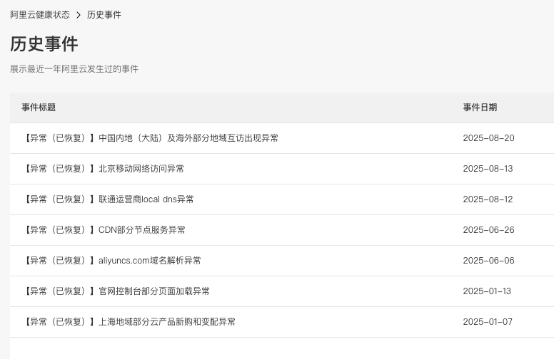

2025年马上要过去，现在这个时代可以说每个人都与互联网及互联网基础设施服务密切相关。在十五五规划中提到：「在未来五年要构建现代化基础设施体系。......适度超前建设新型基础设施，推进信息通信网络、全国一体化算力网、重大科技基础设施等建设和集约高效利用，推进传统基础设施更新和数智化改造。」

可以说，人们现在能享受到手机方便的刷抖音、聊微信、打电话，信息通信网络是底层的基础设施支撑，各种云厂商是平台保障，最后才是提供直接服务的各类服务企业。人们生活的方方面面已经与基础设施与信息系统是否稳定运行密切的绑定在一起了，但是不同类型的基础设施，其发生故障时对人们和社会的影响不尽相同，本文尝试在总结2025年比较典型的基础设施或者互联网故障服务的事件，并做一个简单的分类探讨对生活和社会的影响。

## 故障清单

通过互联网各种媒体信息渠道收集了2025年发生的一些典型故障，清单和简要描述如下，按照发生的时间做了排序，因为公众号内不支持外部链接，感兴趣的可以自行搜索查阅：

* 2025-04-02，腾讯云广州地域网络异常，从15:50分开始发现异常，到16:30左右影响范围达到高峰，直到19:59完成恢复，持续了4小时9分钟。影响了广州地区访问腾讯会议等相关服务。
* 2025-06-12，谷歌Cloud在上午10:51左右发生故障，影响55个Google Cloud云服务，至18:18分才恢复。
* 2025-06-26，阿里云故障，从凌晨2:57分开始，3:30左右运维团队发现异常，9:00左右恢复。阿里云核心域名 aliyuncs.com 遭域名劫持，影响对象存储服务、内容分发网络、网络镜像服务等。
* 2025-07-14，Cloudflare在对服务拓扑结构进行调整过程中，导致 1.1.1.1 边缘节点出现服务终端，影响使用 1.1.1.1 公共DNS解析的客户。故障从21:52 UTC开始，直至22:54 UTC恢复。
* 2025-08-12，中国联通多地用户（尤其以北京地区为主）遭遇了大规模的网络服务中断，许多网站和应用程序无法正常访问。阿里云监控系统在19:40捕捉到异常流量，确认联通Local DNS响应异常。20:48，相关受影响的服务已全部恢复正常。
* 2025-09-22，美团外卖瘫痪，无法点餐、页面卡顿，据称是今年第三次大规模服务异常。官方回应为区域下单密集导致。
* 2025-10-20，亚马逊重大故障，从10月20日00:11分持续到下午15:53分，核心服务DynamoDB完全中断，影响141项AWS服务。根本原因未DNS解析失败。
* 2025-10-29，29日深夜至30日凌晨，工商银行App突发数据异常，用户账户余额显示不准确。工行客服通过媒体回应问题系偶发系统故障导致数据显示延迟，核心资金未受影响。
* 2025-11-13，青海联通大面积网络故障，故障从晚上19点左右开始，21点左右青海联通发布官方公告表示故障已完全恢复，并对故障期间的影响致歉。
* 2025-11-12，阿里云发布公告称云产品控制台服务异常。公告显示自11月12日17:44起，阿里云监控发现云产品控制台访问及API调用出现异常，阿里云工程师通过分批重启组件服务，绝大部分地域控制台服务已恢复访问。
* 2025-11-18，Cloudflare发生大规模全球性服务中断，导致大量依赖其CDN、WAF及安全网络服务的网站和应用出现500错误或无法访问，受影响的包括X（原Twitter）、ChatGPT、Spotify等大型互联网服务。从11:20 UTC开始故障，主要服务在14:30 UTC左右完全恢复，持续时间约3小时。
* 2025-12-17下午，南京市部分区域导航集体失灵。南京市部分区域的百度、高德、腾讯等主流导航软件突然集体失灵，导致外卖、网约车、共享单车等服务大面积瘫痪。

以上就是初步整理的2025年比较有影响范围的信息系统故障情况，共12起。当然，这并不是所有真实发生的故障的全集，但是这些事项已经具备了相当的代表性。我将这12起故障划分为主要的三种类型。

## 基础服务类故障

联通0812、1113，南京1217，共3起。联通为三大网络运营服务商，南京的虽然没有具体的原因和对应的责任单位，但是都可以归类为基础设施级别的服务故障。

像联通这种级别的故障，会导致某个区域内，所有使用联通服务的C端用户受到很大的影响。除非用户配备了另外一个运营商的手机或网络，否则会导致用户几乎所有通过互联网的活动受到影响。对于B端用户来讲，往往通过对接至少2家运营商的方式来避免单点故障。对于普通的用户来说，实现冗余的成本比较高。

像南京这起导航服务的大面积故障，也会对C端用户的使用带来非常大的影响，基本上否定了所有的LBS应用场景。这种情况更像是战时的场景，最近看到俄罗斯对我们开放免签后，第一波到俄罗斯旅游人的经历，俄罗斯为了防范乌克兰的无人机攻击，在某些区域就屏蔽了导航信息，导致LBS应用、甚至是互联网无法使用。

## 云服务类故障

腾讯0402，谷歌0612，阿里云0626、1113，Cloudflare0714、1118，美团0922，亚马逊1020，共8起，是占比最多的，影响范围也相对较大。

腾讯、谷歌、阿里云、Cloudflare、亚马逊是现在国内、国外使用比较广泛的互联网基础服务，这类服务发生故障往往影响范围比较大，所有依赖互联网云服务搭建起来的应用，都有可能遭受到不同程度的损失。如果应用做好了多云的灾备，可以实现在一家云服务商故障时，快速切换到备用的服务商，确保自己的业务连续性。对于一些小型的应用来说，往往没有在业务连续性方面投入过多成本，那就只能依靠云服务商的快速恢复了。

像美团是某个行业的主要服务提供商，当自身故障时，这个时候用户是有备用选择的，往往会导致他的竞争对手获得额外的流量。因为这种服务的复购性很强，也没有特别大的用户粘性，因此感觉此类服务商对于业务连续性应该会比较重视。

## 行业服务类故障

工行1029，银行、证券、保险是属于金融领域的重要服务商，其服务如果产生异常，往往会对社会生活产生比较大的影响，甚至还可能会对国家信用造成比较大的不良影响。因此对于这类行业，不管是从行业自身，还是从法律、监管角度，对于业务连续性都提出了很高的要求，在业务连续性方面的投入应该也是最高的。

诚然，意外总会发生，故障几乎是不可避免的。我们的目标就是不断的减少故障，就像太阳系那样，确实无法想象，是怎样的超级能力才能建造出像太阳系这样稳定运行的系统，经历亿万年几乎不会发生系统性风险。我们的信息系统却在不断上演着各种各样的故障，有高级一点的故障是因为系统设计不足或者管理能力不行，有低级一点的故障让大家觉得世界就是一个草台班子，尽量的减少低级错误，不断的让我们的系统稳定运行是我们的终极追求。

## 参考资料
1. https://csguide.cn/other/cloudflare.html#%E4%B8%BA%E4%BB%80%E4%B9%88%E5%8F%88%E6%98%AF%E5%AE%83
2. https://www.techug.com/post/cloudflare-1-1-1-1-incident-on-july-14-2025/
3. https://www.163.com/dy/article/K300996G0556CSY5.html
4. https://www.163.com/dy/article/IJEQ79B90511A641.html
5. https://www.zhihu.com/question/1984958227994149671
6. https://zhuanlan.zhihu.com/p/1966171010928731480
7. https://zhuanlan.zhihu.com/p/1974292954576360506
8. https://www.techug.com/post/cloudflare-1-1-1-1-incident-on-july-14-2025/
9. https://www.163.com/dy/article/K6S0F2QG0550W16F.html
10. https://www.zhihu.com/question/1938709880853754695
11. https://www.yoojia.com/article/8931392291480100418.html
12. https://baijiahao.baidu.com/s?id=1847467960403362171&wfr=spider&for=pc
13. https://news.qq.com/rain/a/20251114A01LI200
14. https://cloud.tencent.com/developer/article/2365207