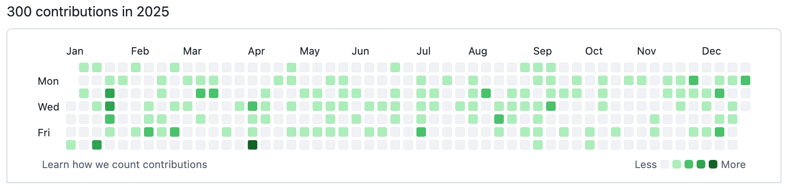
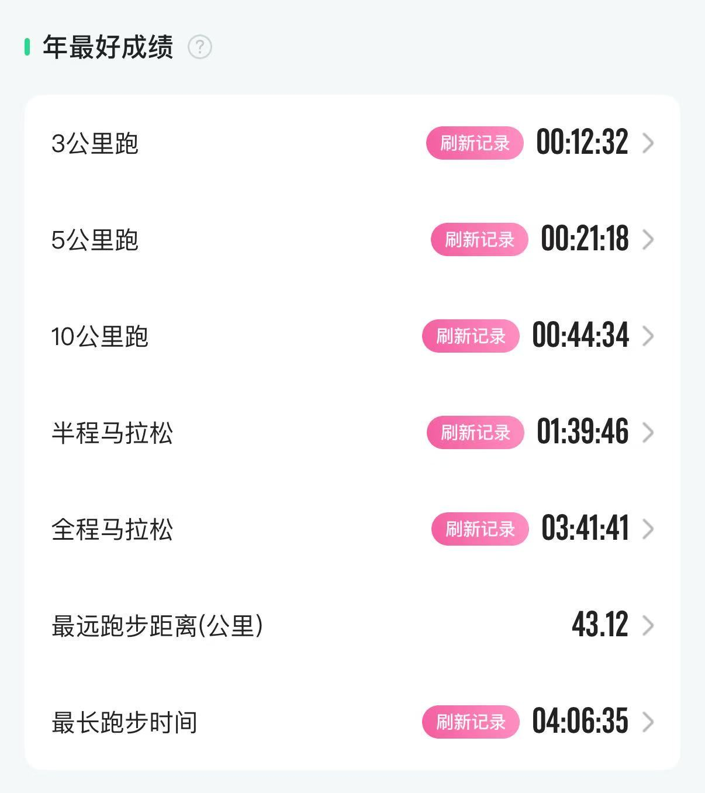

不刷抖音，不看快手，2025马上就要结束了，对这一年的情况做个总结。按照先苦后甜的顺序来分类总结吧，看看这一年有哪些收获，又有哪些遗憾。

## 生活

今年年中的时候，不小心摔倒导致了肱骨大结节骨折，经过三个多月骨头长好了，但是因为影响了周围的肌腱或者肌肉，到现在有一些投掷、扭转等比较灵活的手臂动作，还是会感到有一些疼痛和不适应。

经历这次伤病才发现原来肩袖受损伤的人很多，而且也特别不容易好，仔细分析这个部位的结构，可以算得上是最灵活的一个部位了。如果把肩部做为一个圆球的中心，手臂的活动范围远远大于一个半球，这么灵活的关节，真是鬼斧神工。

家人们在今年也染过一些流行性感冒或一些小的疾病，总体上来讲还算比较好，希望明年家人们都能健健康康的。本来想今年带孩子出国去看一看，因为形势问题没有完成这个目标。家里人的护照都过期了，要完成这个目标还有很多的准备工作要做，争取2026年实现这个目标。

## 技术

今年写了一个小的 LightProxy 工程，希望实现一个简单的代理服务器，上半年投入的精力比较多，目前能实现 HTTP GET 请求的代理转发，差的功能还很多。希望在2026年继续完善，至少完成HTTP/HTTPS所有方法的代理转发。

今年在自己的博客发表了20多篇文章，在公众号发表了一些文章。在博客上的文章 Markdown 文档都提交到 GitHub 了，加上代码工程的提交，今年 GitHub 的提交次数和去年差不多。今年的目标是每周有提交，六月底七月初的时候，可能是因为休假，开了一周天窗，算是没有完成年度目标。

比较意外的是今年发公众号文章，有一篇回忆当年在香港遇到科比的经历，进入到了公众号的推荐池从而获得很多的流量，也让我这么多年在域名、站点上的投入有了一点回报。公众号感觉我也写不出太多花样来，2026年能够继续记录，继续分享就不错，欢迎板砖。

今年还有幸去兰州参加了陇剑杯，实地体验了下高强度「坐牢」的感觉，回来之后很不是滋味，毕竟是空手而归什么奖项都没有拿到。对于 CTF 方面的爱好还是一如既往的吸引我，最近快手暴露出来的安全问题说明在现在的环境下，安全问题仍是一个需要重点关注的内容，希望在2026年自己能够知耻而后勇，在这方面有所斩获。

## 读书

今年读书任务完成目标，到现在共完成了12本书的阅读，其中3本纸质书，9本电子书。现在的阅读主要还是以电子书为主，非常方便，随时随地可以利用一些间歇的时间碎片。纸质书阅读必须要带着书，对于环境也有一定的要求。现在的孩子们也是使用电子设备太多了，不知道纸质书的未来会如何演变。

| 名称 | 作者 | 完成时间 |
|--- | --- | --- |
|活出生命的意义|维克多·弗兰克尔|2025-01-10|
|经济学原理|马歇尔|2025-2-18|
|神们自己|阿西莫夫|2025-2-24|
|分析与思考·黄奇帆的复旦经济课|黄奇帆|2025-03-17|
|论共产党员的修养|刘少奇|2025-04-08|
|小家越住越大2/3||2025-7-1|
|国史大纲|钱穆|2025-07-31|
|筚路维艰·中国社会主义路径的五次选择|萧冬连|2025-08-21|
|阿西莫夫科幻短篇全集|阿西莫夫|2025-08-26|
|周期|马克斯|2025-09-10|
|完美的真空|莱姆|2025-09-30|
|中共历史人物研究|陈答才|2025-12-15|

## 运动

读书使人快乐，运动也让人快乐，看一下能让自己乐一阵的成绩单。去年总结的时候，没想到3公里、5公里、10公里、半马、全马几个项目都能刷新PB。今年上半年的时候，经过冬训状态比较好，全马成绩有所突破。但是6月份肱骨骨折之后，有两个月训练不系统，乃至于10月份的海淀马拉松刷新了跑步最长时间纪录。

今年参加了通州马拉松、武汉马拉松、海淀马拉松，成绩分别为：
| 赛事 | 净时成绩 | 日期 |
| --- | --- | --- |
| 武汉马拉松 | 3:52:41 | 2025-03-23 |
| 通州马拉松 | 3:42:59 | 2025-04-19 |
| 海淀马拉松 | 4:04:15 | 2025-10-12 |

不过进入冬训以来，加入了西北旺跑团，相比去年来讲，间歇、长距离训练都有所增加，因此到11月、12月的时候，感觉跑力增长的还是非常明显。

2026年，我计划跑3～5个马拉松，成绩期望能到338左右。今年的总跑量达到了 2300 公里，明年也不期望太多，还是能够到 2000 公里就行。毕竟跑量越大，跑步投入的时间也就越多，还是需要在跑步、生活、工作之间做一些平衡。

## 展望

2026年感觉单位还会发生不小的变化，在这方面我做好了随时应对的准备。生活方面我希望能够安安稳稳，按部就班的行进。

我希望在2026年实现以下几个目标：
* 马拉松比赛突破340
* 读书完成12本
* CTF赛题完成200道

千里之行始于足下，2025的结束就是2026的开始。结束意味着过去所有累积的数字要开始重新计算，新的开篇意味着要在过去的基础上去不断的前进，积累更多的步数、获取更多的知识、刷新更多的PB。

一年之计在于春，在阳历年关结束的时候，2026年的计划开始于冬天。