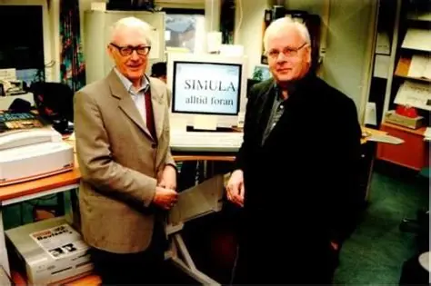

奥利·约翰·达尔（Ole-Johan Dahl，1931年10月12日 - 2002年6月29日），挪威计算机科学家，「面向对象编程」之父，2001年图灵奖得主之一，挪威科学院院士。

达尔于1931年10月12日出生在挪威南海岸的一个小镇曼达尔，这个小镇是度假胜地，当地居民多以海洋为生，虽然达尔家拥有悠久的船长和水手血统，但是达尔的兴趣却转向了阅读、数学和弹钢琴。

7岁时，达尔及家人搬到了奥斯陆南部的德拉门。13岁时，他的表兄被纳粹枪杀，他们全家逃亡瑞典。在瑞典，达尔通过外部考生的入学考试进入了高中。高中毕业后，达尔进入奥斯陆大学学习数值数学。在大学期间，他还兼职在挪威国防研究机构「NDRE」工作。正是在此期间的工作经历，达尔首次接触到了计算机，还很幸运的受到了扬·加维克「Jan Garwic，常被称为挪威信息学之父」的影响。1954年，达尔成为加维克的助理。

1952年，达尔参军在奥斯陆的挪威国防研究机构工作，在那里他结识了奈加特「Kristen Nygaard」。

1958年，达尔在奥斯陆大学获得数值数学硕士学位，他的大学学位虽然属于数值分析领域，但实际上是计算机科学的，他的论文题目是《费兰蒂水星计算机上的多重指数计数》。

1960年，奈加特成为挪威计算中心的研究主任，这是一个成立于1958年的半政府研究机构，并于1961年邀请达尔参与一个编程语言项目。一直到1963年，达尔才加入挪威计算中心，一直工作到1968年。

在与奈加特合作期间，达尔提出了面向对象编程的最初想法。达尔和奈加特共同开发的语言是一种名为 SIMULA 的模拟语言，现在通常称为 SIMULA I，这种语言旨在描述复杂系统，也用于对其行为进行编程仿真。这种语言也可以用于通用编程，随后这个语言逐渐发展为另外一种通用语言 SIMULA 67。

SIMULA 67 从一开始就被设计为通用语言，但达尔和奈加特发明了一种机制（类前缀），使 SIMULA I 的仿真专用特性作为一种特殊的库在 SIMULA 67 中可用。这个特性催生了现代编程语言中最重要的两个理念：继承与模块。

对象、继承和模块化，是达尔和奈加特对编程学科的主要贡献之一。达尔和奈加特在创造面向对象理念方面取得成功的部分原因显然归功于他们非凡的才能，但部分原因也在于他们背景差异很大，使得一方提出的每一种语言特征都成为另一方批评的对象。有一个关于他们争论的故事说在1967年春天，一名新员工震惊的对总机接线员说：”两个男人在楼上走廊的黑板前激烈争吵，我们该怎么办？“接线员走出办公室，听了几秒钟后说：”放轻松，是达尔和奈加特在讨论SIMULA。“

1968年，达尔受邀成为奥斯陆大学教授，他几乎独自承担起将挪威计算机科学发展为一门学科的责任。在最初的十年里，他是该校唯一的计算机科学教授。他白天授课，晚上编写教科书，同时指导多达20名研究生。他致力于编程方法论，他与[安东尼·霍尔](http://edulinks.cn/2025/08/12/20250812-antony-hoare/)共同编写了一章名为「层级程序结构」的章节，收录在著名著作《结构化编程》中（由达尔、艾兹格·迪科斯彻、安东尼·霍尔共同著作）。

2002年，达尔因病去世，享年70岁。

## 参考资料
1. https://baike.baidu.com/item/%E5%A5%A5%E5%88%A9-%E7%BA%A6%E7%BF%B0%C2%B7%E8%BE%BE%E5%B0%94/9788198?structureClickId=9788198&structureId=ced913fd22dfe016c93805da&structureItemId=77a0624290e3b6d606bea9f8&lemmaFrom=starMapContent_star&fromModule=starMap_content&lemmaIdFrom=324645
2. https://www.britannica.com/biography/Ole-Johan-Dahl
3. https://amturing.acm.org/award_winners/dahl_6917600.cfm