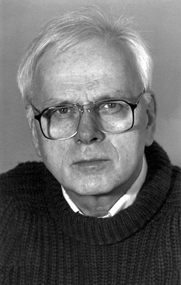

克利斯登·奈加特（Kristen Nygaard，1926年8月27日 - 2002年8月10日），挪威数学家和计算机科学家，他与同事奥利·约翰·达尔共同发明了面向对象编程和编程语言 SIMULA。

1926年奈加特出生在奥斯陆，高中就读于奥斯陆 Fagerborg 高中，由于经历了第二次世界大战，他的学习经历了很多困难。最终于1945年高中毕业，随后进入奥斯陆大学学习科学，最初对天文学感兴趣，后来专项应用数学。

奈加特最初的研究领域是运筹学，在职业生涯早期他就意识到计算机仿真将是一个有用的工具。他和达尔紧密合作，催生了第一个 Simula I 语言，这个语言最初被视为一种系统描述与仿真语言，而非通用编程语言。达尔和奈加特很快意识到其仿真概念可以应用于编程。基于这一见解，他们设计了 Simula 67，他是一种通用编程语言。

SIMULA 包含了目前面向对象编程语言中的主要概念，包括：类、对象、子类、活动对象、进程、调度、框架、自动内存管理、垃圾回收等等。

随后的时间，奈加特与其他学者合作共同开发过 DELTA项目、BETA编程语言。

六十年代末，挪威铁金属公司工会联系了奈加特寻求新计算机技术的帮助，奈加特和其他人开发了相关课程和书籍，专门为工人提供信息技术的介绍和培训。

1970年代，奈加特的研究兴趣逐渐转向技术对劳工运动的影响，并参与了其他政治、社会和环境议题。他是挪威自然保护协会环境保护委员会的首任主席，曾是经济合作与发展组织信息技术活动的挪威代表。

2001年，因为奈加特与达尔在设计 Simula I 和 Simula 67 编程语言，以及提出面向对象编程基础思想方面的贡献，他们一同获得了图灵奖。他们的工作带来了软件系统设计和编程方式的根本性改变，催生了可复用、可靠、可扩展的应用程序，简化了软件代码编写流程并促进了软件编程。

2002年，奈加特在家族位于乔梅的度假别墅度周末时突发心脏病去世。

## 参考资料
1. https://baike.baidu.com/item/%E5%85%8B%E5%88%A9%E6%96%AF%E7%99%BB%C2%B7%E5%A5%88%E5%8A%A0%E7%89%B9/7684674?structureClickId=7684674&structureId=ced913fd22dfe016c93805da&structureItemId=fbc778d5473e7d1876e1a5e7&lemmaFrom=starMapContent_star&fromModule=starMap_content&lemmaIdFrom=9788198
2. https://www.britannica.com/technology/object-oriented-programming
3. https://amturing.acm.org/award_winners/nygaard_5916220.cfm
4. https://mathshistory.st-andrews.ac.uk/Biographies/Nygaard/
5. http://kristennygaard.no/in_memoriam_kristen/