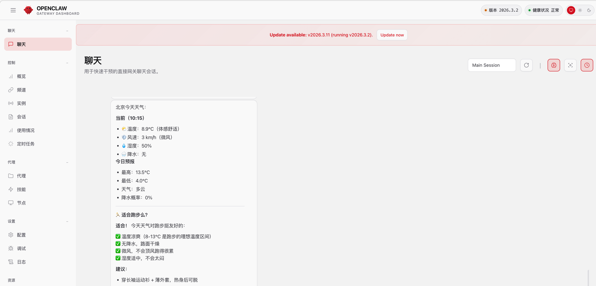

最近 OpenClaw 真的太火了，连我们平时不怎么谈技术的大领导在工作交流时，也要求我们去学习学习 OpenClaw，于是我开始连夜看起了 OpenClaw 相关的技术资料、博客和各种短视频。

我在本地的 macOS 环境中也搭建了一个 2026.3.2 版本的 OpenClaw，配置了一个 Agent，对接了 qwen-portal 模型，简单体验了下 OpenClaw 的相关功能。



OpenClaw 的安装确实比较简单，只要依赖的基础环境（Node、Python）都具备的话，只需要一条命令行就能够安装。安装完成后，也提供了快速启动的命令（通过`openclaw`），很快就能在网页端体验。我这个版本的 OpenClaw  默认了提供了 51个Skills，每个 Skills 依赖不同的 Tools 权限。

Tools 是和 Agent 绑定的，默认的 Agent 提供了几类 Tools，包括：
* Files 文件类：可以操作 OpenClaw 所在机器的本地文件；
* Runtime 命令执行类：可以操作 OpenClaw 所在机器的命令行，执行相关命令；
* Web 网站搜索和网页获取；
* Memory 子系统为 OpenClaw 提供了「代码+文档+会话」的长期/短期记忆检索能力，这部分我的理解还不是很透彻；
* 的记录不能共享，有了这个系统可讲我们与大模型交互的对话历史保留下来；
* Session 是 OpenClaw 的记忆容器，有三种类型：会话Session、执行Session、子代理Session；
* UI 系统我理解是可以用图形界面的方式做一些 Web操作；
* Messaging 系统是 OpenClaw 的亮点，能快速的支持用户通过主流的 IM 软件接入 OpenClaw，这样就可以实现以远程聊天的方式驱动 OpenClaw，真正达到随时服务用户；
* Automation 是一个定时任务相关的子系统；
* Media 是多媒体支持的子系统，默认支持图片、文本到语音；
* Nodes、Agents 这两个还不是很熟悉；


## 环境与安装

本地的环境
* macOS Monterey
* Python 3.12.5
* Node v24.13.0
* OpenClaw 2026.3.2
* DeepSeek 开发者平台申请密钥

我本地原来 Node 版本比较低，在安装 OpenClaw 的命令中支持升级 Node，但是不知道为什么找不到编译好的版本，走到了下载源码编译安装的分支，导致整个过程很慢多次出错，后来我选择了去 Node 官网下载安装包单独安装升级。升级 Node 版本之后，再运行安装 OpenClaw 的命令，此时执行很快，没有再报错。

```sh
$ curl -fsSL https://openclaw.ai/install.sh | bash
$ openclaw -v    
2026.3.2
```

##  场景

> 在本地应用之前，看了网上的一些教程，首先提醒的是注意数据安全，尤其是自己的密钥、个人文档之类的材料。在OpenClaw运行模式选择上，为了安全肯定使用容器方式运行更安全受控。如果是本地运行，注意进行相关代码的审核。

我想实现一个通过聊天工具（如钉钉），联动大模型解答问题，提供天气查询服务的简单场景。


## 思考

ChatGPT和DeepSeek自从2025年大火之后，开发人员方面已经大量的在实际工作中使用大模型来辅助提高工作效率，比如协助来进行代码编写、代码测试等工作，开发人员往往是在 IDE 中使用集成的大模型对会窗口。但是对于普通大众来说，仍然需要通过 Web 页面或者手机 APP 的传统方式使用大模型。

OpenClaw提供的功能，对于科技公司或者研发实力较强的公司来说，应该已经通过MCP等方式，将大模型能力与企业内部的IM工具做了集成。对于研发力量比较弱的企业和个人来说，OpenClaw的出现，提供了一个快速构建个人助理的工具，能够帮助一些有想法，使用 AI 产品较多的用户提高大模型的使用效率。

首先是可以在离开办公电脑的场景下，通过对接的APP，以发送文字或语音消息的方式驱动OpenClaw工作，实现了 AI Agent 24小时为主人服务。另外也能够将交互历史、个人常用APP、个人资料与大模型结合起来，利用大模型的推理能力完成过去很多需要自己亲自完成的琐碎工作。

对于使用者来说，真正有用的 Tools 或者 Siklls。虽然 OpenClaw 默认提供的 Tools 和 Sills 并不是很多，但是网上出现了大量的、共享的 Skills 和 Tools，方便大家取用提高效率。同时这也带来了非常高的风险隐患。

鉴于OpenClaw已经出现的风险问题，如快速消耗用户Token、删除用户本地文件、删除用户远程资料等等问题，乃至于连官方媒体都开始提醒各大公司要审慎的决策内部 OpenClaw 的使用。OpenClaw提供的Tools、Skills是一把双刃剑，如果没有经过严格的代码审计，内部使用还是建议企业内部根据自己的实际需要去开发。

## 参考资料

1. https://www.cnblogs.com/xiaobaiysf/p/19595515
2. https://zhuanlan.zhihu.com/p/2012240792371098520
3. https://docs.openclaw.ai/zh-CN