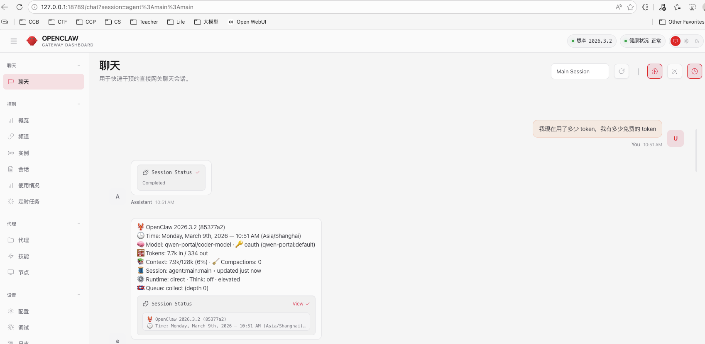

## 环境与安装

本地的环境
* macOS Monterey
* Python 3.12.5
* Node v24.13.0
* OpenClaw 2026.3.2
* DeepSeek 开发者平台申请密钥

我本地原来 Node 版本比较低，在安装 OpenClaw 的命令中支持升级 Node，但是不知道为什么找不到编译好的版本，走到了下载源码编译安装的分支，导致整个过程很慢多次出错，后来我选择了去 Node 官网下载安装包单独安装升级。升级 Node 版本之后，再运行安装 OpenClaw 的命令，此时执行很快，没有再报错。

```sh
$ curl -fsSL https://openclaw.ai/install.sh | bash
$ openclaw -v    
2026.3.2
```

##  场景

> 在本地应用之前，看了网上的一些教程，首先提醒的是注意数据安全，尤其是自己的密钥、个人文档之类的材料。在OpenClaw运行模式选择上，为了安全肯定使用容器方式运行更安全受控。如果是本地运行，注意进行相关代码的审核。

我想实现一个通过聊天工具（如钉钉），联动大模型解答问题，提供天气查询服务的简单场景。




## 有用的配置


## 思考

真正有用的 Tools 或者 Siklls，还是需要企业内部根据自己的实际需要去开发。

## 参考资料

1. https://www.cnblogs.com/xiaobaiysf/p/19595515
2. https://zhuanlan.zhihu.com/p/2012240792371098520
3. https://docs.openclaw.ai/zh-CN