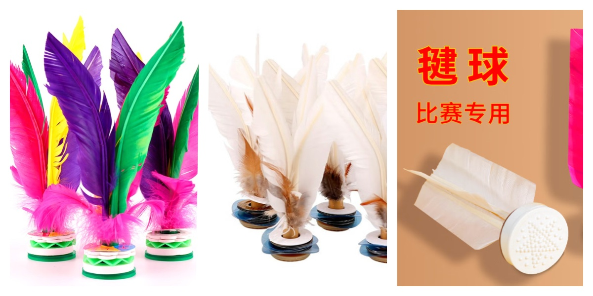
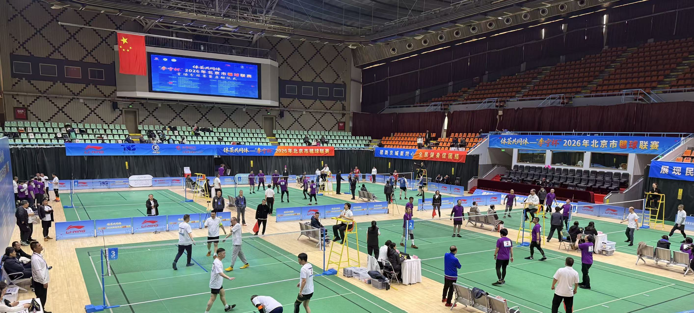

向大家推荐一项小众的体育运动「毽球」，也就是大家常说的踢键子。踢键子是一项有悠久历史的民间体育运动，据说最早起源于汉代，古代基本上以铜钱或者金属为托，以鸡毛或其他禽鸟为羽，可以单人盘踢，也可以双人交踢，多人圈踢。

这项运动不需要激烈对抗，适合的人群很广泛，从小学生到老年人都可以参与。这项运动以脚踢为主，也可以使用身体多个部位接球（手臂及手除外，类似于足球规则），对于身体协调性和柔韧性的要求和锻炼也比较高。俗话说「筋长一寸，寿长十年」，因此受到了广大民众的喜欢。

常见的毽子下面几种，一种是有多色羽毛的毽子，常见于普通商店或超市，是普通人接触到最多的一类毽子。这类毽子体积大，不是很好掌握，质量也参差不齐，很多容易坏。一种是公园常见的大白键，这种毽子在头部由橡胶和多层的金属片构成，通常是四根白色羽毛，质量相对好一点。这种的缺点是普通的鞋踢起来，可能会比较疼，金属片还是有一些重量。最后一种是目前大多数比赛指定使用的毽球，底部是整体橡胶制作，重量很轻，球速比较快，需要一定的技巧才能灵活掌握。

在北京的城墙根下、各大公园、商场的空旷地带，可以看到很多人，穿着平底运动鞋，围成圈踢大白键。踢毽人群年龄各异，但都个个身怀绝技，可以盘踢，也可以背后用脚底板接球，还能花式绕踢。大白键在空中飞来飞去，根本不会有落到地上的机会，看起来赏心悦目。

毽球比赛则融合了团队合作与得分对抗的元素，在一块与羽毛球场大小相仿的场地上，两支队伍隔网对抗，球在己方落地或在对方场地出界就算失分。每个队通常是三个人，一个回合最多踢三次，其中同一个人最多踢两次，球就需要到对方场地，这样依次轮回对战。比赛通常是三局两胜，每局11分。

3月22日，有幸参加了体荟共同体”李宁杯—2026年北京市毽球联赛。这场比赛共32支男子队伍，汇聚了北京通州、大兴、朝阳、海淀、东西城众多高手队伍，还有来自承德、石家庄的队伍，非常热闹。

这属于平踢毽球赛事，赛事规程限制了不能在网前下压等动作要求，使比赛激烈程度有所控制。还有一类是竞技毽球比赛赛事，这种比赛规则是每个队踢4次过场，不限制下压、发球等动作，对抗更加激励，技术要求更高。

今年的系列赛也开通了抖音直播，可以通过抖音搜索「毽球」关键词搜索到。

赛后我也让抖音整理了一份毽球发展的历史，供大家参考，希望更多的人参与到毽球这项运动中来，强身健体。

踢毽子（Shuttlecock）是起源于中国汉代、由古代蹴鞠演变而来的传统体育项目，至今已有两千多年历史，从民间游戏逐步发展为现代竞技运动，并走向世界。

### 一、起源：汉代萌芽，源自蹴鞠

* 起源时间：汉代（公元前 202 年 — 公元 220 年），考古发现汉代画像砖已有踢毽者形象，是目前可考的最早记录。
* 起源脉络：由古代蹴鞠（古代足球）演变而来，是蹴鞠 “二十五法” 之一，后独立为以脚踢、轻巧便携的游戏。
* 早期形态：以铜钱为托、鸡毛为羽，用皮条缚扎，称 “毽子”“鞬子”“箭子”，玩法与蹴鞠 “白打”（无球门的踢法）相近。

## 二、发展历程：从民间游戏到现代竞技

1. 南北朝 — 隋唐：普及兴盛，技艺成熟
南北朝：已广泛流行，《续高僧传》记载北魏 12 岁慧光在洛阳天街井栏上反踢毽子五百次，观者赞叹，可见当时技艺高超。
隋唐：成为宫廷与民间共同喜爱的活动，“寒食蹴鞠”“春日踢毽” 成习俗，玩法多样，可单人、多人对踢。

2. 宋代：形制定型，商业化兴起
形制成熟：《事物纪原》记载 “以铅锡为钱，装以鸡羽，呼为毽子”，鸡毛毽子成为主流，玩法有里外廉、拖枪、耸膝、佛顶珠、剪刀、拐子等数十种。
产业形成：出现专业制毽作坊，《武林旧事》记载南宋临安有 “毽子” 专卖店铺，从业者众多，毽子成为市井常见玩具。
文化融入：成为 “百戏” 之一，在勾栏瓦舍表演，兼具娱乐与竞技性。

3. 明清：鼎盛发展，竞技化与民俗化
明代：成为全民性民俗活动，《帝京景物略》载童谣 “杨柳儿死，踢毽子”，秋冬踢毽成风尚；开始出现正式踢毽比赛，规则逐步形成。
清代：达到鼎盛，技术登峰造极，可用头、额、肩、背、腹、膺等部位代足，一人可应对多人，花样达百余种。
成为八旗军训练项目，也融入杂技表演，河北承德获 “踢毽之乡” 美誉。
1902 年，谭俊川刊印《翔翎指南》，系统整理踢毽技巧，是首部踢毽专著。

4. 近现代：从传统走向现代竞技
民国时期：1935 年，第六届全运会将踢毽子列为国术比赛项目，设盘踢、交踢等项目，成绩记录规范。1936 年，翟连源在柏林奥运会表演踢毽，惊艳世界。

新中国成立后：
* 1956 年，广州举办首次现代正式踢毽比赛。
* 1963 年，踢毽子被列入国家提倡开展的体育活动，编入小学体育教材。
* 1984 年，国家体委将其定为全国正式比赛项目，更名为毽球，颁布统一竞赛规则，现代竞技体系建立。
* 2011 年，踢毽子列入国家级非物质文化遗产名录，传统技艺得到系统性保护与传承。

5. 国际化：走向世界，成为国际赛事
2000 年，第一届世界毽球锦标赛在匈牙利举行，毽球正式成为国际竞技项目。
目前，世界毽球联合会（WKF）组织世锦赛、世界杯、亚洲锦标赛等，全球数十个国家和地区开展毽球运动，成为中外体育文化交流的重要载体。

## 三、现代毽球：传统与现代融合

竞技毽球：采用网式对抗，类似排球，分单人、双人、三人赛，强调速度、技巧与配合。
花毽（传统踢毽）：保留传统花样，注重表演性与观赏性，是全民健身热门项目。
文化价值：兼具健身、娱乐、竞技与文化传承功能，是中华传统体育文化的活态遗产。