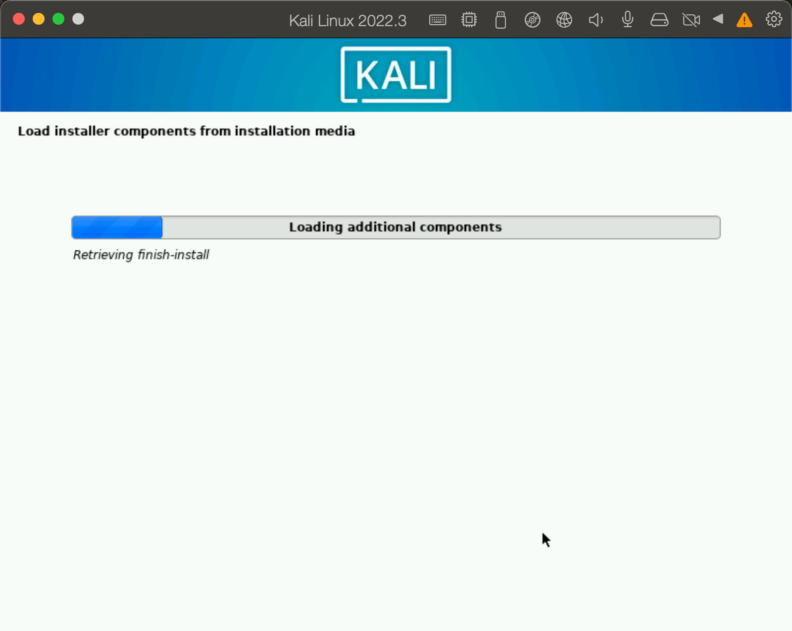
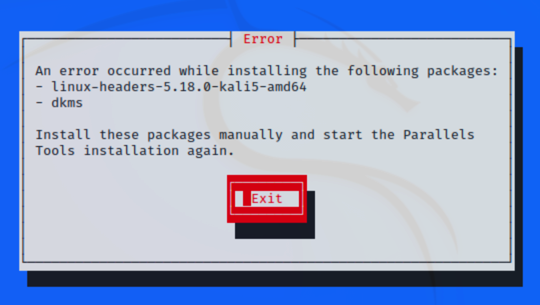
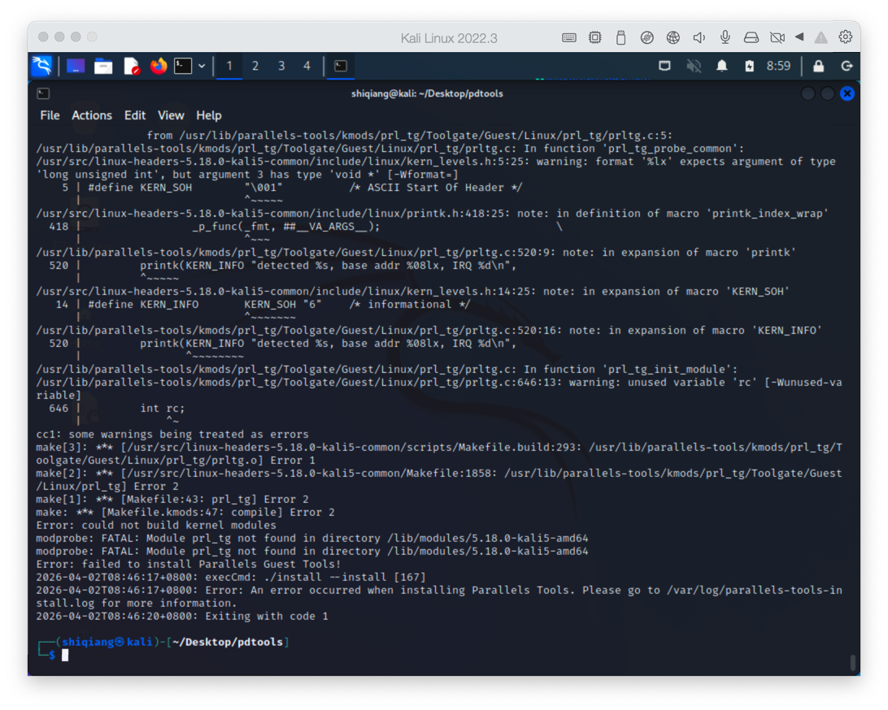

## Kali 更换需求

上次打 CTF 的时候，安装了一个 2025 某个版本的 Kali Everything ，花了好多时间，结果 Parallels Tools 死活装不上去。查了一下，可能是我的 Parallels Desktop 17 版本太低了，和 Kali 2025 相关的版本不匹配。

Kali Everything 装好之后，占用空间要 40G 以上了，实际很多功能也用不到。最近又在培训 CTF，有点时间重新安装一个 Kali 吧，这次用 Qwen 分析了下，Kali 2022.3 应该和当前的 PD 匹配，能够正常安装 Parallels Tools。

Pralallels Tools 安装了之后，可以和宿主机共享粘贴板，能够方便的拖拽文件，共享文件系统，对于图形展示和窗口缩放的支持也更好，对于日常操作效率的提升和体验有很大的帮助。

## Kali 安装的小问题

介绍下我本地的环境，操作系统是 macOS Monterey 12.2.1，Parallels Desktop 版本是 17.1.7-51588。

通过大模型 Qwen、Deepseek、Doubao 的辅助，初步确定安装 Kali 2022.3 版本，并且安装 Parallels Tools，这是我的目标。

第一次在安装 Kali 的时候就出问题，选择 Graphic Install 模式安装后，界面重复的提示 Cannot find display，无法进入安装的界面。


找到了一个解决办法，在提示选择安装模式的界面，按 Tab 键，会出现一个命令行，在后面添加

> nomodeset xdriver=vesa

回车之后就可以正常进入安装界面了。系统安装大概也要十几分钟到半个小时，这次学会了，软件安装都先选默认的，后面需要了再弄别的。



完成之后装 Parallels Tools，第一步执行 `sudo apt update` 就出问题了，查了下发现还存在 2025年 Kali 不慎丢失密钥的问题，看来世界之大真是无奇不有啊。

> 个人感觉，学习一门编程，用在倒腾环境和工具的时间，估计能占学习过程的 20～30%。但是对于 CTF 来说，倒腾环境和工具的时间占比在 60～70%。

使用下面的命令可以搞定，然后还可以更换国内的源，这样速度稍微快一点。

```sh
# 1. 下载 Kali Linux 最新的 GPG 密钥
sudo wget https://archive.kali.org/archive-keyring.gpg -O /etc/apt/trusted.gpg.d/kali-archive-keyring.gpg

# 2. 更新为国内源，编辑 /etc/apt/sources.list，注释掉原来的地址，添加国内地址
# deb https://mirrors.tuna.tsinghua.edu.cn/kali kali-rolling main non-free contrib
# deb-src https://mirrors.tuna.tsinghua.edu.cn/kali kali-rolling main non-free contrib

# 3. 更新，等待完成
$ sudo apt update
```

## Parallels Tools 安装的坑

前面的步骤完成之后，Kali 2022.3 已经安装完成，进入 Parallels Tools 安装过程。如果不出意外的话，肯定会有问题，我遇到的第一个问题是缺一些包。



这些包通过在线的方式已经无法安装了，一方面国内源没保留这么久的历史文件（对应 Kali 2022.3 版本），官方源可能也没有了。这就需要去官方的存档下，地址是：http://old.kali.org/kali/pool/main/l/linux/ 。需要下载下面的三个文件，下载后

```sh
$ sudo dpkg -i linux-kbuild-5.18_5.18.5-1kali6_amd64.deb
$ sudo dpkg -i linux-headers-5.18.0-kali5-common_5.18.5-1kali6_all.deb
$ sudo dpkg -i linux-compiler-gcc-11-x86_5.18.5-1kali6_amd64.deb
$ sudo dpkg -i linux-headers-5.18.0-kali5-amd64_5.18.5-1kali6_amd64.deb
```
> 如果是 M 芯片的笔记本，需要选择 arm64 的包。我的笔记本是2019年最后一代 Intel 的 MBP 16

安装完上面的包之后，Parallels Tools 能进入安装过程了，最后会报 prl_tg 相关的错误，这个和内核有关系，需要补丁解决。



打补丁之前还尝试了一下更新 Parallels Desktop 的小版本，但是没有什么效果，看来官方没有修复这个问题。


修复过程中，Qwen 准确的给出了补丁包的下载地址，对应了 Parallels 一个论坛的地址，https://forum.parallels.com/threads/patch-support-for-kernel-5-18-parallel-tools-17-1-4-51567.357611/ 这个里面有一个 patch 文件，在 kali 上执行下面的命令。

```sh
# 复制 Parallels Tools 到临时目录
$ sudo cp -R /media/cdrom/ ~/Desktop/parallels_fixed/
$ sudo cd ~/Desktop/parallels_fixed/kmods

# 解压
$ sudo tar -xzf prl_mod.tar.gz

# 应用补丁
$ sudo patch -p1 --forward --batch --no-backup-if-mismatch < parallels-tools-17.1.4.51567.fixes.txt

# 重新打包
$ tar -zcvf prl_mod.tar.gz . dkms.conf Makefile.kmods > /dev/null

# 安装
$ cd ~/Desktop/parallels_fixed
$ sudo ./install
```

安装成功后，重启电脑就行。第一次登陆进去的时候，右上角会有一个 Parallels Tools 的提示，提示需要登出会话，下次进来之后在配置界面中选择的共享给 Kali 的文件夹会被挂在本地。

```sh
┌──(shiqiang㉿kali)-[/media/psf/Home]
└─$ ls -lha
total 8.0K
drwx------ 1 shiqiang shiqiang  448 Apr  1 14:16 Desktop
drwx------ 1 shiqiang shiqiang 1.2K Apr  2 10:54 Downloads
```

## 一点思考

在解决这个问题的过程中，全程都是在通过大模型来分析指导。对比使用了豆包、千问、DeepSeek，每家都有特点，使用大模型确实让我解决问题的速度变快了，效率变高了。

但是大模型不能解决我知识体系建设的问题，很多事情在具体处理的点上，在操作步骤上，可以通过大模型快速的上手、初步掌握相关技能，但是对于某一领域知识体系的建立，个人观点的形成，还是要靠自己日积月累。

做 CTF 感觉也有点类似，对于一些不能通过工具一把梭的题目，题目的思路很容易看出来，难在如何能在限定的时间内手搓脚本，找出 flag。

这种时候，去问 大模型，不能够很准确的给出行之有效的脚本，在阅读和调试大模型给出内容的时间内，如果自己的技术可以，完全是可以自己做出来的。

我感觉对于专业人士来说，一定是要把自己专业领域内的技能、知识体系锤炼好，这部分一定不能依赖大模型。对于自己领域之外的内容，或者利用大模型的逻辑思维能力、材料整合能力，来辅助提高自己领域内的工作效率，是可以的。

## 参考资料
1. https://blog.csdn.net/weixin_47610939/article/details/127647055
2. https://forum.parallels.com/threads/patch-support-for-kernel-5-18-parallel-tools-17-1-4-51567.357611/