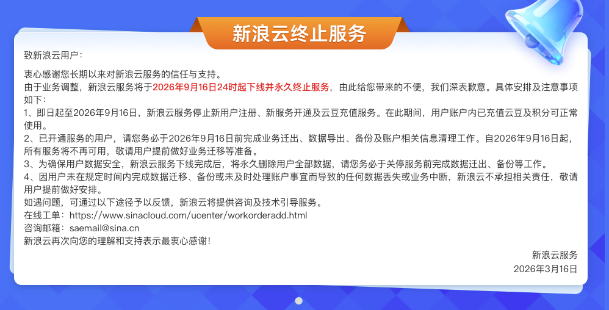

大概是从 2002年购买个人电脑之后，开始断断续续的写一些技术文章，记录一些生活心得。最早是在 CSDN 上的一个账号，文章写的比较水。后来博客园比较火的那阵，在博客园也开了账号进行记录。这两个平台上大概积累了300多篇文章。

在博客园上，通过挂谷歌广告的方式，曾经收获了自己的第一个 100 美元。好像后来博客园不让挂自己的广告了，然后开始考虑转移阵地。

2020年的时候，写了脚本把原来博客园和CSDN上的文章都抓下来存在了本地，并托管到了 Github 上。之后基本上都是在本地编写文章，到今年为止，已经累积了 621 篇文章。

同时为了方便挂谷歌广告，在新浪云上申请了空间，购买了域名，基于 Hexo 生成的纯静态的网站，搭建了独立的个人博客。期望通过写文章挂广告的方式，一方面宣传自己，另外一方面可能的话获取一些计划外的收入。

就这样持续了十几年，但是网页的展示情况一直不太行，随着移动互联网的火爆，PC端的个人站，除了确实能对个人起到一些宣传推广作用，对于普通的站点来说，通过广告费用弥补空间、域名费用的可能性是越来越低了，这些年累积投入超过了 2000 元，但是谷歌的支票却是再也没有收到。

3月份的时候，新浪云正式发布了将于9月份终止服务的通知，彷佛我的个人站点也到了落幕的时刻。接下来准备就不再申请需要费用的空间、主机和域名了，考虑通过 Github Pages 和微信公众号平台。

在没有健康的商业模式支持下，没有一个平台可以长久的运营下去，个人能力建立的站点和互联网资源也终将随着小登、中登、老登的进化而衰老。依赖一些有生命力的平台，比如微信公众号、小红书、B站，能保持一段有生命力的阶段，也是可以了。

关注本站的朋友，如果还想继续收到后续的文章，请扫码关注我的公众号，谢谢。
