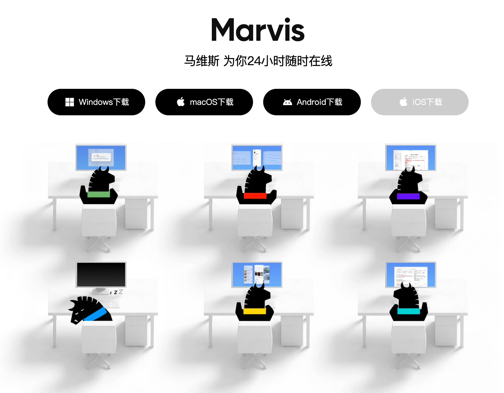
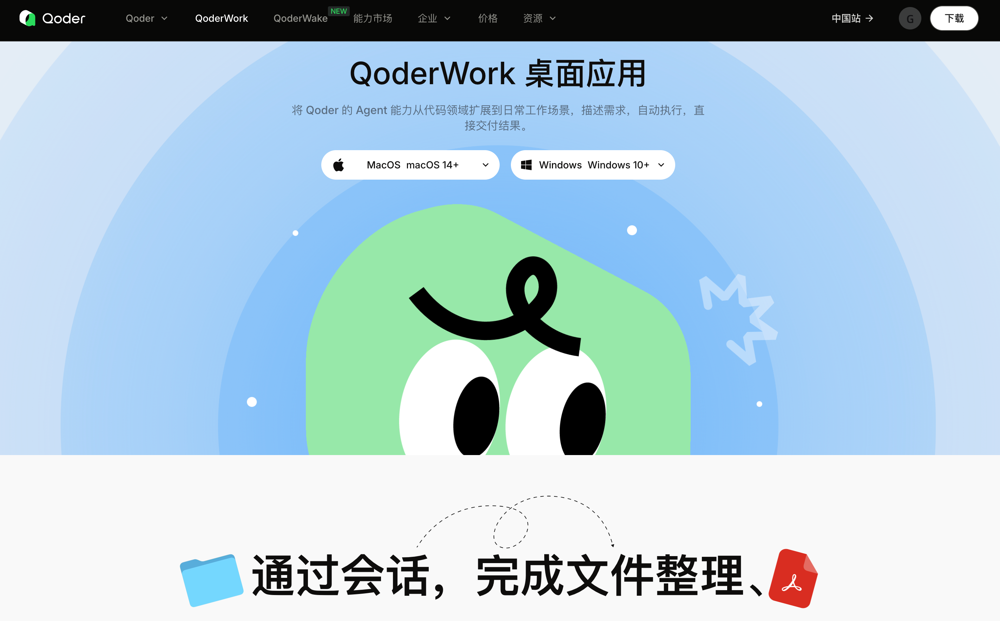

AI技术自从今年出现小龙虾之后，这个技术彻底火出了圈，全社会上上下下都在讨论如何将 AI 运用在自己的工作中。我爱人是一名教师，她们校长就要求每一篇发言稿，都先交给 AI 去润色。AI 在处理文字方面，效率和性价比确实非常可以，毕竟 LLM 全称就是大语言模型。

我们单位领导也给了研究的任务，正好最近各大厂商根据龙虾，陆续退出了各自的桌面工作代理，像 腾讯 一口气推出了多款产品：
* WorkBuddy，定位个人办公助理，以单独软件的形式安装在个人电脑上
* QClaw，
* Lighthouse，云端服务器部署的 openclaw，避免对本地个人电脑产生破坏，更安全，但是在办公处理上少了一些便利性；
* ClawPro，定位智能体开发平台；

最近还出了一个 Marvis，看介绍像是一个多智能体协同的 AI 智能体软件，还没时间研究体验。

除了腾讯系的产品，还有阿里的 Qoder、QoderWork，字节跳动的扣子、妙搭，Kimi也有Kimi Code、Kimi Claw两款产品。我今天就试用了阿里的QoderWork，讲一下使用的体验。

与Code系列软件的区别，Work或者Claw系列的软件，一般强调的是提升办公效率。我在试用的时候，还没总结出这个特点来，所以让 QoderWork 完成了一个偏编程的任务。

任务场景是这样，我提供了一个用户测试案例，案例内容是访问一个工作网站，登陆进去之后，找到对应的一级菜单，在这个菜单的页面中输入一个查询条件，查到的结果再通过一次点击，弹出一个带曲线图的展示窗口。这是一个典型的运维工具使用场景，就是运维人员通过某个运维工具系统查看运维数据。

QoderWork 选择了 playwright + 谷歌浏览器的脚本化测试方案，其实我本地有 selenium 的运行环境，可能如果我的指令给的清楚一些，也能帮助它选择一个适合我本地的方案。

整个任务从 14:20 开始，我原以为大概半个小时可以搞定，没想到一两个意外让它花了一个半小时，到 16:00 才正常完成测试并给出测试报告。

遇到的问题是这样的，那个工作网站如果是第一次访问，会弹出一个欢迎的图层，这个图层在用户测试案例文档描述中没有，如果是手工测试，测试人员肯定可以想到可以关闭这个图层，但是Qoder在这里卡出了，因为图层挡住了菜单文字，花了好几轮的代码优化才想到关闭这个图层后才能找到对应的一级菜单。

模拟点击一级菜单后，要访问的页面是在新的 Tab 页中打开的，在这里也卡了好几轮，后来经过我给的提示词，QoderWork 才调整方向转到从新的 Tab 页中找对应的查询条件输入框。

另外因为这个工作网站响应不是很快，QoderWork 还用了几轮来调整等待时间的参数。

## 优点

类似于 OpenClaw，利用可以访问本地代码的优势，QoderWork 可以快速的产出代码，如果我做为一个产品或者用户验收人员，可以利用这种方式将自己的工作自动化。我的首要目标是完成测试任务，其实对于产出的代码具体语法和格式是不太关心的。

如果我要人工写出这段自动化测试的代码，且不说学习 playwright 这套框架、搭建环境所需要花费的学习成本，就是单单编写测试脚本、自动生成报告脚本，估计也需要1～2天的时间。对比利用 QoderWork 所需要的不到2个小时，效率是大大提升了。

我觉得未来对于个人开发者，或者开发面向自己使用、提升工作效率脚本的场景，使用 OpenClaw 之类的工具，大概率是一个必然的趋势。可以充分体验 Vibe Coding 的优势，不需要关心代码，把精力更多的放在创意、架构、流程和结果上。

但是对于开发商业软件，或者后台的服务的人来说，这种方式可以用来辅助提高效率，必须还需要有人工 Review 代码后才可以正式交付。否则如果以后线上服务有 Bug，客户和领导可没有耐心等大模型一轮一轮的优化，即便它是一个态度很好的大模型。

## 缺点

使用过程中也发现 QoderWork 的一些缺点，如果产品经理看到，看看是否可以优化。
* 【问题】对话任务在不同用户间没有隔离，我在电脑上登录过2个账号，两个账号的任务之间没有实现隔离
* 【问题】对话开始时指定了工作目录，但是没生效仍然使用了默认目录
* 【提示】旗舰版消耗惊人，智商也确实高一些，最后完成任务消耗 1258.36 Credits，按照官网费用折算约 13 元，耗时 1.5 小时
* 【提示】上下文提示不是很准，可以压缩，解决问题过程中一度占用接近 90%，最后完成时显示占用 55%

## 总结

人工智能的发展真的是日新月异、越来越快，而且在提高我们办公效率、开发效率的路上已经完全具备实战使用的条件了。就是对于个人来说，要想获得自动编码节省自身投入的好处，又要控制成本投入，可以在输出指令之前，尽量把自己想要做的事，可以提供给 OpenClaw 使用的技能、工具描述清楚，把自己期望产出物的运行环境、设计方案考虑细致，这样就能获得一个投入和收获更好的平衡。

> 没有任何人不经历摔跤就学会走路。

我期待在我今后的工作中更多的应用 OpenClaw 类产品，也希望大模型服务商能提供更优质、有性价比的服务套餐，未来大模型服务可能就像基础设施服务一样，是每个人都非常渴望得到的，能提高个人效率的重要资源。